| ### Content Guide |  |
| --- | --- |

# About the DEdit Interface

The DEdit interface allows you to insert and manipulate all of the components necessary to create a level using the Jupiter system. This section introduces you to the following DEdit interface and defines some of the key functionality you must know to create your levels.

- [UI Interface Components ](#UIIntefaceComponents)
- [Understanding the Toolbars ](#UnderstandingtheToolbars)
- [Using the Viewports ](#UsingtheViewports)
- [Moving the Camera ](#MovingtheCamera)

---

## UI Inteface Components

The following image shows the DEdit user interface. It is composed of menus, buttons, tabs, and an editing area.

>

The following image identifies the components of the DEdit UI in the previous image. All sections in this document use the terms illustrated below when refering to the DEdit UI.

>

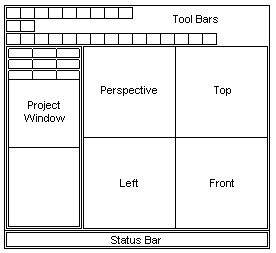

Use the toolbar buttons to make new worlds, switch modes, and run your world. You can learn an individual button’s function by hovering your mouse over the button and viewing its tool tip.

In the **Project Window **, DEdit gives you access to all of the resources in the game. Most tabs contain resources you can add to your game. There are two special tabs, the **Properties **tab and the **Nodes **tab, that relate to objects inside your maps.

There are four viewports that provide windows onto the world you’re building. Each one presents a different view of the world. The upper left window shows you a **Perspective **view shot from a movable camera point in the level. The other three views have a fixed-view camera that displays either **Top **, **Front, **or **Left **view (in clockwise order).

In the **Status Bar **, DEdit provides information about the level or about the view you’re currently in. Use the Tool Tips and the Status Bar to learn more about what the controls do.

[Top ](#top)

---

## Understanding the Toolbars

DEdit toobars contain buttons that activate a varity of useful functionality. The following table describes each of the specialized buttons on the DEdit toolbars.

| 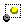 | **Single-Node Selection ** Limits selection to a single object. |
| --- | --- |
| 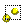 | **Multi-Node Selection ** Allows you to select more than one object. |
|  | **Brush Edit ** Allows you to edit brushes and objects. |
|  | **Geometry Edit ** Allows you to edit the vertices of a brush or object. |
|  | **Object Edit ** Allows you to edit the vertices of an object. |
|  | **Hollow ** Converts the faces of a brush to individual polygons of a specified thickness. |
|  | **Shrink Grid ** Adds grid lines to the grid in the currently selected view, increasing the resolution of the grid and allowing the placement of more closely spaced points. |
|  | **Expand Grid ** Removes gridlines from the grid in the currently selected view, decreasing the resolution of the grid and allowing the placement of more widely spaced points. |
| 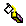 | **Apply Color ** Applies color to a brush or object. |
| 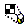 | **Apply Texture ** Applies texture to a brush or object |
| 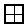 | **Center View ** Centers the view to the current selection, or on the marker if no brush or object is selected. |
| 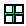 | **Center View on Marker ** Centers the view on a previously set marker. |
| 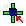 | **Marker to Selection ** Sets a marker to the selected brush or object. |
| 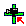 | **Marker to Camera ** Sets the marker to the current camera location. |
| 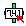 | **Marker to Vector ** Sets the marker to a specified vector using a period delimited three digit X, Y, and Z coordinate. |
| 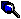 | **Object Search ** Opens the Object Search dialog box allowing you to generate a list of the current objects in the current level. |
| 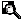 | **Level Textures ** Opens the Level Textures dialog box, allowing you to generate a list of the current textures in the current level. |
| 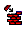 | **Build ** Processes and compiles the current world. |
| 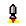 | **Launch ** Launches the currently built world using the Jupiter engine. |

[Top ](#top)

---

## Using the Viewports

Move your mouse pointer over the upper-right-hand viewport (top view). The green crosshair (also called the marker or the insertion point) operates like the cursor in a word processor: it shows your insertion point for drawing brushes.

>

[Top ](#top)

---

## Moving the Camera

To move the camera in DEdit, use the **I **, **O **and **C **keys in conjunction with the mouse.

The following table lists a few of the most important key and mouse combinations for moving the camera view.

| #### Press | #### Result |
| --- | --- |
| **I + Mouse 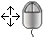 ** | In the any view, hold the **I **key and move the mouse to scroll in the X and Z planes. Additionally, you can increase the speed of the movement by holding the **I + SHIFT **keys. |
| **I + Right Mouse 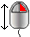 ** | In **Perspective **view, hold the **I **key and the **right mouse button **to scroll in the Y plane. In all other views, this combination scrolls the view in the X and Z planes. |
| **O + Mouse  ** | In the **Perspective **View, hold the **O **key and move the mouse to pan the camera in all directions. In all other views, this combination zooms in and out of the displayed geometry. |
| **O + Left Mouse Button  ** | In **Perspective **View, hold the **O **key and the **left mouse button **to move or “fly” forward through the level. You can continue to pan the camera by moving the mouse during this operation. |
| **O + Right Mouse Button 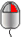 ** | In the **Perspective **View, hold the **O **key and the **right mouse **button to move or “fly” backward through the level. You can continue to pan the camera by moving the mouse during this operation. |
| **C + Mouse 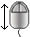 ** | In the **Perspective **view, hold the **C **key and move the mouse **forward **to increase the clipping plane, and **backward **to decrease the clipping plane. The far clipping plane is the portion of your world rendered in the DEdit level editor. If you have a large number of polygons to render, DEdit may slow down to proccess them. Use far clipping to decrease the amount of your world rendered and speed up DEdit. Far clipping does not effect how your game appears when it is compiled, and only works in **Perspective **view. |

### How to Zoom

- With the **Top, Left, **or **Front **view selected, hold the **O **Key and **move the mouse up **to zoom in or **down **to zoom out. Zoom operates the same in any view, allowing you to zoom in or out on any portion of the map.
- With **Perspective **view selected, hold the **O **key and the **left mouse button **. The objects in the view window get larger. You are not actually zooming in or changing the scale of the grid, rather you are moving the camera forward as if you were "flying" through the level.
- With **Perspective **view selected, hold the **O **key and the **right mouse button **. The objects in the view window get smaller. You are not actually zooming out or changing the scale of the grid, rather you are moving the camera backward as if you were "flying" through the level.

>

| **Note: ** | Zoom operates differently in **Perpective **view than it operates in **Top **, **Left **, and **Front **view. In **Perspective **view you can pan while zooming, using the mouse to move the camera on its axis while you "fly" through the level. In **Top **, **Left **, and **Front **view, you cannot move the camera on its axis while zooming, you can only zoom in or out of the current view. |
| --- | --- |

---

Touchdown Entertainment, Inc. [Send feedback regarding this page. ](mailto:support@touchdownentertainment.com?subject=JupiterDevGuide Feedback: Dedit\AbotDEdt.md)2006, All Rights Reserved.
