| ### Content Guide |  |
| --- | --- |

# —TUTORIAL—
Using Brushes

A brush is the basic unit of world geometry. A brush is made up of planes that define its faces, lines that define its edges, and vertices that define its corners. All brushes must be convex. You can manipulate either an entire brush at once or any of the vertices, lines, or planes in the brush.

This section contains the following brush tutorial topics:

- [Starting the Tutorial ](#StartingtheTutorial)
- [Adjusting the Grid ](#AdjustingtheGrid)
- [Creating the Floor ](#CreatingtheFloor)
- [Making Complex Brushes ](#MakingComplexBrushes)
- [Setting Markers ](#SettingMarkers)
- [Selecting Brushes ](#SelectingBrushes)
- [Manipulating Brushes ](#ManipulatingBrushes)
- [Using Brush Power Tools ](#UsingBrushPowerTools)
- [Understanding Invalid Brush Types ](#UnderstandingInvalidBrushTypes)

---

## Starting the Tutorial

This tutorial explains how to select and manipulate brushes, as well as default brushes called primitives, powerful brush tools, and the origins, problems, and solutions for invalid brushes. First, however, you’ll see how brushes can make it quick and easy for you to create complex items in your world.

With DEdit for Jupiter you can quickly create custom brushes of any shape or size. For this tutorial, we must first create a new world, and call it Big1. Create the new world just as you did in the [Building Your First World ](TBldWrld.md)tutorial.

Also, we need an appropriate texture for our floor. In DEdit, go to the Textures tab, select the Tex\Japan container, and then select the texture SFJp003.dtx. This is a good-sized tiling texture that will make a good floor.

[Top ](#top)

---

## Adjusting the Grid

The grid is a way of organizing the placement of objects, similar to a ruler. It keeps you from laying out points totally at random and it allows you to measure the size of the objects you’re creating and their relative positions.

Using the grid makes for much more efficient level layout. When you build to the grid using standard units, your walls are more likely to line up properly and others can more easily understand your level just by looking at it.

#### To Adjust the Grid

1. Go to the Top viewport (the upper right one).
2. Look in the Status Bar for the Grid box, which shows the size of the grid blocks in the current window. Make sure that it says Grid: 64, indicating a grid block size of 64 units.
3. If your grid setting shows something other than 64, you’ll want to adjust the grid scaling.
4. First, single-click in the Top viewport to make sure that the focus is in that port.
5. Then, either use the Expand/Shrink Grid toolbar buttons or the PLUS SIGN (+) and MINUS SIGN (-) keys on the numeric keypad to scale the grid up or down until it’s at 64 units.

| **Note: ** | Each viewport can have a different grid setting, according to the user’s preference. |
| --- | --- |

While 64 units is a reasonable grid block size for laying out floors, walls and ceilings in indoor spaces, if you were working on a large, open outdoor level, 256 units might be a more manageable grid scale. Your goal is always to use a large enough grid to allow you to tell how big your current brush is going to be, but still small enough to create whatever detail you’re going to create.

[Top ](#top)

---

## Creating the Floor

You’ll want a floor that’s about 512 units on a side, centered on the marker in the Top viewport. That means you’ll want to make a square that’s eight grid squares on a side. Create one now, and you should get a brush that looks like this:

>

[Top ](#top)

---

## Making Complex Brushes

Now that you have a floor, the next step will be to use DEdit to make complex brushes, beyond the simple squares that you’ve used so far. You’ll also learn tips and techniques for good brush construction.

The simplest technique is to use DEdit’s vertex-by-vertex brush creation method to build a brush that is close to what you want right from when you lay the brush down. Unlike many other editors that force you to start with simply shaped primitives such as squares or pyramids, DEdit allows you to create a brush by placing its separate vertices wherever you want them. While this doesn’t make it possible to instantly create anything, it speeds things up a lot.

#### To create a complex brush

1. On the Textures tab, select the texture called COJp002.dtx in the same container. It’s different enough from the floor texture to make a good contrast.
2. Go into one of the horizontal views (Left or Front viewports).
3. Press and hold the X key to move the marker up 4 grid squares above the floor, where it is now.
4. You can press the O key to zoom the view out further if you can’t see enough of the grid to complete this task. Your marker is now 256 units above the floor, about the right height for a tall and imposing support structure.
5. Now, switch back to the Top view.

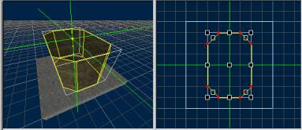

6. In the center of the map, create a pillar that’s eight-sided and shaped like a rectangle with the corners cut off. Make it 256 units thick/tall.
7. Save your level as Big1.LTA.
8. This is an example of an object that can be created quickly using DEdit but would require several steps in most other editors. However, the ability to create brushes this way does allow you to create brushes that DEdit and Jupiter cannot properly use in games.

[Top ](#top)

---

## Setting Markers

The Marker controls all aspects of where you place things, such as lights, start points, brushes, or pasted objects, in your world. When you first worked with the marker, all your work was done in the top viewport, but it works exactly the same in any of the ports. It even works in the Perspective view, although most often it’s not useful to work in that view.

Object placement in ports other than the top view is simple. The object being added always appears at the center point of the marker, and the viewports do not affect this functionality. However, the viewports do affect the placement of brushes.

In your Big1 level, move the marker in the Top view so that it’s one grid square south of the center of the column you created earlier, as in the image below.

>

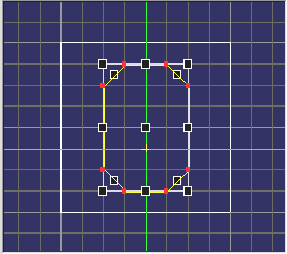

If you were going to add a support to your column, this is probably where you’d want to add it.

Now, switch to the Front viewport. Zoom out a little so that you have some space to work and add a brush that is a triangular wedge with a thickness of 128 from the top of the column and looks similar to the figure below.

>

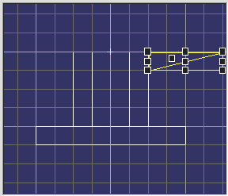

Look in the top view and see what’s been done. What you should see is that the brush lines up exactly with the green marker, and its thickness of 128 units extends along the front/back (X axis). The marker’s location in each view defines where the brush starts and the thickness you specify determines how far from the marker it extrudes.

By placing the marker carefully, you can lay brushes out exactly where you want them. Although this system of viewports and marker is somewhat different from many of the traditional editing tools, it’s also very powerful once you get used to it. Remember always to be aware of where the marker is and where you need it to be.

[Top ](#top)

---

## Selecting Brushes

To select a brush, left-click on it. In any of the viewports, move your mouse over the brush you want to select. If there are brushes stacked on top of each other, DEdit tries to pick the one it thinks you want. If a big brush is in front of a smaller brush, clicking inside the smaller one will select it even though the bigger one is “closer” to you.

You can select brushes in order of their depth in the current viewport by pressing the T key when you click. In other words, if two identical brushes are stacked on top of each other in the current view, the T+left-click combination would select the one closest to the “front” of the view, and subsequent clicks would select the brushes behind that one.

One way of speeding up your work is to select multiple objects or brushes at once. You can do this in many ways, including multi-select mode, the CTRL key, selecting by name, and the Selection menu.

### Multi-Select Mode

In the Mode menu, select the Multiple Node Selection command. While you’re in this mode, selecting an object no longer de-selects the objects you have previously selected.

With Multiple Node Selection chosen, when you select a new object it’s added to the selection. If you mistakenly add a brush to your selection, hold down the CTRL button and left-click on it again to remove it from the selection.

It can be difficult sometimes to select the brush you want, and you can accidentally select the wrong brush. Pressing the U key de-selects all brushes, after which you can select the single brush you want to work with.

Be sure to use the camera in Perspective view and press the U key frequently so that you don’t grab the wrong brushes.

### Adding Brushes to a Selection

You can press and hold the CTRL button while clicking on brushes to add them to your selection. While the CTRL key is pressed, you can click any brush again to remove it from the selection.

### Block Selection

Another way to select a group of brushes at once is by using a block selection, which can be used in any mode.

1. Move the mouse into the top view, then left-click and drag out a rectangle that covers the brushes you want to select. You will see a white highlight that outlines the area you’re selecting.
2. Once you release the mouse button, all the objects under the highlight are selected.

In the case of brushes, a brush only becomes selected when the highlight touches one of its corners, so you can select a brush that’s on top of a larger brush without selecting the brush below it.

### Select By Name

You you can use the Nodes tab in the Project window to select and find objects by name instead of having to find them visually.

Click the Nodes tab to switch to it and examine what looks like a tree diagram of your whole level.

>

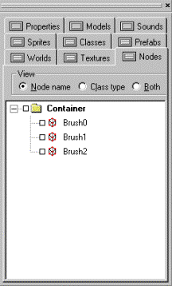

The list you see shows all of the brushes and objects in your level. Each of the names has a box and a symbol next to it.

Move the camera in one of your views out so that you can see the whole level.

Then, click on the box next to the object called Brush1. Two things happen. First, a check mark appears in the box and its name is highlighted. Second, one of the brushes (your pillar) is selected.

This way of selecting things is useful on larger levels, where you may know what brush you’d like to select, but can’t easily jump to it to select it. In that case, you can then use the Center View button (described earlier) to quickly center your views on the brush.

You can do many other things with the Nodes tab to organize your level as well.

### Selection Menu

The last major method for selecting brushes and other objects is via the Selection menu. The menu provides useful commands for working with several brushes at once, as well as a few commands for organizing your brushes.

The first two commands, **All **and **None **, are straightforward. Clicking None behaves exactly the same as pressing the U key: it clears all selections. If you choose All, then DEdit selects everything in the level: all objects and all brushes.

The **Inverse **command inverts the selection so that everything selected is unselected and vice versa.

The **Container **command tells DEdit to select an object’s parent object in the Nodes tree. You can use container objects to organize the objects in your maps without affecting the way the map works. You can read about using containers in the section on using and understanding nodes.

The **Advanced **command displays a dialog that will help you find objects and brushes based on their name or type. This is another feature designed to help you find objects in large levels where you may not be able to locate something right away visually, or to find large groups of objects quickly.

The **Hide **and **Unhide **Selected commands let you hide selected parts of the level from view if you’re not currently working on them. This will help your editor run a bit faster, and can help you to see parts of the level that would otherwise be hard to view with your camera. You can also use these commands to accomplish some complex tasks with carving and geometry mode (which you’ll learn about later). Since a hidden object isn’t affected by most actions while it’s hidden, hiding brushes can be used (like masking tape in painting) to protect certain brushes from work you’re doing on other nearby brushes. This is another command that you’ll read more about in the Nodes section.

The **Hide Inverse **and **Unhide Inverse **commands are just like the above commands, but they operate on anything that you have not selected. They are commonly used for hiding items other than the ones you’re currently working on. For example, in cases where you’re working on only a small area of a large level, you can speed things up by hiding the rest of the level. It can also be useful to hide other brushes when you need to do work on the geometry of a brush that’s too tightly packed in among others to easily find its vertices.

The **Mirror **command allows you to flip a shape or group of objects in a level. You can use the mirroring commands on any brush, object, or group of brushes and objects. We’ll discuss the Mirror command later.

The **Save as Prefab **command takes the currently selected objects and brushes and stores them as a Prefab in their own file so that you can use them in other levels, or in other places in the current levels. Once you’ve saved a Prefab into its own file, you can then import the prefab again by double-clicking it in the Prefabs tab. Prefabs can be as simple as a vending machine or as complex as an entire room complete with lights and characters.

The **Generate Unique Names **command creates a unique name for objects that have identical names. In cases such as AI paths and scripting, this can be important, since some objects use the names of other objects to select them as a target, to move them, or to send them messages. Unless you’re working on such tasks, you shouldn’t have to use this command.

The **Group Selection **command (related to the Container command) adds a new container object and groups the selected objects together in it. This command is very helpful for sorting large levels or rooms into smaller parts. See the Nodes section of this document to learn more about containers and their use.

[Top ](#top)

---

## Manipulating Brushes

In addition to the grab handle at the center of each brush, there are several other ways to rearrange your brushes in the editor.

Use the M key to move selected objects, including brushes. Press and hold the M key, and then click and drag with the mouse to move the objects wherever you drag them.

### Rotating Brushes

You can also rotate your brushes, which is very useful when building symmetrical areas. As an example, assume you want to make a second copy of your pillar and its support but facing the opposite way. The slow way would be to lay out each brush again by hand, which would be tedious. The faster way would be to copy the current brush, then just rotate it into the new position.

1. Switch back to your Big1.LTA file, or open it if you have closed it.
2. Switch to multi-select mode (using either the toolbar buttons or Mode menu Multiple Node Selection command).
3. Select the pillar brush, and then select the support brush.
4. Press CTRL+C to copy them.
5. Since you don’t want to insert the brushes at the green marker when you paste them, from the Edit menu use the Alternate Paste command.

| **Note: ** | When you perform an Alternate Paste, DEdit pastes the object into the current world at the coordinates where it was copied out instead of at the marker. This is most useful in two cases. First, when you want to rotate or realign the brush slightly in relation to the original. Second, in cases where the new brush will be in a new world, but be in the same exact position there as the old brush was in the old world. For example, you might want to copy or paste parts of your world into a test world, just to try a few ideas without modifying the original world’s design. You would not want to align rooms, lights, and so on by adjusting the green marker for each paste operation. |
| --- | --- |

1. Press CTRL+ALT+V to paste in the new brush. The selection will flicker, but since you pasted into exactly the same place that you cut from, nothing will appear to change.
2. Go into the top view and move the marker so that it’s right at the tip of the support brush:

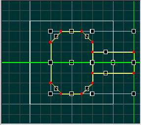

3. Right-click in the top view and select Rotate Selection.
4. Since we want to make an archway out of the two pillars, enter 180 in the Degrees box that appears.
5. When you click OK, you’ll see your selection move. If you use the camera in the Perspective viewport to look at what’s happened, you’ll see that there’s now a mirror image of the pillar on the opposite side of the original. Notice that the marker defines the center around which the brush is rotated.

| **Note: ** | You can also hold down the N key to rotate the selected objects, but since this rotates the brush in very small increments you must be careful to rotate neatly. It’s difficult to rotate an object by exactly 90 degrees by hand; using the menu command is generally faster and more accurate. Additionally, you can hold down SHIFT+N to rotate in 15-degree increments. The most important thing to remember about rotations is that if your rotation operation leaves brush vertices off the grid, then precision errors can occur during processing. |
| --- | --- |

### Mirroring Brushes

Another way to flip objects is to use Mirror commands in the Selection menu. This method works well for brushes that are not symmetrical enough to rotate, such as a brush that’s beveled on one edge in order to meet up neatly at a corner. Each command flips the brush along a different axis relative to the world. It doesn’t matter which viewport you use the mirroring commands in, since the flip axis is relative to the world, not the viewport. A top/bottom mirror inverts the brush along its Y-axis, a front/back mirror along the X-axis, and so on.

### Resizing Brushes

Resizing a brush (which you’ll want to do now, since your level’s floor is too small) is done using the drag handles on the edges and corners of a brush.

1. Switch back to your Big1.LTA file, or open it if you have closed it.
2. Press the U key to unselect everything, then select the brush that makes the floor of your level. You will see filled boxes appear at each corner and on each edge that look just like the one in the middle for moving the brush. The ones on the edges are for stretching the brush in the direction of that axis. The handles on the corners allow for resizing in both directions at once.
3. Go to the top view and resize your floor brush with the drag handles until it is four times its current size on each of the edges and it is underneath both of your pillars so that players can walk underneath them. You should get something like the picture below.
4. It may also be useful to make the grid size larger (128 or 256) to simplify resizing the brush properly.

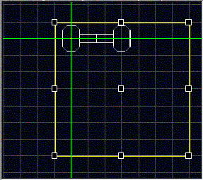

Having the two types of drag handles helps when you want to either quickly resize a brush in multiple dimensions like your floor (corner) or resize it in only one direction as you’d do if you extended a hallway (edge). These handles appear around any group of things in the world, including objects. You can use the drag handles to widen a circle of lights or spread out a group of start points as well as using it to increase the size of a brush. You can even mirror a brush by dragging it inside out. DEdit is smart enough to flip the face normals of the brush so that they still end up pointing outward as they should.

However, one thing that can happen when resizing a group of brushes is that you can re-shape some of the brushes in ways that you didn’t intend. For example, select both the floor brush and the right hand pillar in your level. Drag the right edge resize handle to the right by one square. What you should see is that not only does the pillar grow, it also moves to the right. This is because DEdit treats the entire group selection as one scalable object/brush.

That sort of movement, if you’re not aware of it, can cause leaks when you use the handles to resize a hallway whose floors and ceilings aren’t all the same length. For the same reason, you don’t want to use these handles to move a pair of walls to narrow a hallway. The walls thicken or shrink as they’re moved, and not usually by nice, neat increments. A pair of walls that began as 32 units thick each and 128 units apart might end up 196 units apart as you intend, but be 45 units thick each. That’s not a unit that will be easy to fit textures to or align with your other walls and floors. Conversely, if you scale a lamp post that has a lens flare sprite attached at just the right location, resizing the lamp post and the sprite as a group will ensure that the sprite stays as the proper location.

This brings up the last possible problem with resizing objects. If a brush has vertices that fall on points that wouldn’t line up with even a 1x1 grid spacing (the smallest DEdit and Jupiter can handle without possibly producing precision errors), the Processor may have some trouble getting the corners of the brush’s faces to line up when the level is processed. This can cause gaps to appear between faces and may also cause level leaks.

| **Note: ** | You should undo your resize by hitting CTRL+Z in order to return your column to its proper size now. |
| --- | --- |

If you do use the drag handles to resize a regularly-shaped object, you should generally verify that all of the moved vertices wind up on the grid. If you can’t, correct errors by shifting vertices back onto the grid in Geometry Mode as described in the Brush Power Tools section. Note that for rotated objects, irregular shapes and terrains, this step is not usually required.

### Primitives

One way of creating a new brush is to insert a primitive into the map. Primitives are pre-defined shapes that can be used instead of placing vertices. The main purpose of this is to quickly add brushes that would otherwise be very complex to build. You can add five shapes: Cubes, Cylinders, Pyramids, Spheres, or Domes.

#### To add a primitive

1. Choose Add Primitive from the Brush menu.
2. Select one of the primitive types.
3. You’ll get a dialog that asks for a few options to set up the brush, and then the primitive appears at the marker.
4. One difference between creating a brush this way and making it using Brush mode is that primitives come in un-textured. Be sure to apply the proper texture to your primitive once you’ve inserted it. To do so, select the new primitive and press CTRL+T.

| **Note: ** | You may be tempted to fill your level with lots of domes and 20-sided columns, but be sure to read about optimizing performance in your levels before you do this. These objects can create great beauty where they’re used, but used in the wrong place they can create big problems with your level’s performance. |
| --- | --- |

[Top ](#top)

---

## Using Brush Power Tools

Even with DEdit’s primitives and its vertex-by-vertex brush layout tool, you still can’t create all of the brushes you want in a single step. DEdit has four main tools for changing the actual shape of a brush: Hollowing, Carving, Splitting and Geometry Mode.

While they are very useful tools, they are also very effective for destroying brushes, making your levels slower to process and slower to run, and making bad designs worse. As in carpentry, think twice before you cut. Be sure of what you will get before using these tools.

### Hollowing

Using hollowing, you can empty the inside of a brush, like hollowing out a pumpkin. For a demonstration of how to use this technique, you can very quickly build a box around your entire level to contain it for processing.

First, raise the marker about 128 units above the tops of your columns. Then, zoom out your Top view until you can see all of your level’s brushes and a little space around it. Re-select the texture you used for the floor of the level, since the texture of your pillars and supports is a bit dark.

Draw a square brush that surrounds the whole level in the top view and make it 1024 units tall. That’ll make it large enough to contain the whole level with some space left over. Now, with the big new brush (and nothing else) selected, select Hollow from the Brush menu. When prompted, enter 64 for the new brush thickness. This is the thickness of the walls of the brush, which will be created around the brush. Then the original brush is deleted.

You’re probably annoyed that you’ve been taught to create rooms using the slower method of laying out each of your wall brushes and ceilings by hand instead of just creating and hollowing cubes. However, if you look at the created brushes, you’ll see that DEdit created brushes whose edges are beveled instead of straight. This is to fit them together neatly with the minimum number of faces visible, although in some cases hollowing can drive up the number of faces on your brushes, leading to higher polygon counts inside your game. Also, because of the beveled edges, hollowed rooms must be resized by moving vertices, instead of by scaling whole brushes.

Hollowing can be useful, especially when the bevels fit in with the design of your room, or are in areas that won’t affect the rest of the layout. If you’re using it in an area of the map that you plan on changing a great deal, consider building your brushes by hand instead. It’s usually neater even if it is slower.

### Carving

Your next tool is carving, also known as CSG Subtraction. It’s similar to hollowing and the two can even be used interchangeably for some purposes. However, as with hollowing, it can often produce unintentional results.

In order to carve a brush, first you need to create the brush to be carved. Next, you need to create a second brush that will serve as a tool to carve with. As you may guess from the name of the operation, the volume of the second brush will be subtracted from the volume of the first brush.

As an example, you can bevel an edge off of the top of your two pillars to give them a little more of an interesting look. Select one of your triangular supports. Copy (CTRL+C) and Alternate Paste (CTRL+ALT+V) it, then move (M) it so that it overlaps the outside edge of the support.

>

Resize the copied support so that its edge is a 45-degree slope in the Front view, then resize it in the top view so that it overhangs the north and south edges of the pillar a little. You should get a brush that looks like this:

>

The purpose of the overhang is to make sure that the brush cleanly carves the surface of the pillar. It’s not necessary, but it’s a good idea. DEdit may occasionally create a bad edge or face when using carving, and overhanging a little helps to minimize the chances of this. If it does happen to you, use undo to back up and then try resizing your carving brush to overhang the area where the problem appeared if it’s possible to do so.

If you can’t overlap the carving brush for some reason, see the section on fixing damaged brushes later in this chapter. It includes techniques that might help you fix any damaged brushes that result. You may also be able to use splitting planes (which you’ll learn about next) to do what’s needed.

Notice that your carving brush only touches the pillar and not any of the other brushes in the level. That’s because carving with a brush cuts its shape out of any other brushes it’s touching. Make sure that your carving brush isn’t touching anything you don’t want to carve. You can select both the column and the carving brush, then use the Hide Inverse command on the Selection menu to hide brushes that are in the way. Then select any brush and use the Unhide Inverse command to bring them all back. Alternately, you can move the carving brush and the brush to be carved to an area of the level that’s open enough to avoid the problem and move them back when you’re done.

Once you have the carving brush in place (make sure only the carving brush is selected), press H or use the Carve command on the Brush menu. Move the carving brush away from the column and look at the result. What you should see is that a new edge has been carved off of the column, leaving a large beveled edge. As with resizing brushes, it’s a good idea to line your carve up so that any new vertices stay on the grid, although this is most often a problem for brushes you plan on doing more to after the carve. If you’re building chunks of rubble, you may not care as much about the results being on the grid.

This technique can be used with more complex shapes as well. If you stick a cylinder-shaped brush into a wall to make a doorway or into a ceiling to make a window, you can create some very complex effects quite quickly. However, as with hollowing, your decisions on how to lay out brushes are very often better than the computer’s, and your cuts are probably going to be neater and easier to understand. The splitting planes tool, your next power tool, is designed with exactly that in mind.

| **Note: ** | You might want to create some brushes outside the current map and try playing with carving for a little bit to better familiarize yourself with how it tends to cut before moving on. Try more complex carving shapes and carving multiple brushes at once. Be sure to watch the brushes that you get as a result. To more easily view the splits on your brush faces, turn off the textures. Right-click on the Perspective viewport, choose Shade Mode and then click Flat Polies. |
| --- | --- |

### Splitting

The splitting plane tool is like carving, except that instead of using a full brush to remove a section from other brushes, you use a single plane as a saw to cut brushes into pieces. Although this tool only cuts along a single plane, it’s a very useful and refined device for making complicated brushes for two reasons. First, it doesn’t require the creation of a cutting brush. Second, it allows you to pick the exact position and order of the cuts as they’re being applied instead of letting DEdit make the decisions.

To see the tool in action, select the pillar whose edge hasn’t been beveled off yet. Splitting planes only splits through the brushes that are currently selected, so they can be used even in crowded parts of your level without the problems inherent in carving.

Next, you need to draw a splitting plane that’s located where you want your cut to be. Since we’re trying to be symmetrical with the other side, our cut should cut off the outside corner from two grid lines in at the top to two squares down on the side, a 45-degree angle cut. To define your cutting plane, you do as you’d do if you were starting to create a new brush along the line to be carved: Go to the Front viewport and press SPACE to define a line between the two points where you want the cut:

>

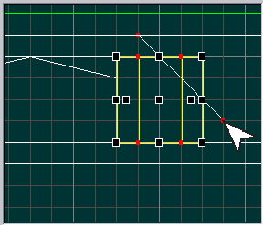

Make sure you only define two points on the line, since splitting only uses the first segment of the line to split on and will ignore any later segments. Use SPACE to place the first spot, then move the mouse to your second spot and press SPACE again to define the second point.

| **Note: ** | Splitting occurs along an infinite plane defined by the two points you place. You do not need to ensure that you overlap all selected brushes or make the line the full length of the split you’re creating. Just make sure that the two points you choose are on the exact line that you want. |
| --- | --- |

Once you have your split line defined, press S to perform the split. Your selection will be cleared, and instead of one brush you now have two:a pillar with a beveled edge and a wedge of pillar that’s been cut cleanly off. If you select and delete the wedge, you’ll have a pillar that’s a mirror of the pillar on the opposite side.

For a more complex case, imagine that you want the floor of your level to float in space. Now, imagine that you want to blow off a corner of the platform to make it appear damaged. What is the best and cleanest way to do it?

>

First, select the floor brush. Now, go into the top view and center in on the 4 squares in the lower left hand corner of the brush. Once you have a good view of them, split the brush vertically at the edge of the second square in from the left.

Select the smaller of the two resulting brushes (the left-hand one) and split the bottom two squares off so that you have a rectangle above a small square that forms the lower left corner of your floor. What we’re doing is isolating the rest of the brush from the area we’re going to work on. This is important, since one of the things we want to add is a splintered, irregular edge. Always choose carefully where you make your cuts. Otherwise, in this case, the whole floor here would be splintered and irregular which would drive up polygon counts and look ugly.

Now, select the square that you created. Zoom in on the square and lower your working grid size in the top viewport to 32 units so you can create smaller cuts. Now, using the splitting tool, carve up the brush and delete any excess bits until you have a nice jagged corner like this one.

>

You may want to use the flat shade view in your Perspective viewport again to do your carving, since it’ll be easier to select items that way. Note that you can now create a pretty complex shape without destroying the rest of the floor. Imagine what the floor would have looked like if you had used carving instead of splitting.

### Geometry Mode

DEdit’s last brush power tool, which you’ll use to fine-tune the raggedness of your destroyed corner, is called Geometry Mode. Unlike Brush Mode, where each operation works on a whole brush at a time, Geometry Mode works on a single face, edge or vertex of a brush at a time.

Press U to unselect your brushes, then press CTRL+G to switch to Geometry mode. Move your mouse around in the Perspective viewport and watch what happens. What you should see is red highlights around the brush faces as you pass over them. You will also see green highlights on nearby edges and vertices. For the most part, you don’t make normal selections in Geometry mode the way you do in Brush or Object mode. The red highlight is DEdit’s way of indicating where the focus is instead. If you have several brushes selected, Geometry Mode filters out all unselected brushes so you can only manipulate parts of the selected brushes. This helps you to make changes in tight areas.

In the Top viewport, move the mouse over the end of the triangle on the upper left edge of the jagged area. Get the mouse over the tip of the triangle that juts out of the corner into space. You’ll want to move that point so that the jagged edge sticks out further into space and looks more torn. Press and hold the M key, then click and drag the point of the triangle a grid line to the left.

>

What you’ve done is move the two vertices that make up the point of the brush over to the right. Something you may also notice is that you actually moved two vertices, not just one. You moved the vertex on the top face and the vertex on the bottom face, which was directly below it in the top view. DEdit knows that since the vertex on top had another vertex directly connected to it that was below it, you probably wanted to move the whole edge. DEdit only makes this assumption when the vertices are both on the same brush and are directly connected by an edge. In order to move vertices that aren’t linked this way in a single step, you have to select them a different way.

The right corner of the triangle you just resized butts up against the corner of another brush. Get that corner in view in the top pane. Then hold down the left mouse button and drag out a rectangle that surrounds that corner. Be careful to only select the one corner, and not any other vertices. When you release the key, you’ll see a yellow dot indicating that the vertex is now selected. If you use the other viewports, you’ll see that all the vertices at that point are selected, whether they’re on the same brush or not.

The nice thing about this is that you can now move all of them as a single unit. Press and hold the S key and drag the yellow dot to the right by one grid space. You should see that both brushes change shape when you do this. It’s important to know what vertices you’ve selected when using this method, since it’s easy to grab the wrong ones. If you have trouble, you can always select the brush you want to work on or hide the surrounding brushes to make it easier. Remember, M moves the vertex you click on (and those below it if connected via an edge) while S moves the vertices you have selected.

>

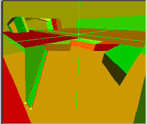

Now, press U to unselect the vertices you currently have selected. Go back to the triangle that you re-shaped before. Use the same technique to select its tip. However, instead of moving it left/right, you’ll be moving it downwards. Go into the Front viewport. Press the S key to drag the two vertices down three grid lines. In the Perspective view, use the camera to look at the result.

What you’ve done is bend your original brush downwards to make it droop. This is where the real power of Geometry mode comes in: You have the ability to totally re-shape a brush down to its smallest features. You can use Geometry mode to fix brushes when their vertices don’t line up with the grid, to resize irregular objects and to repair all kinds of problems.

One other way to select objects in Geometry Mode is to use the Y key to highlight all the vertices on a single face. Move the mouse over a face so that it’s highlighted, then press Y. What you see is that all the vertices on that face are now selected. This is the method most commonly used in DEdit to skew a brush: you select the face and then use the S key to move it around, skewing the brush.

The last area where Geometry Mode is highly useful is face-by-face texture management. There are cases where applying a single texture to a whole brush won’t get the result you want. For example, perhaps you want to darken the edges of your ragged corner.

In the Perspective viewport, highlight the side of one of your pillars. Next, right-click and choose Select Texture from the Context menu. If you now go to the Textures tab, you’ll see that the texture on the pillar is now the active one. Using this tool helps you to quickly grab a texture without needing to know where it’s located in your texture tree.

Move the camera so that you can see the edges of your ragged corner.

>

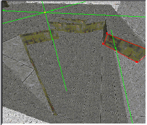

Hover the mouse over one of the edge faces of your ragged brushes and press CTRL+T. The highlighted edge now has the dark texture on it. By moving the mouse and camera you can quickly re-texture all of the brushes to the new, dark texture.

Since Geometry mode is such a powerful tool, it also allows you to damage brushes and create objects that the LithTech engine can’t run. DEdit assumes that users in Geometry mode are experts doing things for a reason, so it allows them to do actions that might cause problems because it thinks that is what they want to do. You can probably easily imagine ways to make concave brushes using Geometry mode, but there are more subtle problems you can cause using this mode as well.

Do not use Geometry mode to mirror brushes. If you select a face or group of vertices and drag them so that the brush becomes inverted, the brush will literally turn inside out, with the normals of each face towards the center, resulting in a bad brush when compiled.

| 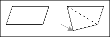 | Do not twist the faces of a brush. This is a hard concept to demonstrate. Say you have a face that’s rectangular, and you pull one of the vertices straight downwards, as in Fig. A. What results is a twisted face. |
| --- | --- |

Since faces must be totally flat, you have effectively split this one face into two without creating an edge to separate the new faces. To DEdit this will register as a concave brush, and Processor will not be able to properly compile it. Twisted faces are probably the most common kind of Geometry mode problem, and the hardest to spot in many cases. Use the Triangulate Brush (CTRL-E) command to double-check your work occasionally if you’re working heavily in Geometry mode. Any folded faces will be triangulated into good faces when you use the command. If DEdit complains about a brush and you can’t see anything wrong with it, chances are good that you have twisted a face.

Geometry mode is very effective for doing many things that otherwise simply couldn’t be done, but it’s also very easy to do serious damage with it. It’s the most powerful of the power tools, and as such should be used with plenty of care and attention.

[Top ](#top)

---

## Understanding Invalid Brush Types

This section provides more detail on the how and why of bad brushes and a few ways to repair them. Not all problem brushes cause terminal problems. However, you should always be sure to avoid creating invalid or problem brush types.

### One Sided Brush

The first type is often created accidentally, and here’s how to do it:

1. Move to the Top viewport and press CTRL+G to switch to Geometry mode. You’re now in the mode DEdit reserves for editing on the level of faces, vertices, and edges, rather than brushes.
2. What happens if you create a brush in this mode? Try it: Use the SPACE bar to create a square brush in the Top viewport. Notice that when you close the brush by placing the last vertex, you are not prompted for a brush thickness the way that you are when you build a brush in Brush mode.
3. Press CTRL+B to switch back to Brush mode and look at the new brush you’ve created.
4. Use the I and O keys in the Left or Front viewport to bring it into view.

What you’ll probably notice is that the brush is completely flat. In fact, not only is it flat, it has only one side. What that means is that from one side it’s solid and has a visible surface, and from the other it’s completely transparent.

These brushes are used in building your level as Occluders, which are brushes with a very specific and special purpose. They can also be used in WorldModels or as regular world geometry. They can only be seen in the game from the side which has a face. Since Jupiter does not perform hidden surface removal on your brushes, you will often create objects out of one-sided polygons. However, there are times when you intend to create a multi-sided object and get a single-sided polygon instead.

If you create a brush in Object or Geometry mode, or if you ever notice you haven’t been prompted for a brush thickness, you have created a single-sided brush. If that was not what you intended, you should make sure you’re in Brush mode, then delete and recreate the brush.

### Concave Brush

Concave brushes were invalid in previous versions of the LithTech SDK. That has changed in Jupiter. Jupiter’s Processor can understand concave brushes, and most world geometry in Jupiter is concave. However, you must still be very careful to avoid making concave or folded faces. Just as in Max or Maya, a concave face will create rendering issues and may cause collision problems as well. If you are going to create concave shapes, always check them carefully and triangulate them if needed to remove folds and concave faces.

### Loose Faces

Brushes also sometimes develop a loose face, or you may build an object out of separate faces and want to connect them into a single unit for ease of editing.

If you try to move one face on a brush in Geometry mode and the rest of the brush doesn’t follow it, the face has probably been detached from the rest of the brush. This is easily fixed.

1. Undo the move so that the face goes back where it was.
2. Then use click-and-drag selection technique to carefully select the vertices at one of the corners.
3. Press CTRL+J to join the tagged vertices.
4. Keep doing this for each corner until you’ve reattached each of the corners.

This technique can also be used to correct problems from a carve where one plane of the brush protrudes too far, another rare problem. Just move any misplaced vertices to where they should be attached and then join and clean them up as described above.

### Off-Grid Vertices

Another problem that occurs rarely is with brushes whose vertices don’t all land on the grid.

Most of the time, vertices off the grid are fine and normal, especially for complex terrain or rotated objects. However, sometimes a vertex that’s off of the grid slightly will be miscompiled due to rounding errors in the floating-point math involved in processing the level for the engine. As a result, you may see gaps between brushes where two faces don’t line up as they should. Care when stretching, carving or splitting brushes can prevent most of these problems, and you can correct them after the fact using Geometry mode or the Triangulate command. This problem rarely happens in Jupiter, since concave shapes are now supported.

### Overlapping Brushes

Another type of error occurs when two faces of different brushes occupy the same space. In such cases (a handrail sticking through a wall, two walls whose corners overlap), if the overlapping planes are both visible to players, the engine may not know which to remove. In these cases, it will leave them both. This results in a weird flickering display of both surfaces at once, which is pretty unpleasant. You’ll recognize the effect when you see it.

| 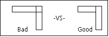 | The way to avoid this is to make sure that where surfaces meet, they don’t overlap on surfaces where the player can see. Don’t overlap two walls at the corner; just neatly join them. |
| --- | --- |

Don’t run a handrail all the way through the wall. Just end it where it touches the wall. The second diagram presents the proper way to connect two brushes at a corner. Luckily, you only need to worry about z-fighting in cases where both surfaces are visible to the player. However, surfaces that the player can never see should always be removed to save on file size and memory. Processor will no longer remove them automatically.

### T—Junctions

A t-junction is anywhere that one polygon has a vertex touching the edge of another polygon without a vertex at the same location, like the one circled in the figure below.

>

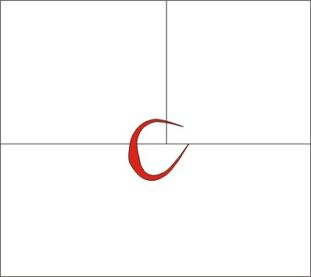

As you can see in the figure below, the red and yellow polygons each have a vertex in the middle of the adjoining edge of the green one, which does not have a vertex there.

>

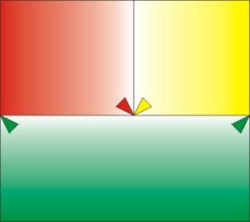

To remove the t-junction, you'd add a vertex there, as indicated in the figure below by the purple arrow.

>

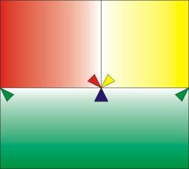

Without fixing the t-junction, what happens is that any time there's a rounding difference when the polygons are rendered, the red and yellow polygons stick together because of their vertices being at the same spot. As a result, there's never a gap drawn between the red and yellow polygons. The green guy, however, can't bend there due to the lack of a vert, and you get a gap as shown in the following figure.

>

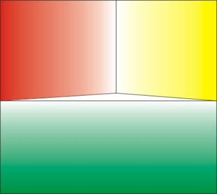

If you add a vertex at that spot (as is done in the figure below) or split the green polygon at that point, then all three polygons can flex around and stay together.

>

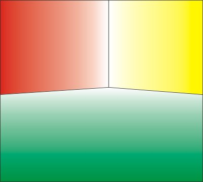

The way that you solve this is by avoiding long brushes with smaller brushes stacked on top of them. In the case of terrain, make sure you insert extra vertices and re-triangulate or otherwise make sure that the face stays planar. Fix T-junctions and the console command are fallbacks for cases where you either couldn't or didn't know how to build without Ts when you first made the level; they can't always stop the problem, unfortunately. The best method is prevention.

[Top ](#top)

---

Touchdown Entertainment, Inc. [Send feedback regarding this page. ](mailto:support@touchdownentertainment.com?subject=JupiterDevGuide Feedback: Dedit\Brushes.md)2006, All Rights Reserved.
