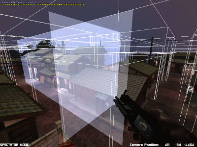

| ### Content Guide |  |
| --- | --- |

# Optimizing Your Level

It’s actually fairly easy to make a gorgeous Notre Dame-scale cathedral in DEdit. Once you know the basic controls, you can pretty quickly lay out the brushes, apply the textures and add in the lighting necessary to make such a structure. However, it is also extremely easy to build a level that:

- Will not compile
- Will take far too long to compile
- Will run poorly in the game even after a full optimization

This is truly where the science of level design begins to take a back seat to the art. Though there are some basic rules and a lot of guidelines to optimizing levels, the best way to learn good optimization techniques is to experiment and to carefully observe the results you get inside your levels. You must think about optimization right from the moment when you first begin designing your level, and you must watch the performance of your level every step of the way as you build.

Unlike any other computer art product, computer games are rendered in real time, and this restricts you substantially in what you can get away with in your levels. This section contains the following topics related to optimizing your level for the best compiling, rendering, and run times:

- [Polygon Counts ](#PolygonCounts)
- [Measuring Polgyon Counts ](#MeasuringPolgyonCounts)
- [Lightmapping ](#Lightmapping)
- [Complex Geometry ](#ComplexGeometry)
- [Large Levels ](#LargeLevels)
- [Efficient Visibility ](#EfficientVisibility)
- [Blocking Visibility ](#BlockingVisibility)
- [Visibility Control Strategy ](#VisibilityControlStrategy)
- [Wireframe ](#Wireframe)
- [Overdraw ](#Overdraw)
- [Texture Concerns ](#TextureConcerns)
- [Simulation Object Concerns ](#SimulationObjectConcerns)
- [Optimization Warning Signs ](#OptimizationWarningSigns)

---

## Polygon Counts

Levels can become bogged down for a number of reasons. The first of these is high polygon counts in a scene. Even a simple empty room that has only walls, floor and ceiling can be made up of several hundred polygons. In order to apply lighting and tune the level’s performance, the brushes that you specify inside DEdit are broken down, juggled around and reshaped by the Processor as it builds the in-game .DAT file out of your .LTA file. As mentioned above, this process is one of the reasons why you can’t edit a .DAT file in DEdit.

[Top ](#top)

---

## Measuring Polgyon Counts

To measure the polygon counts in your game, you use the ShowPolyCounts console command. As a general guideline, the game designers for TO2 kept multiplayer levels to around 30,000 polygons/scene in general on multiplayer levels and 40,000 or so for single-player levels where frame rate was not as vital. It’s important to perform some tests of your own on your target platform to develop your own standards.

[Top ](#top)

---

## Lightmapping

Lighting a level via lightmapping requires that large brushes be broken down into smaller chunks. It is also useful to subdivide brushes for Gouraud lighting as well, since more vertices lead to greater Gouraud detail. This usually happens along texture boundaries. Thus, if you have a large room with a 64x64 floor texture, the floor may be broken up into dozens of 64x64 chunks when in the editor it is shown as a single brush. The reason this is done is to create the lightmap textures and extra vertices for Gouraud lighting. In some very large rooms it can add significantly to the area’s polygon count. It’s important to take that overhead into account.

There are ways to reduce this overhead. The LMGridSize parameter listed in the WorldInfo string section describes how you can scale up your lighting splits in order to reduce the number of polygons created, which can lead to a decent savings in poly counts for large rooms. You can also control the LMGridSize for individual brushes with the LMGridSize property in a brush’s LightControl dialog. Gouraud lighting can require fewer extra polygons in areas where the light is relatively uniform, but may require many more in areas of high contrast.

[Top ](#top)

---

## Complex Geometry

The second cause of high counts is complexity. It’s very hard to resist the urge to put every detail into your geometry instead of using textures to create detail. However, it is much more expensive to add detail using geometry than it is to imply detail through tricks of the eye, lighting and texturing. Avoid nonfunctional detail that can be added through textures like molding/trim, curlicues, grooves and bumpy surfaces. A level designer’s art is figuring out how to imply detail. Ask your texture artists to build a grooved surface or the face of a curlicued building ledge, and then apply that texture to a simple flat surface. Use as few sides as you can get away with on your columns and carefully consider how to build each shape with the fewest polygons.

[Top ](#top)

---

## Large Levels

Each polygon in a level must be stored in the .LTA and .DAT file. That means each polygon takes up space, both in memory and on disk. Polygons take up less space than they did in previous versions of LithTech, but since the number of polygons per level has increased more than ten times, your levels must be smaller than in previous SDKs. Alternately, you can reduce the polygon density of your levels back to that of the previous SDKs and create larger levels. Doing this, you could have a level that was larger than levels in previous versions, but the level’s polygon counts per scene would be at the level of the older SDKs.

If you wish to take full advantage of the higher polygon densities available in Jupiter, you should expect to make levels about one quarter the size of the levels in older SDKs. This will ensure that your levels will fit within the memory of average machines, and that the data sets will be simple and easy for the engine to traverse.

You should also remove any polygons that won’t be visible to the player. In previous versions, LithTech Processor would automatically remove hidden faces via CSG, but this operation was the main reason for the limitations on concave brushes in that version. In Jupiter, you should build more in the way you might build in an external 3D package: Make the level a shell, with only faces that point inward towards the player actually attached. Also, you should try to avoid useless detail that can be better expressed in the texture or do not contribute to the level’s functions or lighting. Useless polygons do nothing but reduce performance.

[Top ](#top)

---

## Efficient Visibility

The computer and the player see the level in different ways. The player can’t see anything that’s behind a solid wall or any solid surface. However, the computer always looks just a little bit ahead and pre-draws some objects that may not yet be visible to the player. This is because of the sorting mechanism used by the system to generate the list of visible polygons.

A problem area usually comes in the form of other rooms that add to the poly counts in the current areas. Sometimes the increase in counts makes very little sense. You can have a very small room without any real detail such as an entryway with the polygon counts of a much larger, more detailed room. If you look around in a room like this, you can almost always find a hallway or other hole into another more detailed room.

[Top ](#top)

---

## Blocking Visibility

Visibility in Jupiter is very different from visibility in previous versions of LithTech. Jupiter supports very high numbers of polygons, but you must still do some visibility control work. Whereas in previous engine versions visibility control needed to be extremely tight, in Jupiter, world polygons are one of the cheapest things to render. Although it is still valuable to do visibility control, the preferred method in Jupiter is to control visibility in much larger, simpler chunks with as few visibility blockers as is possible to reduce the overhead of sorting.

By default, nothing in your level will block line of sight in Jupiter. You must manually establish visibility blockers known as Occluders. In Jupiter, an Occluder is a one-sided polygon that blocks the player’s line of sight. Models and groups of brushes on the far side of the occluder will not be drawn. Once the player moves around the occluder, they become visible. Skyportals aren’t blocked by the occluders, so your player will still have something to look at if you build an occluder outdoors.

You can turn any brush into an occluder by changing its Type property to Occluder. Since occluders are visibility structures, you should keep them as simple as possible. Make your occluders single-sided to eliminate unneeded cuts. The occluder will still block from either side if it’s one-sided. You can insert occluders in between the floors of buildings, at the tops of ridges, or in walls of a large building.

Just remember, simpler is often better. Occluders should be large, broad and few in number. Many TO2 levels have only 12 occluders. Some have none at all. If you have a level where the player will only dip behind occluders on rare occasions, it may not be worth having them. In these cases, just control the polygon counts in the area directly by simplifying objects or redesigning areas.

Objects will only be hidden by an occluder if they are completely behind it. In the case of brush polygons, brushes are grouped together by Processor into collections called render blocks. Each block renders as a group: either all its polygons are visible or none of them are. If one corner of the block is visible, then the whole block will draw. Once all the brushes in a block are behind the occluder, it will cease to draw. Another important thing to be aware of is that the player’s viewing angle affects what the occluder will block. The occluder and the player’s view form a frustum that determines what can be seen behind the occluder. The further away from the occluder the player stands, the less the occluder will block.

The screen capture below shows a scene from TO2 in which wire boxes indicate the render blocks. The white panels are occluders.

>

If two occluders touch, they operate cumulatively. In other words, if a render block is partly behind Occluder A and partly behind Occluder B, the block will not be rendered as long as A and B are between the player and the render block. This is true even if the two occluders are of different sizes or heights, as long as they’re both tall enough to conceal the render block.

You should design your levels with occluders in mind. Make sure that the occluders can be placed where a player won’t notice parts of the world flashing in and out of view. Try to make areas where the player will need the highest frame rates (boss battles, multiplayer arenas) lower in detail. Avoid very long fields of view through detailed settings, or make sure that you plan carefully to keep the total polygon counts in these areas under control.

[Top ](#top)

---

## Visibility Control Strategy

In Jupiter, it’s generally better to keep visibility controls simple rather than making them complex. The Jupiter engine does better when it has a shorter list of visibility blockers to run through. Since the occluders work on groups of brushes and checks their corners, it’s best to place most of your occluders aligned to the grid. Unlike hullmakers in older LithTech SDKs, which created a portal between areas, occluders simply block. Angling them generally reduces the amount of surface area they present to the player, lessening their effectiveness. Further, if you angle the occluders, they will slice into render blocks in order to ensure that blocks never lie halfway across an occluder. This creates extra render blocks, leading to decreased performance. In some cases, this can create a really large number of extra render blocks.

A render block of world polygons always includes 2,000 polygons. Processor splits the level in half, then checks to see if either half is 2,000 or fewer polygons. If a half is not, it is split again. The splits continue until every block contains only 2,000 polygons. If there are less that 2,000 polygons left for the last block, the remaining polygons will all be stored in the last render block. However, since Worldmodels and models can move independently, each Worldmodel or model object forms its own discrete render block, regardless of its polygon counts. Keeping the total number of render blocks low is important to good performance, so you should try to avoid creating extra models or worldmodels when you don’t need them.

If you need to prototype the visibility structure of a level, you must make sure that you add polygons to the level that approximate the counts and locations of the polygons you expect in the final level. This is again due to the 2,000-polygon threshold for render blocks. If there are too few polygons in the level, it may be reduced down to a single render block. As a result, you will not be able to learn much about how the level’s counts will behave in the final level.

[Top ](#top)

---

## Wireframe

The easiest way to watch this process is to use the Wireframe console command. It switches your view to a wireframe view of the level. Since all brushes are transparent in wireframe view, you can see right through a wall into rooms on the other side. This means you can also see what brushes are being drawn in rooms other than the one you are in. Though it takes some getting used to, this mode makes it possible to figure out exactly when and where the view of a room or object is cut off, making it extremely useful when you want to check your visibility blocks.

[Top ](#top)

---

## Overdraw

Another concern is a factor called overdraw, which is the number of polygons drawn on screen that are actually out of the player’s view behind other polygons. This is related closely to the visibility optimizations referred to previously. You can often find high levels of overdraw in rooms with lots of detail: columns, low walls, complex fixtures and cracks can all lead to overdrawing. Overdraw in a scene is measured using the ShowFillInfo console command. In the development of the game Shogo, for instance, values of 2-3 here were considered acceptable and values of 4-6 were danger signs. Once again, testing on your target platform to obtain figures for your own game would be wise.

[Top ](#top)

---

## Texture Concerns

Besides geometry-related factors that may slow down your game when it’s running, you can also get significant slowdowns if you use too many textures or several overlarge textures in a scene. Even in the age of AGP, if you use a 512x512 texture for everything from tiles on the bathroom floor to murals to the nameplate on a door, the game will run more slowly. As with many problems, this is best addressed in the design stages rather than in the testing stage.

You should try to resist the urge to use the largest texture possible and instead work to find a balance between a texture that looks good and is small in size. Objects that won’t get much scrutiny like floor/ceiling tiles, wall-to-wall carpets and grass should usually be given small textures. Objects that the player will focus on (view screens with data, pictures, signs) can use higher-resolution textures.

[Top ](#top)

---

## Simulation Object Concerns

Simulation objects can also affect game performance. If you build a huge particle fountain that creates 1000 particles every second with a decay time of 10 seconds on each particle, the engine is going to be very busy keeping track of the particles. Likewise, large, moving objects such as props made from WorldModels can slow the engine down as it tries to manage their physics.

Character models and AI can also affect frame rate. A level that runs fine with just the player on it can bog down seriously when two very intelligent AI enemies are added to it. Likewise, a Boss character with thousands of polies in her character model will slow the engine much more than a minor character with just a few hundred.

Be careful how you code, design and place your AI. Also, be sure to test the results to make sure you haven’t stressed the system too much. The ShowTickCounts command gives useful information for figuring out these sorts of generalized issues by listing what portion of the engine’s time is spent in what area, be it rendering, sound or game code.

[Top ](#top)

---

## Optimization Warning Signs

As mentioned before, optimization is more art than science, and it takes practice. The warning signs of trouble you should always heed are low frame rates, high polygon counts in a scene, and sudden jumps in the length of time it takes to process your level. Any of these should make you take notice. Immediately backtrack and figure out what has caused the issue.

Even if you don’t do anything to correct it at the time, performance issues are almost always easier to fix if they’re identified early. It is heartbreaking to have to discard a level that is completed but completely unworkable, and you will do so if you don’t pay careful attention to optimization throughout the construction process.

[Top ](#top)

---

Touchdown Entertainment, Inc. [Send feedback regarding this page. ](mailto:support@touchdownentertainment.com?subject=JupiterDevGuide Feedback: Dedit\OptLvl.md)2006, All Rights Reserved.
