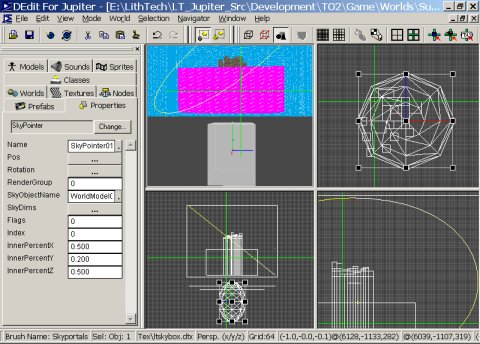
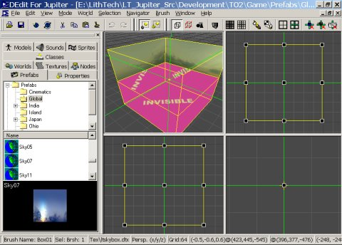

| ### Content Guide |  |
| --- | --- |

# —TUTORIAL—
Adding Sky to Your Level

This tutorial describes how to add sky to your Jupiter level, either using the prefabs or creating a sky using TO2 resources (textures, prefabs). It includes a sample level which you can study in order to see a complicated working skybox. You can locate the Tut_Skybox.LTC sample level in the following directory:

>

\Development\TO2\Game\Worlds\RetailSinglePlayer\

This section contains the following topics related to adding sky to a level:

- [Adding SkyPortals ](#AddSomeSkyPortals)
- [Adding SkyPortal Brushes ](#AddingSkyPortalbrushes)
- [Adding Clouds ](#_Toc534778186)
- [Moving Clouds ](#_Toc534778187)
- [Index Ordering Multiple Sky Objects ](#_Toc534778189)
- [Adding Fog ](#_Toc534778190)

---

## Adding SkyPortals

Before you can add a sky to your level, you must first add some SkyPortals. SkyPortals are brushes that tell the renderer where the player will see the sky. These are simple to set up.

1. Add brushes in your level where the sky is to be rendered.
2. Assign the Sky texture to the brushes to make them easy to recognize in DEdit.
3. Set the Type property of the brushes to SkyPortal.
4. Make sure to turn off lighting features such as lightmapping on the brushes, since they will not be lit.

In the case of a level that is largely or completely open and outdoors, you can just build your skyportals as a box that surrounds your entire level. Make sure that the box's faces point inward so that the sky is visible inside the level. If you are making a level that is mostly indoors, where the sky is only visible in a few places, then you may want to make your SkyPortal brushes out of several smaller brushes fitted into the windows or other areas where your players will want to see the sky.

>

---

## Adding Skybox Brushes

The part of your level's sky that your players will actually see is called the Skybox. There are three ways you can create a skybox: using a prefab sky from TO2, creating a new sky using TO2 textures, or creating and applying your own textures. The following topics describe how to create a Skybox using each of these methods.

### Using a Prefab Sky from TO2

With the TO2 prefabs (located in the \Development\TO2\Game\Prefabs\ folder) you can use a sky from TO2 by simply double-clicking on the description of the Prefab type in the Prefabs tab.

Under the Japan directory in the Prefab tab's list you will find a selection of prefabs for the Japanese sections of TO2. This includes two sky prefabs.

These simple skies are composed of either a hollow sphere or a cube whose inside is textured to look like a sky-filled room. You can also do this with a cube by using six textures, one for each face. Such sphere- or cube-shaped skies are the most common types of sky in use. When using a simple sky it is best to check your WorldProperties object's FogInfo properties and make sure SkyFogEnable is set to FALSE. This property turns on and off the z-fog in the skybox.

Complex sky types often require SkyFogEnable set to TRUE in order for the sky to look right. Most skies work well with a SkyFogNearZ value between 0 and -256 and a SkyFogFarZ value between 256 and 800, depending on the sky used. Experiment with the SkyFog color values to find an appropriate color to the sky. Note that the SkyFog variables are all console variables, which means that you can change them in the game until they look correct, then enter those same values in DEdit. Refer to the sample maps for reference.

Once you place your sky prefab, make sure to move the prefab to the outside of your level. A good place for the sky prefab is underneath the level, so that the actual geometry won't show through the skyportals like a box hanging in the sky. (See the screen capture on the following page.)

>

### Creating a New Sky Using TO2 Textures

You can create the same skies manually without using the prefabs. Here's how to create the simple skybox (See the screen capture on the following page.):

1. Build a hollow box or sphere out of the view of the level. A good place is underneath the level, so that the actual geometry won't show through the skyportals as mentioned before. Make sure it is large enough to give you good working room (512x512x512 is a decent size).
2. Set the AmbientLight value in the Light property to white.
3. Set the lighting features such as lightmapping on the brushes to FALSE, since these brushes will be lit by their Ambient value.

>

4. With the box geometry ready, place the crosshairs in the center of the box and bind all the skybox brushes to a DemoSkyWorldModel.
5. In the Properties tab, set each of the DemoSkyWorldModel’s InnerPercent fields to "0.001" to create a static sky. InnerPercent is used to make your sky move around in proportion to the player movement (parallaxing), which isn’t useful in a simple skybox.
6. Set the SkyDims of the object so that the inner walls of the box are touched by it in each dimension.
Example: for a 512x512x512 cube, set the dimensions to “256 256 256.”
7. Texture the insides of the sky with the appropriate set of sky textures. In the Textures tab, browse for the Sky directory under TexFX. Usually a set of skybox textures for a cube will consist of six different textures, one for each side of the box’s interior. The name's extension depicts the position of the texture like so:

>

blue_bk goes on the back face of the cube.
blue_dn is the bottom face of the cube.
blue_fr is the front.
blue_lf is the left.
blue_rt is to the right.
blue_up is the top face of the cube.

You can create the textures for a cube skybox in Max or Maya as described below and import them into DEdit, or you can use the simple texture JpSky001, a cloud texture, for your test sky.

In the case of a sphere, you usually only need one texture, stretched across the sphere. You can use the texture JpSky001 for the inside of your sphere.

If your level only needs a simple skybox, then you are finished at this point.

### Creating Your Own Skybox Textures

If you plan to use a single tiling texture for your skybox, you can create it as you'd create any other texture. If you want to create cubic skybox textures, typically you will need a 3D package such as Bryce3D, 3DStudio Max or any other 3D package that will allow you to render a 3D scene into the six images needed to accomplish the effect.

As an alternative to 3D, you can use a paint program such as Painter or Photoshop to to paint a sky utilizing a shareware plug-in named Skypaint. Skypaint is a handy tool that aids in setting the correct field of view of the painting and assures that the cubic form of the geometry will not be visible in the perspective of the textures you create.

- For more information on SkyPaint, visit [wasabisoft.com ](http://www.wasabisoft.com/)

### Creating a New Complex Sky Using TO2 Textures

A complex sky goes beyond a static skybox. Your sky can contain more than the skybox object: panning clouds, a sunflare, or sometimes even a keyframed object. Refer to the included sample level **(Tut_Skybox) **for an example of a complex sky.

In order to create a good complex sky, it's best to start with the simple skybox first. Keeping a sealed skybox ensures that players will never see the void of 3D space outside the level, which causes a mirror/shearing effect. Also, the DemoSkyWorldModel object’s center is the sky camera’s reference point. Be aware that any objects added to the sky scene will use the DemoSkyWorldModel's center as a reference, so it’s important to create this object at the center of your sky.

### Enlarging

If you created your own textures for a cube skybox, you will want to re-texture the cube now. Since you'll be adding objects for visual effects, you can replace the six larger textures with a smaller tiling texture, which is more memory efficient. For this example use the simple texture JpSky001, a tiling cloud texture.

1. Open the Texture tab and select JpSky001 from the TexFX\Sky directory.
2. If you need to, resize the skybox to allow more working room now. For a cube, 4096x512x4096 will do well. For a sphere, try 2048x2048x2048.
3. When you resize the geometry make sure the DemoSkyWorldModel object stays in the center, and reset its SkyDims to fit the new sky’s size.

[Top ](#top)

---

## Adding Clouds

Now the stage is ready for other objects to be added to the scene. The first object to make is the clouds object.

1. Add a 4096x64x4096 one-sided brush facing downward about 64 units above the center of the DemoSkyWorldModel object.
2. In Geometry Mode, texture the brush face with a clouds texture with an appropriate alpha mask. For this example, use the texture Clouds2 in the TexFX\Sky directory.
3. Right-click on the textured face and select Map Texture Coordinates and set the U and V fields to 1024. Increasing the scale of the texture will prevent players from noticing that the texture repeats.
4. Bind this brush to a Worldmodel object and set the following brush properties under LightControl:
AmbientLight = White
ReceiveLight = False
5. Make sure the Worldmodel's FogDisable property is set to FALSE, since you want the SkyFog to fade the cloud layer to the horizon.
6. Set the BlendMode property to Translucent. This will make the brushes in the WorldModel translucent according to their texture’s alpha channel.
7. If you wish to increase the translucency of thelayer, you can set the Alpha property to any number less than 1, such as 0.99. The smaller the value, the more translucent the clouds will be.
8. In the WorldModel object’s Name field, enter Clouds1.

| **Note: ** | When working with more than just a DemoSkyWorldModel in your sky scene, it is best to name each object with a descriptive term, such as changing the DemoSkyWorldModel’s name to skybox and the WorldModel to Clouds1. Careful naming makes the next steps a lot easier to deal with. |
| --- | --- |

---

## Moving Clouds

#### To make the clouds to appear to move

1. Select your cloud brush and open the brush Properties tab.
2. In the TextureEffect field, click the Browse button.
3. In the Select Effect Group dialog, click New.
4. In the Edit Effect Group dialog, enter Pan as the name of your effect.
5. Since we want to pan the cloud texture, In the Stage 1 group, set Channel to Base Texture.
6. Click the ... button on the Script field to find a texture script. Browse to the \TextureScripts folder in your \TO2\Game directory. Find the file WSPosXZPan.tfs and select it, then click OK. You should now see some additional properties listed. These are the parameters for the texture script that's going to move your clouds.
7. Set the XSpeed and YSpeed to 0.01.
8. Set the XScale and ZScale to 0.001.
9. Click OK, then click OK again to save the settings and apply the texture effect to your cloud brush.

Now that the skybox and cloud objects are created, you need to set them up to render in the sky.

[Top ](#top)

---

## Index Ordering Multiple Sky Objects

Setting the rendering order of all the sky objects is the most important step in creating a complex sky. This is done using the Index field. Because the DemoSkyWorldmodel is the only WorldModel type with the built-in ability to render in the sky, you must add a SkyPointer object to your sky scene for every other WorldModel object you add after your skybox. If you don’t do this, these objects will not show up in the sky. The SkyPointer object points to the WorldModel and provides the Index value for that WorldModel.

1. Add a SkyPointer for the clouds layer. It is recommended that you place all objects without geometry at the middle of the skybox.
2. Fill in the SkyPointer’s name field with a descriptive term such as Clouds1Skypointer.
3. Enter the name of the Worldmodel you made for your cloud layer (Clouds1) in the SkyObjectName field. This tells the SkyPointer which object to render.
4. Continue adding SkyPointers for each worldmodel object in your scene as described above, with the exception of the DemoSkyWorldmodel bound to your skybox.

Now that there is an Index field provided for each object via the new SkyPointers, you will set the drawing order of all the objects for the sky. Each DemoSkyWorldModel or SkyPointer has an Index property. The objects in the sky are drawn in order of Index, so objects with low values are drawn first, followed by objects with higher values, which are drawn on top of (effectively "nearer to the camera" than) the earlier objects.

1. Open the properties of the DemoSkyWorldModel (your skybox) and check that the Index field is set to 0. This tells Jupiter to render the skybox first.
2. Select the Clouds1SkyPointer and set its Index to 1. Now the game engine knows to draw the Skybox object first, then the clouds layer next, drawing the clouds in front of the sky.
3. Continue adding more objects in your sky as needed, while adding SkyPointers and updating the Index for all the objects. Once you’ve done so, your skybox is complete.

Typical Index settings for a scene are:

- Skybox = 0
- Sun = 1
- Clouds1 = 2
- Clouds 2 = 3
- Trees = 5

[Top ](#top)

---

## Adding Fog

Once the sky is fully functional, you can add fog to hide the edges of the clouds.

#### To Add Fog

1. Go into the WorldProperties object and make sure that FogEnable is set to TRUE.
2. In the FogInfo, set the SkyFogEnable to TRUE.
3. Select white for the FogColor.
4. Set the SkyFogNearZ to 0.
5. Set the SkyFogFarZ to 800.

As an alternative to using fog to fade in the clouds, you can add other objects around the horizon in front of the clouds (such as trees or buildings), just as you added the clouds. If you don't like the appearance of your fog, you can change the fog in the game using the SkyFogNearZ/SkyFogFarZ console commands at runtime. Once you find values for both that you prefer, write them down and change your WorldProperties when you return to DEdit to make the change permanent.

[Top ](#top)

---

Touchdown Entertainment, Inc. [Send feedback regarding this page. ](mailto:support@touchdownentertainment.com?subject=JupiterDevGuide Feedback: Dedit\TAddSky.md)2006, All Rights Reserved.
