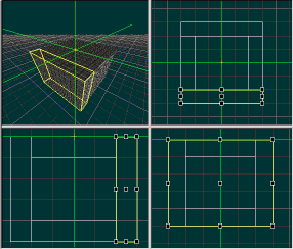

| ### Content Guide |  |
| --- | --- |

# —TUTORIAL—
Building Your First World

This tutorial walks you through the proccess of creating a new world using Jupiter and DEdit. This tutorial contains the following world creation topics:

- [Creating a New World ](#create)
- [Making a Simple Room ](#MakeRoom)
- [Adding Objects ](#AddingObjects)
- [Processing the World ](#ProcessingtheWorld)
- [Testing the World ](#TestingTheWorld)

---

## Creating a New World

The first step we’ll want to follow in building our new world is to pick a project. A project specifies all the resources you’ll have access to in your world, from the game code on up. Generally, you’ll only create or use one project per game. Projects can be modified over time very easily, since they simply consist of a collection of files laid out on disk in a structure that DEdit can recognize.

#### To create a world

1. In DEdit’s File menu select the Open Project command, or press CTRL+O.
2. Navigate to the No One Lives Forever 2 game resource directory in the following location:

\<installation directory>\Development\TO2\Game\

3. Open the TO2.dep file.
TO2.dep is the project’s root file, and contains a variety of different data about the project. .dep files are the only type of file directly opened with DEdit.
4. On the File menu, click New World.
5. When DEdit asks you what to name the world, type Simple1. This is the name your world will have when you open it in DEdit.

| **Note: ** | The name you provide is also the name of the world’s file on your hard drive (for example, Simple1.LTA). |
| --- | --- |

[Top ](#top)

---

## Making a Simple Room

Our first world is going to be very, very simple. We’re going to make a box with a light. If you’re a programmer, this may be as complex of a level as you need to create, since you’ll mainly be making levels only to test your code and not for inclusion in the game itself.

### Choosing a Texture

Even though this level is extremely simple, we’ll still want to texture it. When you select a texture, it will be applied to all brushes that you create in the world. It’s like choosing a font in a word processor. When you select the Arial font, all the text that you enter is Arial until you select a new font.

#### To select a texture

1. Select the Textures tab in the Project Window. This tab is where you select textures to apply to your brushes.
2. In the top section of the Textures tab, there’s a box with folders listed in it. Click on the folder that is called Tex. When you do so, the list box in the middle of the tab should fill up with subfolders that break the textures up into categories and types to make it easier for designers to find the right texture quickly.
3. Navigate to the Japan subfolder and then click on the folder to select it.
4. In the list of textures choose a texture named SFJp006.dtx. Notice that there’s a preview of SFJp006.dtx in the bottom window of the tab. From now on (until you select a different texture) this texture will be applied to every brush you create.

### Using the Viewports

Move your mouse pointer over the upper-right-hand viewport (top view). The green crosshair (also called the marker or the insertion point) operates like the cursor in a word processor:it shows your insertion point. If the viewports are your eyes, then the marker is your hand. We can leave the marker where it is for now, but you’ll learn how to move it around shortly.

>

Camera control is done in DEdit using the I, O and C keys in conjunction with the mouse.

The following table lists a few of the most important key and mouse combinations for moving the camera view.

| #### Press | #### Result |
| --- | --- |
| **I + Mouse ** | In the Perspective View, hold the I key and move the mouse pointer to scroll in the X and Y plane. In all other views, this combination scrolls in all available directions. |
| **I + Left Mouse ** | Same as above, but faster. |
| **I + Right Mouse ** | Scroll along the Y-axis in the Perspective View. |
| **O + Mouse ** | In the Perspective View, hold the O key and move the mouse to pan the camera in all directions. In all other views, this combination zooms in and out of the displayed geometry. |
| **O + Left Mouse Button ** | In the Perspective View, hold the O key and the left mouse button to move or “fly” forward through the level. |
| **O + Right Mouse Button ** | In the Perspective View, hold the O key and the right mouse button to move or “fly” backward through the level. |
| **C + Mouse Button ** | In the Perspective View, hold the C key and move the mouse pointer to adjust the draw distance. |
| **C + Left Mouse Button ** | Same as above, but faster. |

Since we’re zoomed in fairly close to the grid, we should zoom the camera out a little in the viewport so that we can see more of the grid at once.

- Hold down the O key and move your mouse pointer slowly up. You should see the grid in the upper right viewport getting smaller. We’re actually zooming out to see more of our map, not changing the scale of the grid.
- Don’t zoom out farther than you need to in order to see a few more grid squares on the screen (perhaps four or six squares across the screen).
- Your screen may be at a high enough resolution that you can already see six or so grid squares. If that’s the case, play with the camera a little but make sure you come back to a scale of about 4-6 squares across.

### Creating a Floor

First, we’ll place a brush to represent the floor of our room.

1. Press CTRL+B to switch into Brush mode. This is the mode reserved for moving brushes, as well as adding them to the world.
2. From the center of the marker, count up two gridlines and then over to the right by two gridlines. Move your mouse pointer to that intersection in the gridlines.
3. Once you have the mouse over the intersection, press the SPACE key once and move the mouse away. You should now have a line following your mouse pointer. The line you see is the first side of the brush you’re about to create.
4. To continue the brush, move your pointer until it’s over the grid two gridlines below and to the right of the marker and press SPACE again. DEdit drops the vertex on that point and adds a new vertex and side to the brush.
5. Now move the mouse and place another new vertex four grid units to the left of the current vertex.
6. Add your next vertex four units straight up (two units above the green marker).
7. Last, move the mouse pointer back to the vertex you started at.
8. When you press SPACE over the original vertex, DEdit displays a dialog box that asks you to enter the thickness of your brush. Enter a value of 64 and click OK. This completes the creation of the brush.

Your room should now look something like the following image:

>

In the 3D Perspective viewport, you can see that your square has been created and given a height of 64 units. This square will form the floor of our simple room. Each time you create a brush in the editor you will be prompted to give it a thickness. The 64-unit thickness was chosen to make the floor brush easy to find in the editor by eye.

Using relatively large units where possible also helps in other ways: You can more often let the editor align your textures for you if you build to the grid, since typical texture sizes fall along the grid as well. If your textures are mostly 32x32, 16x16, 32x64 and so on, laying textures out becomes a very simple task when you build to the grid. You’ll need to scale things to fit much less often, you can more easily make use of textures that tile together and you can realign a texture much more simply. We’ll talk about that in a later section as well. For now, assume that building to a large grid where possible is a good rule of level design practice.

### Creating a Ceiling

Next, we’re going to use the Copy and Paste feature to create a ceiling for our room.

1. In the Edit menu select the Copy (CTRL+C) command. Now there is a copy of the floor brush on the clipboard.
2. In the Edit menu select Paste (CTRL+V) to paste. If you look in the perspective viewport (the one in the upper left), you should now see the new brush near your original brush.
3. Since the brush isn’t lined up quite as you’d want it for a ceiling, you’ll want to move it around a little. In the Top viewport (upper right), press the O key and click the mouse to zoom out until you can see both brushes.
4. Move the mouse to the black drag handle in the center of the brush. Drag handles can be used to move or to resize the objects they’re attached to. In this case, click the left mouse button and drag the center handle towards the center of our original brush (which should still be the center of the marker as well).
5. When you have the center handle over the marker, your selected brush should be lined up exactly on top of your first brush.
6. Drop the brush there and move your mouse to the bottom right viewport (Front).
7. Use the O key again to zoom the viewport out until you have a good view of the selected brush.
8. Click and drag the center handle of the brush until you’ve moved the brush straight up 4 grid units. Don’t worry if that means dragging the brush out of the visible area. The viewport will scroll up for you when you reach its edge.

Your ceiling is now a good height above your floor, at 192 units. That’s about the height of a tall conference room ceiling in most games.

#### About the FALSE Detail Brush

For reasons that are unimportant, one brush in each of your levels must have its detail property set to FALSE. It should be a brush with a simple shape, and it cannot be concave. Usually, if there’s not a brush in your level that’s cube-shaped, you can just add a 64x64x64 cube somewhere out of sight. We will use the ceiling brush we just created as our non-detail brush.

1. Click on the Properties tab in the Project window.
2. Find the Detail property.
3. Click the Detail property to change it from True to False.

### Creating Walls

Now we need to create four walls.

1. In the Front viewport, hold down the X key and move the mouse upwards a few grid lines. What you should see is that the green marker moves wherever you move your mouse. Since the marker represents the insertion location where new brushes will appear, we’ll need to move it upwards until it reaches our ceiling in order to add our walls. Move the marker until it’s at the same grid line as the top edge of the ceiling brush.
2. Switch back to the Top viewport.

3. Use the O key to zoom out a little further until you can see a few rows of grid around the selected brush.
4. Use the SPACE bar to draw a rectangular brush that’s 1x4 grid squares and runs along the whole right edge of your ceiling brush.
5. When you’re prompted for a thickness, give it a value of 320. That’s a lot thicker than you used for the floor, but there’s a reason. We want this wall to reach all the way from the ceiling to the floor. If you’ll look in the Front view, you’ll see that our new brush does just that, neatly sealing off one side of our room.
6. To make the next wall, copy and paste your new brush.
7. Then use the center drag handle on the pasted brush to move it until it seals the west side of the ceiling brush the same way that your first brush seals the east side.
8. Now we have to make two more walls. Using the SPACE bar to draw a 6x1 320 unit tall rectangle on the north edge of the ceiling brush. By making it 6 grid squares wide, you’ll make a good seal against both the floor/ceiling brushes and also against the two existing wall brushes.

| **Note: ** | Sealing a level is another topic that we’ll cover later. For now, accept that it is important. |
| --- | --- |

9. The last step you’ll need to take making brushes for your level will be to copy your latest brush, paste it and move it to cover the south edge (in the top viewport) of the ceiling brush.

Now would be a good time to save your level again.

Your room now has solid walls, a floor and a ceiling. You’ve created 75 percent of your level. Follow the next set of instructions to add some important objects.

[Top ](#top)

---

## Adding Objects

There are only three objects left that you need to add in order to see your level:

1. A GameStartPoint (which specifies the location where your player will first spawn into the world).
2. A light (without which you won’t be able to see your level).
3. A WorldProperties object (which specifies some of the rudimentary information necessary to create your level).

Perform the following three proecdures to add your start point, lighting, and world properties.

#### To Place the Start Point

1. Switch to the Front viewport so that you can move the marker vertically.
2. Use the X key to move the marker down until it is one grid square above the floor. Since 1 grid square is 64 game units, this ensures that your player won’t accidentally appear halfway into the floor.
3. You should also check the Top viewport and make sure that the marker (if it isn’t still at the very center of the level) is at least 1 grid square from any of the walls.
4. Press CTRL+H to enter Object mode. Object mode is the main mode you use for creating, moving, and setting the properties of objects.
5. While in Object mode, select Add Object from the World menu.
6. In the Objects dialog, the left pane of the dialog lists all the objects that your game code supports. Scroll down the list until you see a GameStartPoint object. Select it and click OK.

Once you’ve done that, look at the center of the marker. The small white square is the newly created start point. Your player can now actually enter the world.

#### To Place the Light

1. Move the marker vertically upward one grid square, using the X key in the Front viewport. Although you could add your light right at the location of the GameStartPoint object, it will be easier to select later if you add it at a different location.
2. In the World menu select Add Object again. This time, go through the list of objects until you find one called Light. Select it and click OK.

Your start point will become unselected, and a small new cube will appear at the center of the marker. You should also notice a bluish circle that surrounds your whole level. That circle represents the radius of the light in the level. The light fades out as it gets further from its center point, and it ends completely at the edge of the blue line. Since you have a small level, one light will illuminate it all without trouble.

#### To Add a WorldProperties Object

1. Use the X key to move your marker forward one grid square in the Top viewport.
2. As before, select Add Object from the World menu, scroll down, select WorldProperties, and select OK.
3. Save your world.

[Top ](#top)

---

## Processing the World

The last step you’ll need to take in preparing your level is to process it.

#### To process your world

1. In the World menu, select Process and you’ll see a large dialog box appear.
2. Make sure that the Import Geometry, Apply Lighting and Full optimization checkboxes are checked. If they aren’t, then check them. You can leave the rest of the checkboxes as they are by default.

>

| **Note: ** | Don’t worry if the Import Geometry box is grayed out. DEdit is just assuring that the option’s turned on, since the level has never been processed before. |
| --- | --- |

1. Under Project Directory, enter the full path to the No One Lives Forever 2 game resource directory ( \Development\TO2\Game\ , for example).
2. Click OK to process the level.

The dialog box will change into a progress monitor and a log of what the Processor’s doing. Once an OK button appears in the dialog, your level has been processed. Your world’s now ready for you to explore.

[Top ](#top)

---

## Testing the World

1. To actually load your level in the game, follow these steps:
2. Click on Edit, and the Options, to bring up the DEdit Properties menu.
3. Click on the Run tab.
4. In the Executable field browse to LithTech.exe.
5. In the Working directory enter the location of the root TO2 directory (\Development\TO2\Game\).
6. In the Program arguments field enter the command string –rez Game +runworld %WorldName%. Note that the WorldName parameter is case-sensitive, so you must capitalize the W and N.
7. Launch your world by clicking World and then Run. Alternately, you can launch the world by pressing CTRL+ALT+R, or by clicking the Run World button on the tool bar.
8. Examine your new level.

[Top ](#top)

---

Touchdown Entertainment, Inc. [Send feedback regarding this page. ](mailto:support@touchdownentertainment.com?subject=JupiterDevGuide Feedback: Dedit\TBldWrld.md)2006, All Rights Reserved.
