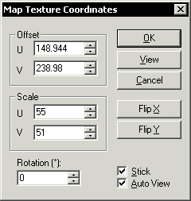
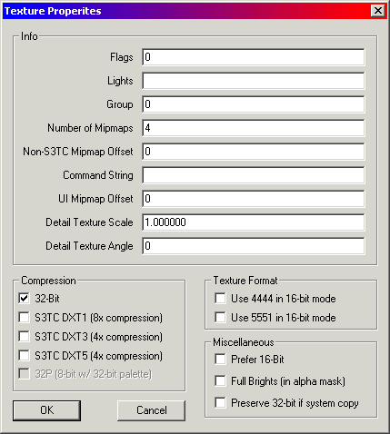

| ### Content Guide |  |
| --- | --- |

# Advanced Texturing

DEdit supports intricate texture work, both on a brush-by-brush level and on a face-by-face level.

This section explains how to scale, rotate, offset and flip textures to line them up and make them appear correctly. This section also includes information about Texture Properties and Attributes.

This section contains the following advanced texturing topics

- [Aligning Textures ](#AligningTextures)
- [Texture Alignment Hotkeys ](#TextureAlignmentHotkeys)
- [Assigning Properties to Textures ](#AssigningPropertiestoTextures)
- [Assigning Attributes to Textures ](#AttachingAttributestoTextures)

---

## Aligning Textures

Even when you follow all the rules of good brush layout and level design, some textures don’t line up where you want them to be when you first apply them. Either the texture’s edges don’t line up with the edges of the brush, the only texture that has the symbol you want on it is too large, or a crate is rotated off the grid and its textures are not.

#### To Modify and Align your Texture

1. In **Brush **mode, select the brush with the texture to edit.
2. Get a good view of the brush in the Perspective viewport, then right-click.
3. In the **Context **menu, select **Map Texture Coordinates **.
The following dialog box appears:

You can use this dialog in either Brush or Geometry mode. In Brush mode, the settings affect all the faces on the brush. In Geometry mode, this same dialog can change each face individually. Instead of selecting the face you want, just highlight it in red by hovering the mouse over it in the Perspective port, then right-click.

The dialog’s controls are mostly intuitive.

### U/V Offset Controls

The U/V offset controls tell you about the alignment of textures on a face. U (horizontal) and V (vertical) offsets are used to move the texture around on the face pixel by pixel. You can apply a negative or positive offset, which allows you to move a texture in any direction along a face. They are especially useful for things like aligning a sign to properly fit the brush you’ve created for it.

For instance, a texture may perfectly fit the brush but hang a little off-center: say, 4 pixels too low and 8 pixels too far to the left. To correct this, you would add to the U and V offsets. Setting the U offset to 8 would move the texture 8 pixels across the face to the right, and setting the V offset to -4 would move the texture up 4 pixels on the face.

This isn’t something you want to use for all of your textures. It’s much better to build such that the bulk of your textures fall naturally along brush boundaries so that you don’t even need to think about texture alignment on most of your brushes. It’s meant to be used for detailed, standout objects like crates, signs and display screens which are often set at odd locations and need to be exactly aligned.

### Rotation Control

The next control, the Rotation control is what you use to align a texture on a brush that’s been rotated. Perhaps you’ve made a poster that’s hanging on a wall at a slightly weird angle of 17 degrees to make the room look a little unkempt. By applying a 17-degree rotation to the texture of the poster, you can get the poster to look as it should, properly lined up on the brush.

### U and V Scaling Controls

The next controls are the U and V scaling controls. By default, these are each set to the horizontal and vertical size of the texture on the current face in pixels. However, by changing these values you can change the size of a texture in the world. By modifying just one of them (say, doubling the value in the U scale) you can stretch the texture. By doubling both of them, you quadruple the size of the texture on the brush. Lastly, you can flip a texture without rotating it by putting a negative value into either of these boxes. There are many cases where mirroring a texture can be useful: aligning trims on a wall, building a fake mirror image of a screen, and giving a clue to a secret door. The dialog also has two Flip buttons that allow you to do the same thing.

Finally, there are two check boxes. When you check the Stick checkbox, DEdit will attempt to hold the textures aligned to the brush’s faces as they currently are. This allows you to move the brush around without the texture sliding around on the face. DEdit will try to automatically update the textures’ offsets and even rotation to keep the faces. Although DEdit doesn’t always make the right choices, for simple moves and simple rotations it can be faster than doing the math yourself.

The XZ Only checkbox is used to force textures to map on the brush from straight above it. It’s generally only used for terrain, to make it easier to align textures. You can experiment with it, but it generally causes undesirable results on anything but terrain.

[Top ](#top)

---

## Texture Alignment Hotkeys

There are also some texture alignment hotkeys that allow you to do some of these operations without going into the dialog.

The **K **key rotates the texture on a face in Geometry mode, attempting to align it accurately with the corners of the brush. It’s frequently faster than going into the Map Texture Coordinates dialog for simple problems like our sign problem above.

The other useful shortcut (also used in Geometry Mode) is the **R **key. When this key is held down, moving the mouse will move the texture around on the face of the brush. It is difficult to exactly align a texture using this shortcut, but it can be very helpful for getting the texture roughly aligned. You can then use the Map Texture Coordinates dialog to clean up the result, cleaning up the UV offsets to exactly fit.

You can also hold **R **and click the right mouse button to rotate textures freehand. Holding **SHIFT+R **changes from totally freehand rotation to rotating in 15-degree increments. Holding **R **while clicking with the left mouse button allows you to scale the texture freehand.

[Top ](#top)

---

## Assigning Properties to Textures

Each texture in the game has certain properties attached to it. Texture properties are global, and they effect each and every instance of a texture. For example, if you set the alpharef Command String for a texture to 100, then all instances of that texture in your game have an alpharef of 100.

#### To assign properties to a texture

1. Click the **Textures **tab.
2. Double-click a texture name. The **Texture Properties **dialog box appears.

3. Enter the appropriate property values and selections, then click **OK **.

[Top ](#top)

---

## Assigning Attributes to Textures

You can attach attributes to a texture using the **Flags **property in the **Texture Properties **dialog box. To access the **Texture Properties **dialog box, double-click any texture in the **Texture **tab.

The **Flags **property specifies the attributes for a texture. Texture attributes are defined in the surface.txt file. For more information about attributes, see [Working With Attributes ](../ProgGuid/Prog/Attrib/Attribs.md)in the [Programming Guide ](../ProgGuid/mPG.md).

Attributes you can associate with a texture using TO2 game code include:

- ShowsMark (Integer)
- ShowBreath (Integer)
- CanSeeThrough (Integer)
- CanShootThrough (Integer)
- MaxShootThroughPerturb (Integer)
- MaxShootThroughThickness (Integer)
- BulletHoleSpr (String)
- BulletHoleMinScale (Float)
- BulletHoleMaxScale (Float)
- BulletRangeDampen (Float)
- BulletDamageDampen (Float)
- BulletImpactSnd1-2 (String)
- ProjectileImpactSnd1-2 (String)
- MeleeImpactSnd1-2 (String)
- ShellImpactSnd1 (String)
- ShellSndRadius (Float)
- GrenadeImpactSnd1 (String)
- GrenadeSndRadius (Float)
- RtFootPrintSpr (String)
- LtFootPrintSpr (String)
- FootPrintLifetime (Float)
- FootPrintScale (Vector)
- RtFootSnd1-2 (String)
- LtFootSnd1-2 (String)
- SnowmobileSnd1-2 (String)
- BodyFallSnd (String)
- BodyFallSndRadius (Float)
- BodyLedgeFallSnd (String)
- BodyLedgeFallSndRadius (Float)
- ActivationSnd (String)
- ActivationSndRadius (Float)
- DeathNoiseMod (Float)
- MoveNoiseMod (Float)
- ImpactNoiseMod (Float)
- Hardness (Float)
- SnowmobileVelMult (Float)
- Magnetic (Integer)
- ImpactFXName (string) (OPTIONAL)
- UWImpactFXName (string) (OPTIONAL)
- ExitFXName (string) (OPTIONAL)
- UWExitFXName (string) (OPTIONAL)
- SnowmobileImpactFXName (String) (OPTIONAL)

To associate a set of attributes with a texture, place a value in the **Flag **property for that texture. You can specify any Flag number between 0 and 256. Each flag number corresponds to an ID in the surface.txt file. Each ID contains values that specify how a texture functions in the game. The following custom IDs designate textures used in the TO2 game code supplied with Jupiter:

>

8 = Electronics (computers, machines, with activation sound)
9 = Chainlink Fence (masked metal, shoot through)
10 = Ceramic Tile (Stone tile, cut stone, louder footsteps than cement)
11 = Cement (you can walk quietly on it compared to ceramic tile)
12 = Plaster & Stucco (flakier and more powderlike debris than other stones)
13 = Porcelain (For vases,porcelain lamp bases, tiolets, urinals, sinks, etc)
20 = Metal
21 = Tin (corrugated metal,light metal, can shoot through, different impact)
23 = trussing (masked metal like chainlink, but with different impacts/sound)
24 = Metal Pipe, Water
30 = Wood
31 = Drywall (a powdery wood/stone impact, can shoot through)
32 = Plywood, thin wood (can shoot through, different sound, impactfx)
40 = Glass
41 = Bullet-Proof Glass
42 = Glass Facade (can't see through, but shows glass impacts)
50 = India Spices
51 = Sake Jug (water spout)
52 = trashbag
53 = paper
54 = generic debris impact
55 = Muck (slime)
69 = Terrain: Ice
70 = Terrain: Dirt
71 = Terrain: Snow
72 = Terrain: Mud
73 = Terrain: Grass
74 = Terrain: Dirt Road
75 = Terrain: Rock, gravel
76 = Terrain: Slushy, slushy Road
77 = Foliage
78 = Terrain: Snowy Gravel
79 = Terrain: Snowy Dirt
80 = Carpet
81 = Cloth (can shoot through)
90 = Linoleum (like ceramic tile but plastic)
91 = Rubber (like linoleum, only more rubbery)
100 = Wood Door (with activation sound, can shoot through)
101 = Metal Door (with activation sound)
102 = stone Door (with activation sound)
103 = Metal File Cabinet (with activation sound)
205 = Force Field ()

[Top ](#top)

---

Touchdown Entertainment, Inc. [Send feedback regarding this page. ](mailto:support@touchdownentertainment.com?subject=JupiterDevGuide Feedback: Dedit\TextrAln.md)2006, All Rights Reserved.
