| ### Content Guide |  |
| --- | --- |

# Working With Brushes

This section explains how to draw and manipulate brushes in DEdit. Brushes are three dimensional polygons inserted directly into DEdit when you are creating a level. You cannot deform brushes, but you can programmatically (throuh code) move and/or rotate them. This makes brushes ideal for static objects such as buildings, streets, walls, and the basic content of your world. Brushes are also used to create zones, or areas, in your game that trigger specific events coded by your developers.

All brushes have properties controlling various aspects of how they appear and function in your game. For more information about brush propertes, see [Working With Properties ](../WProprts/mProprts.md).

All brushes can accept textures. For more information about textures, see [Working With Textures ](../WTextrz/mTextrz.md).

This section contains the following brush topics and procedures:

- [About Grid Spacing ](#AboutGridSpacing)
- [About Brush Editing ](#AboutBrushEditing)
- [About Brush Properties ](#AboutBrushProperties)
- [Drawing a Brush ](#DrawingaBrush)
- [Inserting a Brush Primitive ](#InsertingaPrimitiveBrush)
- [Sizing a Brush ](#SizingaBrush)
- [Moving a Brush ](#MovingaBrush)
- [Carving a Brush ](#CarvingaBrush)
- [Hollowing a Brush ](#InsertingaPrimitiveBrush)
- [Splitting a Brush ](#SplittingaBrush)
- [Rotating a Brush ](#RotatingaBrush)
- [Grouping Brushes ](#GroupingBrushes)
- [Setting Normal Visibility ](#SettingNormalVisibility)

---

## About Grid Spacing
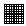

When you draw a brush, DEdit asks you for a brush thickness. The thickness of brushes is controlled in game units. Game units are equal to one square of the grid when the grid size is set to one. Changing your grid size does not effect game units, so if your grid size is set to sixteen, and you insert a brush with a thickness of eight, the thickness of the brush will appear to be half of one grid square even though it is actually eight game units thick. If you change your grid size back to one, you will see that the brush has a width of eight grid squares (although it may not be aligned with the grid).

The image below illustrates how grid spacing varies depending on your current grid spacing. Note that the grid color has been changed to green for the purpose of this illustration.

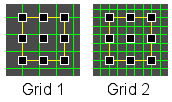

In the image above, a cube was drawn with grid spacing set at two (Grid 2). Then the grid was resized to grid spacing one (Grid 1). You can see that the edges of the polygon no longer all reside on the grid. When you size polygons by dragging the size handles, they automatically snap to the current gridlines. Because of this snapping, you may wish to set your grid spacing before sizing in order to ensure you are able to size your polygons correctly.

#### To change grid spacing

- With your mouse in the desired view, press the **+ **or **- **key on the **numeric keypad **.

>

**Plus **increases grid spacing (for less detailed brushes).

**Minus **decreases grid spacing (for more detailed brushes).

Alternatively you can click the **Grid Shrink **

or **Expand Grid **

buttons.

---

## About Brush Editing
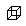

To edit an entire brush (not just the vertices or faces) you must be in brush editing mode. Brush editing mode allows you to move, delete, and resize entire brushes. Any operation you apply to a brush in brush editing mode get applied to the entire brush. For example, if you apply a texture to a brush selected in brush editing mode, all of the faces of the brush recieve the texture. For information about editing individual faces and vertices, see [Working With Geometry ](../WGeom/mGeom.md).

#### To enter Brush Edit mode.

- Press **CTRL + B **at any time to enter **Brush Edit **mode.
- Alternatively, you can also press the **Brush Edit **

button.

>

**Note: **All procedures in this section assume you are in Brush Edit mode.

[Top ](#top)

---

## About Brush Properties

All objects in DEdit have properties, and brushes are no exception. Brushes have very important property settings that allow you to alter the way the brush gets rendered in your world. For additional information about brush properties, click the property name in the **Properties **tab for the desired brush.

#### To alter brush properties

1. Select the desired brush.
2. In the **Project Window **, click the **Properties **tab.

The following list explains some of the more common brush properties:

>

**Name— **Allows you to change the name of your brush. The name you specify also appears in the Nodes tab, so is usefull in identifying important brushes.

**Type— **Specfies the behavior of the brush. Normal is the default type.

**Lighting— **Specifies the type of lighting applied to the brush.

**NotAStep— **If True, specifies that this brush cannot be used by the character as a stair step.

**Detail— **If True, specifies that the brush is used for world geometry. All worlds must have one, and only one, detail brush set to false.

**Light Control— **Sets the following options controlling how the brush deals with light:

>

**AmbientLight— **Specifies the color and intensity of light added to the brush during the lighting phase. All surfaces of the brush not light by external light get set to AmbientLight. Darkness on the surface of the brush cannot drop below the ambient light setting.

**RecieveLight— **Specifies if the brush will accept light, or only use ambient lighting. If False, then the AmbientLight value gets applied evenly over the entire surface of the brush (causing a glowing or dimming effect depending on the surrounding environment).

**RecieveShadows— **Determines if this brush can have shadows cast on it by other brushes. If False, the surface of the brush ignores shadows and accepts light as if the surrounding brushes are transparent.

**RecieveSunlight— **Specifies if the brush can recieve sunlight from the skybox.

**TextureEffect— **For dynamic movement of textures, these effects are typically determined by a *.TFG file containing a script that controls the animation of the texture.

[Top ](#top)

---

## Drawing a Brush

You can draw a brush in any view except perspective view. The **mouse **controls the brush vertex insertion point, and the **space bar **inserts a vertex at the current mouse position.

#### To draw a brush

1. Press **CTRL + B **to switch into **Brush **mode. Brush mode is reserved for moving and adding brushes to the world.
2. In the **Top **, **Front **, or **Left **view, move your mouse to a grid intersection, and press the **Space ****Bar **.
3. Repeat the previous step until you have created a geometric shap ending at your starting point.

>

**Note: **If the color of the lines changes to violet, your brush has a concave face. If the color of the lines changes to red, then you have crossed your lines and your brush is invalid. Concave faces can be corrected by [splitting ](#SplittingaBrush), but invalid brushes always appear incorrectly in games. You should always avoid invalid brushes, and avoid or correct concave brushes.

| 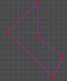 | 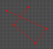 |
| --- | --- |
| **Concave Brush ** | **Invalid Brush ** |

4. In the **Enter Brush Thickness **dialog box, type the thickness of your brush in game units. For more information about game units, see [About Grid Spacing ](#AboutGridSpacing).

---

## Inserting a Brush Primitive

Primitives are simply ready-made geometric brushes that you can insert into your world and manipulate. DEdit can insert five types of primitives: **box **, **cylinder **, **pyramid **, **sphere **and **dome **. Primitives always insert at the marker current marker (set the marker using the **X **key).

#### To insert a brush primitive

1. In the **Top **, **Front **, or **Left **view, move your mouse to the location you wish to insert your primitive and press the X key. This places the marker at the selected grid location.
2. On the **Brush **menu, move to **Add Primitive **, and then click the brush primitive you wish to add.
3. In the **Primitive **dialog box, enter the geometry options for your primitive.
4. Click **OK **.

[Top ](#top)

---

## Sizing a Brush

You can change the size of any brush drawn in DEdit by left-clicking and dragging the sizing handles. When you resize brushes, they automatically snap the the current gridlines. The direction the brush gets resized depends on the **Top **, **Front **, and **Left **view you use during the resizing operation.

#### To resize a brush

1. In the view containing the direction you wish to resize the brush, click the brush to select it.
2. Press the **+ **or **- **keys (on the **numeric keybad **) to increase or decrease the grid spacing. This controls the increments you can resize the brush.
3. Click and drag the **sizing handle **on the side of the brush you wish to change.

[Top ](#top)

---

## Moving a Brush

You can move any selected brush (or group of brushes) to any location in your world by clicking and dragging the brush.

#### To move a brush

1. In any view, click the brush you wish to move.

| **Note: ** | Press CTRL + G to group brushes if you wish to move multiple brushes simultaneously. Press and hold the D key during the move operation to move a duplicate of the selected brush without changing the original brush. |
| --- | --- |

1. In the view you wish to move the brush, click and drag the **center handle **of the brush to the new location. The view you move your brush in controls the X,Y, and Z position of the brush's movement.
2. Press **U **to deselect the brush.

[Top ](#top)

---

## Carving a Brush

Carving requires two brushes: a brush to carve, and a brush to carve with. When you perform a carving operation, DEdit removes the portion of the brushes overlapping the selected brush.

| **Note: ** | Carving is often avoided because it requires DEdit to determine the new geometry of the carved brushes, and may result in T junctions (vertices connecting to faces). |
| --- | --- |

#### To carve a brush

1. Select or [draw ](#DrawingaBrush)the brush you wish to use for carving.
2. [Move ](#MovingaBrush)the carving brush to overlap the brush you wish to carve.
3. Press the **H **key.

The following images illustrate the carving of a brush. The small pyramid carves a hole in the center of the large polygon.

>
| 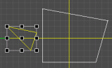 | In **Top **view, the small pyramid is selected. The small pyramid is the carving tool, and its volume gets subracted from any brushes it overlaps. |
| --- | --- |
| 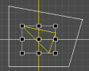 | The small pyramid is moved to the carving point. This determines the area that is carved away. May sure to check Front and Left view to ensure you are carving the desired area. |
| 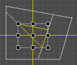 | The **H **key is pressed. DEdit creates vertices for the carved faces of the large polygon. Notice that in several places DEdit has created T-junctions. |
| 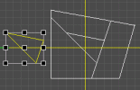 | The small pyramid is moved away to show the carved area. The large polygon now consists of three smaller brushes. You can select and manipulate each of the new brushes individually or as a group. |

[Top ](#top)

---

## Hollowing a Brush

>

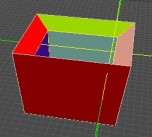

Hollowing a brush empties out the center of the selected brush, breaks the brush into multiple smaller brushes, and creates sides of a specified width for each face of the brush. The image above shows a hollowed cube with the top brush deleted. As you can see, the edges between each of the hollowed faces get cut at an angle equal to half the radius of the initial angle. Thus, a 90 degree angle results in a 45 degree angle cut between the new brushes that form the sides of the box. Likewise, a 120 degree angel results in a 60 degree cut. The angle varies depending on the shape of the polygon.

The following image illustrates a 45 degree cut on a cubic face during a hollowing operation. Notice that hollowing expands the brush outward. When you perform a hollowing operation, the brush expands the width you select in every dimension.

>

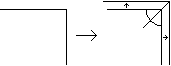

#### To Hollow a Brush

In any view, select the brush you wish to hollow.

On the **Brush **menu, select **Hollow **, or on the toolbar, press the **Hollow **

button.

Enter the width of the faces resulting from the hollowing operation, and click **OK **.

[Top ](#top)

---

## Splitting a Brush

Splitting a brush allows you to create two brushes from one brush. Splitting a brush is usually done to either alter the geometry of your world, or to add additional vertices for Gouraud shading.

#### To split a brush

1. Select the brush to split.
2. In **Top **, **Front **, or **Left **view, press the **Space Bar **to start a line.
3. Move your mouse accross the face of the selected brush along the angle to s plit the brush.
4. Press the **Space Bar **again to draw a single line (do not draw a brush, just a line).
5. Press the **S **key.

The following images illustrate the process of splitting a simple cubic brush in the **Top **view.

>
|  | First select the cubic brush to split. |
| --- | --- |
| 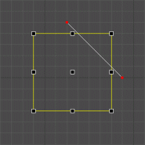 | Next use the **Space Bar **to draw a line across the brush. |
| 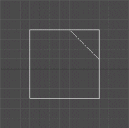 | The **S **key is pressed to perform the split operation. |
| 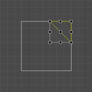 | You now have two separate brushes, and any operation you can normally perform on a single brush can be performed on either of the two brushes. |

[Top ](#top)

---

## Rotating a Brush

You can rotate any brush or group of brushes around a central point. This allows you to create all types of off center geometry. The view that you rotate the brush in (Top, Front, or Left) determines the X,Y, and Z of the rotation.

#### To rotate a brush

1. Select the brush or group of brushes to rotate.
2. Press the **X **key to set the rotation point of the brush.
3. Move you mouse to the **Top **, **Front **, or **Left **view determining the angle of rotation.
4. Hold the **N **key, and move your mouse left or right to rotate the brush.
5. Release the **N **key when you have completed your rotation.

[Top ](#top)

---

## Grouping Brushes

Grouping brushes allows you to perform any operation you would normally perform on one brush on an entire group of brushes. This includes movement, texture application, resizing, splitting, etc. Brushes are automatically ungrouped when they are unselected. There is no difference between selecting multiple brushes and grouping brushes. Grouping is not joining or merging, and groups are not permanent.

#### To group brushes

- In Top, Front, or Left view, click and drag over the brushes to group.

>

—or—

- In any view, hold down the **Shift **key, and click the brush to group. Click any brush again to remove it from the group.

[Top ](#top)

---

## Setting Normal Visibility

Normal visibility controls the direction the faces of the brush are visible in the game. Faces are only visible from one direction, and any player looking at the opposite side of a brush face sees directly through those polygons. In other words, the term "normal" refers to the side of a polygon that the engine renders. When you set the normals in Geometry Edit mode, you set the normals for individual faces of the brush, but to set the normals for all of the polygons on a brush, you must enter Brush Edit mode. For information about setting the normals for individual faces of a brush, see [Setting Normal Visibility Direction ](../WGeom/mGeom.md#SettingNormalVisibilityDirection)in the [Working With Geometry ](../WGeom/mGeom.md)section.

#### To set the normal visibility

1. Select the desired brush.
2. Press the **F **key to flip the normals of all faces on that brush.

[Top ](#top)

---

Touchdown Entertainment, Inc. [Send feedback regarding this page. ](mailto:support@touchdownentertainment.com?subject=JupiterDevGuide Feedback: Dedit\WorkWith\WBrush\mBrushz.md)2006, All Rights Reserved.
