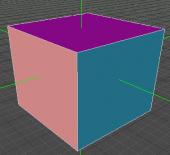
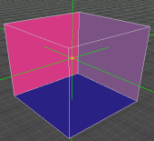

| ### Content Guide |  |
| --- | --- |

# Working With Geometry

This section explains how to draw and manipulate geometry in DEdit. Geometry is composed of faces, vertices, and edges. Each brush in DEdit is composed of multiple geometric elements (polygons) whose edges are determined by vertices. Just like Brush Edit mode allows you to work with entire brushes, Geometry Edit mode allows you to work with the individual geometric elements composing the brushes.

All polygons (individually or as a group) can accept textures. For more information about textures, see [Working With Textures ](../WTextrz/mTextrz.md).

Geometry mode, and polygons in general, are subject to the same grid spacing rules as brushes. For more information about grid spacing, see [About Grid Spacing ](../WBrush/mBrushz.md#AboutGridSpacing)in the [Working With Brushes ](../WBrush/mBrushz.md)section.

This section contains the following geometry topics and procedures:

- [About Geometry Editing ](#AboutGeometryMode)
- [Drawing a Polygon ](#DrawingaPolygon)
- [Moving Vertices ](#MovingVertices)
- [Deleting Faces ](#DeletingFaces)
- [Setting Normal Visibility Direction ](#SettingNormalVisibilityDirection)

---

## About Geometry Editing

To edit vertices, faces, and edges you must be in **Geometry Edit **mode. If you enter Geometry Edit mode with a brush selected, you can only apply changes to the geometry of the selected brush. If you enter Geometry Edit mode without a brush selected, you can apply changes to any geometry in your world.

#### To enter Geometry Mode

- Press CTRL + G to enter **Geometry Edit **mode at any time.
- Alternatively, you can also click the **Geometry Edit **

button.

**Note: **All procedures in this section assume you are in **Geometry Edit **mode.

---

## Drawing a Polygon

You can draw an individual polygon in Geometry Edit mode just as you can draw an individual brush in Brush Edit mode. The resulting polygon you create is considered a brush by DEdit, but it is actually only a face.

#### To draw a polygon

1. In **Top **, **Front **, or **Left **view, place your mouse over a grid intersection and press the **Space Bar **.
2. Move your mouse to the next vertices and press the **Space Bar **again.
3. Repeat the previous step until your polygon is complete and the line color changes to yellow.

>

**Note: **If the color of the lines changes to violet, then your polygon has a concave face. If the color of the lines changes to red, then you have crossed your lines and your polygon is invalid. You should always avoid invalid polygones, and avoid or correct concave polygons.

|  |  |
| --- | --- |
| **Concave Polygon ** | **Invalid Polygon ** |

[Top ](#top)

---

## Moving Vertices

You can move vertices individually or as a group. The Top, Front, or Left view you move the vertices determines the X,Y, and Z the vertices are moved in.

#### To move a vertex

1. In the **Top **, **Front **, or **Left **view for the direction to move, place your mouse cursor over the vertices to move.
2. Hold the **M **key and the **LEFT ****MOUSE **button.
3. Move the mouse to the new position.
4. Release the mouse and the **M **key.

[Top ](#top)

---

## Deleting Faces

Deleting faces is often used to break holes in split brushes. This allows you to create doorways and openings in world geometry.

To Delete a Face

1. In **Brush Edit **mode, select the brush containing the face to delete.
2. Press **CTRL + G **to switch to **Geometry Edit **mode.
3. In the **Perspective **view, move your mouse cursor over the face so that it's edges are highlighted.
4. Press the **Page Down **key.

| **Note: ** | If you enter **Geometry Edit **mode without a brush selected, you can delete any face using this procedure. However, you risk selecting and deleting faces behind the desired face. It is always safest to select the brush in **Brush Edit **mode first prior to entering **Geometry Edit **mode. This prevents geometry editing operations from working on any brush other than the selected brush. |
| --- | --- |

[Top ](#top)

---

## Setting Normal Visibility Direction

Normal visibility controls the direction the polygon is visible in the game. Polygons are only visible from one direction, and any player looking at the opposite side of a polygon sees directly through that polygon. In other words, the term "normal" refers to the side of the polygon that the engine renders. When you set the normals in Brush Edit mode, you set the normals for all of the polygons on a brush, but to set the normals for individual polygons, you must enter Geometry Edit mode.

#### To set the normal direction

1. Move your mouse cursor over the desired face.
2. Press the **F **key to flip the polygon's normal visibility.

The following image shows the same cubic brushes with normal visibility flipped. The left image shows normals facing out, and the right image shows normals facing in.

[Top ](#top)

---

Touchdown Entertainment, Inc. [Send feedback regarding this page. ](mailto:support@touchdownentertainment.com?subject=JupiterDevGuide Feedback: Dedit\WorkWith\WGeom\mGeom.md)2006, All Rights Reserved.
