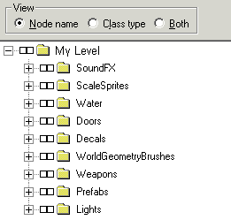
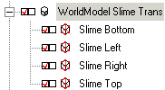

| ### Content Guide |  |
| --- | --- |

# Working With Nodes

The **Nodes **tab in DEdit allows you to easily control all of the brushes and objects in your level. Using the **Nodes **tab you can group brushes and objects, select any brush or object (hidden or otherwise), place brushes or object in containers, and freeze brushes or objects. You can also use the **Nodes **tab to attach a brush or object to another brush or object.

This section contains the following topics and procedures for using the DEdit Nodes tab:

- [About the Nodes Tab ](#AbouttheNodesTab)
- [Adding a New Container ](#AddingaNewContainer)
- [Moving Selections to a Container ](#MovingSelectionstoaContainer)
- [Hiding and Unhiding Selections ](#HiddingandUnhidingSelections)
- [Freezing and Unfreezing Selections ](#FreezingandUnfreezingSelections)
- [Naming and Renaming Objects ](#NamingandRenamingObjects)
- [Naming Groups of Objects ](#NamesforGroupsofObjects)
- [Using Containers to Organize Your Level ](#UsingContainerstoOrganizeaLevel)

---

## About the Nodes Tab

As your levels grow larger and more complex, it becomes increasingly important to have ways of grouping areas of your map into subsections for easier selection and management. The Nodes tab is designed to help you do this, as well as to manage doors, windows, and other objects that are composed of a brush bound to a simulation object, rather than a simulation object or brush on its own.

| **Note: ** | Binding brushes to objects is discussed in more detail in the [Adding Simulation Objects ](SimObj.md#BindingSimulationObjectstoBrushes)section. |
| --- | --- |

Your level may also have groups of simulation objects like AI paths or scripting paths that would benefit from being in groups so that you can easily find them.

The Nodes tab is a tool for organizing your level, for viewing its structure and for quickly locating objects in it. As mentioned previously in our section about selection, the nodes view reflects objects you select in the other views and vice versa. If you select a brush or object in one of the viewports, it becomes selected in the Nodes view. If you select a node, it will be highlighted in the viewports as well.

Go to the Nodes tab and look around at your level. What you’ll see is that the tab lays out your level not as it’s visually organized, but as a tree, showing the connections and relationships between objects in the level. At the very top of the tree is the root node. This object has no properties, and selecting it selects all of the child nodes below it, but doesn’t actually select the root. Selecting a node that contains other nodes always selects the contained nodes, but usually it also selects the parent node as well. In this case, the root node is special. You cannot delete, change, move or rename the root node, so there is no reason to select it other than as a quick way to select all objects in the level.

You should also notice that there are multiple levels in the tree of nodes. Some nodes are hanging off of nodes other than the root node. Most of the objects that contain other nodes probably have the name Container. Container objects are special. When an object is contained as a child node below another object, it inherits the parent’s properties. This is called binding and will be talked about in the section on objects. The reason that containers do not effect the objects that they hold is because Containers don’t have any properties. They only exist to hold and organize the other objects in your level.

As mentioned before, the Nodes tab also shows the relationship between the objects in the level, which can be very important in the case of objects.

The **Nodes **tab operates in a tree view similar to the Windows explorer. Each container in the **Nodes **tab view can contain multiple objects or brushes. If the top level container is selected or frozen, then all of the brushes and objects within the container are also selected or frozen.

The following image shows a sample of a typical Nodes tab:

>

The two checkboxes (Select/Freeze boxes) to the left of each folder or item in the Nodes tab controls the selection and freeze state of that item.

The **left **box controls the selection, and the **right **box controls the freeze state.

The view selections above the node window control how the names are displayed.

- **Node name **—lists each node in the tree by its designated name.
- **Class type **—lists each node in the tree by its class type (such as light, or brush).
- **Both **—lists each node by its Node name followed by its Class name in parenthesis.

Each folder in the Nodes list represents a container object. Containers are not actually nodes, they are simply named folders that contain a sequence of nodes. When you add new nodes, containers are automatically created for you with default container names. To better organize the contents of your would you should provide unique descriptive names for each of your containers, and fill them with the brushes and objects that match the description you have given.

### About Parent-Child Relationships

>

Brushes bound to objects appear below the parent object they are bound to (as displayed in the previous image). This not only **indicates **the parent-child dependency, it also **creates **the parent-child dependency. If you move a brush beneath an object capable of taking a brush as an attachment, then DEdit attempts to bind the brush to that parent object. This binding is useful if you have several brushes you want to bind to the same object. For example, if you have a WorldModel object setting a texture to transparent and you want several nearby brushes to have transparent textures, you can click and drag the brushes to the WorldModel object name. The brushes moved beneath the WorldModel object automatically become child objects of that WorldModel object. For an alternative way of performing the same movement operation, see [Moving Selections to a Container ](#MovingSelectionstoaContainer).

[Top ](#top)

---

## Adding a New Container

You can add a new container to the Node view at any time. New containers are useful ways of keeping track of which objects and brushes are associated for each element in your level. For example, if you had a swimming pool section, creating a SwimmingPool container to hold all of the brushes and objects in that section would enable you to easily locate and alter the brushes and objects associated with the swimming pool.

#### To add a new container

1. In the **Nodes **tab, right-click the container to be the parent container, and then click **Add Container Node **.
2. Type the name for the new container, and then press **Enter **.

[Top ](#top)

---

## Moving Selections to a Container

You can move any number of selected brushes and objects to a container or to a parent node.

#### To move selections to a container

1. Select the brushes and objects to move. You can do this in **Nodes **view by holding down the **Shift **key and selecting the left box for each item to move. Alternatively you can hold down the **Shift **key and select the items to move in any of the DEdit view windows.
2. Right-click the node to be the parent container, and then click **Move Tagged Nodes Here **.
All of the selected nodes get moved to the parent container.

- Alternatively you can always click and drag a node to another container or parent node, although this process becomes more difficult as the number of nodes in your level increases.

| **Note: ** | After moving your selections, they are still selected. If you are done working with the selections as a group, make sure to deselect them using the **U **key. |
| --- | --- |

[Top ](#top)

---

## Hiding and Unhiding Selections

Hiding selections makes them invisible in DEdit, but does not prevent them from alteration if they are selected. While you cannot select hidden brushes and objects in any of the view windows, you can select hidden objects in the Nodes tab, and if you select the parent of a hidden object, then all children including the parent get selected.

Hiding brushes and objects is useful if you want to perform adjustments on brushes and objects obscured by brushes and objects that you do not want to change. Hiding also reduces the amount of material DEdit needs to render and display, and therefore allows it to run faster in worlds with large numbers of polygons and large amounts of complexity.

| **Note: ** | When a node is hidden its Select/Freeze boxes change from a solid outline to a dashed outline. |  |
| --- | --- | --- |
|  | —Hidden node. |  |
|  |  | —Unhidden node. |

#### To hide a selection

- The Standard method for hiding a selection is to press the **[ **key, hiding all of the currently selected items.
- The Nodes tab's right-click menu allows you to perform the following additional operations on nodes:

  - **Hide Node **—Hides the currently selected node only.
  - **Hide Node and Children **—Hides the currently selected node and all child nodes.
  - **Unhide Node and Children **—Unhides the currently selected node and all child nodes.
  - **Hide All Nodes **—Hides all nodes in the Nodes tab.
  - **Unhide All Nodes **—Unhides all nodes in the Nodes tab.

[Top ](#top)

---

## Freezing and Unfreezing Selections

Frozen selections still appear in the DEdit view windows, but you cannot select or change frozen nodes from the view windows. Additionally, you cannot change frozen selections from the Properties tab.

Freezing selections is useful when you are performing changes to a level and want to ensure that certain brushes and objects do not get altered. Additionally, because you can "select through" frozen brushes, freezing brushes that are in the way of brushes and objects you want to edit gives you access to them without the risk of making unwanted changes to the frozen brushes.

#### To freeze or unfreeze a selection

- In the **Nodes **tab, click the right box of the brush or object to freeze. A blue check appears in the box.
If the node is a container, then selecting the container also freezes all child nodes in the container.

[Top ](#top)

---

## Naming and Renaming Objects

Many nodes have somewhat cryptic names like Container or Brush1. That’s easily fixed, though. By default, DEdit creates object names based on the class of the object. When a new brush is added to DEdit, its name is automatically set to Brush#, where # is a unique number. DEdit tries to give each object a unique name to make each one easier to find.

If you don’t like the names DEdit gives to objects or want to change them for other reasons, you can change the name of a node just like you’d change it in Windows Explorer.

1. Click on one of the node names.
2. Press F2 or single-click once again on the node’s name. You’ll see the name become highlighted, just like a file or folder in Windows.
3. You can now type a new name.
4. When you press ENTER the new name is applied.

[Top ](#top)

---

## Naming Groups of Objects

Since the regular viewports are linked to the Nodes view, you can also rename objects in their Properties dialog, which is useful when you want a group of objects to have the same name.

#### To name groups of objects

1. Using the **Perspective **view, select all of the brushes to group.
2. Select the **Properties **tab.
3. In the **Name **field, type the new name for the group, and then switch to the **Nodes **tab.

[Top ](#top)

---

## Using Containers to Organize a Level

Using containers to organize your level is a very good idea. Imagine a level with 200 brushes, 50 lights and 75 enemies and you can imagine why. Using containers to group brushes by room, lights by area and enemies by squad turns your level from a massive jumble into a logical order.

| **Note: ** | Now that you know about container nodes and renaming things, you may be tempted to carefully name each brush and object, or to build six layers of containers for all of your items. Don’t spend more time than necessary on organizing things. It’s wise to sort out your level in a general way to make things easy to find and to help others who may need to work on your level. However, it’s easy to go overboard as well. Spending hours laying out your level in the Nodes tab is as much of a waste as the hours you may spend searching through an unorganized level to find a brush or simulation object. Be careful to find a balance. |
| --- | --- |

You can have as many container nodes as you want in your level. Since containers are removed from the level when it’s processed, they have no effect on the actual operation of the level in the game. They’re present exclusively to help you structure your level within the editor.

[Top ](#top)

---

Touchdown Entertainment, Inc. [Send feedback regarding this page. ](mailto:support@touchdownentertainment.com?subject=JupiterDevGuide Feedback: Dedit\WorkWith\WNodes\WNodes.md)2006, All Rights Reserved.
