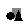
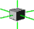
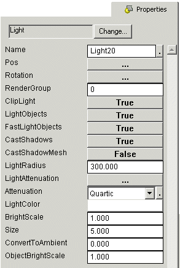
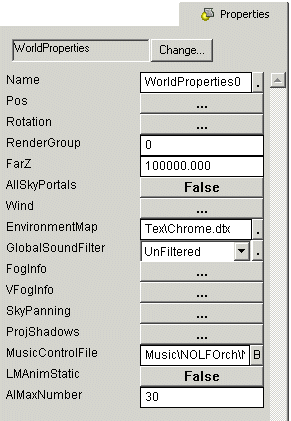

| ### Content Guide |  |
| --- | --- |

# Working With Objects

This section explains what objects are, how they operate, and how you can use them. Not all objects are listed or described in this section, although there are some specific examples. The best way to learn about objects is to insert them into your game and manipulate their properties to see how they operate.

This section contains the following object insertion and operation topics:

- [About Jupiter Objects ](#AboutJupiterObjects)
- [Using Object Commands ](#UsingObjectMessages)
- [Inserting an Object ](#InsertinganObject)
- [Inserting a Light Object ](#InsertingaLightObject)
- [Inserting a LightGroup Object ](#InsertingaLightGroupObject)
- [Inserting a Decal Object ](#InsertingaDecalObject)
- [Inserting a DirLight Object ](#InsertingaDirLightObject)
- [Inserting a Polygrid Object ](#InsertingaPolygrid)
- [Inserting a GameStartPoint Object ](#InsertingaGameStartPoint)
- [Inserting a VolumeBrush Object ](#InsertingaVolumeBrush)
- [Inserting a Spawner Object ](#InsertingaSpawnerObject)
- [Inserting a SpecialFX Object ](#InsertingaSpecialFX)
- [Inserting a SoundFX Object ](#InsertingaSoundFXObject)
- [Inserting a WorldProperties Object ](#InsertingaWorldPropertiesObject)
- [Inserting a PlayerTrigger Object ](#InsertingaPlayerTriggerObject)
- [Inserting a ScaleSprite Object ](#InsertingaScaleSpriteObject)
- [Inserting a TeleportPoint Object ](#InsertingaTeleportPointObject)

---

## About Jupiter Objects

Objects are sections of game code you can manipulate using Jupiter Tools. They can represent physical objects, special effects such as sounds and lights, or abstract things such as paths for a camera to follow. The **Properties **dialog boxes of each object control the essential information used by the object's code to produce the desired effect. Jupiter comes complete with a wide variety of objects ready for use, but these objects may not necessarily fit your needs. During the creation of your game, you will probably create your own objects, or at least modify the existing objects. For more information about creating your own objects, see the [Programming Guide ](../../../ProgGuid/mPG.md).

Although you can insert an object in any mode, you can only select and move objects in **Object Edit **mode. Press **CTRL + H **to enter **Object Edit **mode at any time.

Alternatively, you can also press the **Object Edit **button

to enter **Object Edit **mode.

---

## Using Object Commands

Most objects in DEdit are capable of sending messages (commands) to other objects. Sending commands is an important part of creating a level because it allows objects to interact with each other. Doors and triggers are particularly dependent upon message commands because they use the commands to send instructions to other objects in the game. Not all objects can send or recieve commands. Lights, for example, do not take commands.

For more detailed information about commands and player messages, see the **Commands.doc **and **PlayerMessages.doc **files in the LithTech\LT_Jupiter_Src\Specs\GameSystems folder.

When you enter a command in the **Commands **property of an object (in the **Property **tab for the object), if the command is invalid the **Debugger **window opens and displays the commands that the object can take.

>

**Note: **Commands are not case sensitive. Commands can also be composed of multiple commands separated by semicolons.

The following list describes the syntax for commands (angle brackets indicate individual entries and should not be included in your command string):

- Msg <ObjectName> <ObjectCommand>
- Delay <DelayTime> <Command>
- DelayID <CommandID> <DelayTime> <Command>
- Rand <command1 percent> <command 1> <command 2>
- Loop <min delay> <max delay> <command>
- LoopId <command id> <min delay> <max delay> <command>
- Repeat <min times> <max times> <min delay> <max delay> <command>
- RepeatId <command id> <min times> <max times> <min delay> <max delay> <command>
- Abort <command id>
- Int <variable name> <value>
- Set <variable name> <value>
- Add <variable name> <value>
- Sub <variable name> <value>
- If <condition> THEN <commands>
- When <condition> THEN <commands>

#### Use of Operators:

>

Two of the above commands ( **If **and **When **) have a condition argument where you can compare a variable to a number value or another variable. The condition argument can be broken down into a single expression or a series of expressions. An expression has 3 arguments, the first parameter followed by an operator followed by the second parameter. Depending on the operator, either of the parameters can be another expression. Every operator can be expressed by either a mathematical symbol or the English phrase equivalent.

- <Variable> Equals (==) <Value>
- <Variable> Not_Equals (!=) <Value>
- <Variable> Not_Equals (!=) <Value>
- <Variable> Greater_Than (>) <Value>
- <Variable> Less_Than (<) <Value>
- <Variable> Greater_Than_Or_Equal_To (>=) <Value>
- <Variable> Less_Than_Or_Equal_To (<=) <Value>
- <Expression1> And (&&) <Expression2>
- <Expression1> Or (||) <Expression2>

#### Use of Parenthesis:

>

You must use parenthesis to group multi-term arguments together. This is most often necessary when a command is an argument to another command (for example, Repeat 2 5 0.25 2.0 (msg prop0 fire) ). In this example **msg prop0 ****fire **is a single argument to the command **Repeat **. In order for the **Repeat **command to correctly parse the string **msg prop0 fire **as a single argument, the individual terms must be grouped together using parenthesis.

#### Possible Commands:

The following list contains some of the command messages that you can send between objects. Not all objects can use these commands, and DEdit automatically displays incorrect or invalid commands in the debugging window when you enter them.

- ACTIVATE
- ATTACH <object name(s)>
- ATTACHCLASS <class name>
- BACKWARD
- CLEARTARGET
- DESTROY
- DETACH <object name(s)>
- FORWARD
- FOV <FovX> <FovY> <time>
- GOTO <key>
- HIDDEN <bool>
- LOCK
- MOVETO <camerapoint>
- MOVETO <key> [destination cmd]
- OFF
- ON
- PAUSE
- REMOVE
- RESUME
- REVERSE
- SKIP
- SOLID <bool>
- TARGET <object>
- TARGETOFFSET <x> <y> <z>
- TOGGLEDIR
- TRIGGER
- TRIGGERCLOSE
- UNLOCK
- VISIBLE <bool>

[Top ](#top)

---

## Inserting an Object

Objects are always inserted at the current marker position in your world. Use the **X **key in any view to control the location of the marker. After objects are inserted you can move them in the same manner you would move a brush or polygon.

#### To insert an object

1. Position the marker where you want to insert the object.
2. Press **CTRL + K **to open the **Select Object Type **dialog box.
3. From the **Class Types **list, select the object to insert and click **OK **.
Alternatively, you can select from the **Recent **list to insert a new instance of any object you have previously inserted.

[Top ](#top)

---

## Inserting a Light Object

All light ****objects cause illumination of your world or of objects in your world. The light object itself does not appear in your game (there is no ball of light hovering in the air), but the effect the light would have on the environment if it did exist results in the illumination of brushes in the range of the light that are set to respond to it (all brushes respond to light by default, but you can adjust this in the properties for each brush).

Creating correct lighting is an artform that requires experience and time to master. There are many different types of lighting and lighting effects. The following procedure only outlines how to insert and adjust a simple **Light **object.

#### To insert a light object

1. Position the marker where you want to insert your light.
2. Press **CTRL + K **to open the **Select Object Type **dialog box.
3. Press the **L **key to go directly to the **Light **object.
4. Press **Enter **to insert the selected **Light **object.

#### To adjust a Light object

1. Select the light you wish to adjust.
2. In the **Project Window **, click the **Properties **tab. If the **Properties **tab is not visible, on the **View **menu, click **Project Window **.

There are many different properties for Light objects. This topic explains a few of the primary adjustments you may wish to make. For additional information, In DEdit, click the name of the property for a pop-up box containing a brief description of that property's function.

The following image shows a typical Light object properties tab:

>

**Name— **Specifies the Name of your object. Using unique names for objects allows you to easyily identify them in the **Nodes **tab, and also allows you to send messages from other objects.

**Pos— **Specifies the position of your light in world coordinates.

**Rotation— **controls the rotation of your light. This is not of much use for a standard light, but is important in direction lighting (such as the DirLight).

**ClipLight— **If True, cliplight causes world geometry to stop the light. If False, the light passes through world geometry and illuminates everything in its radius.

**LightObjects— **Determines if the light illuminates models.

**FastLightObjects— **If True, renders the light on models quickly, but only by adding light to the model's Ambient component, which is non-directional. If false, then the light acts as a D3D hardware light, which renders the light on models directionally and with more detail, but requires more graphics processing power.

**CastShadows— **Determines if brushes lit by your light cast shadows on other brushes.

**LightRadius— **Determines the radius of the light, or the complete distance the light will travel before ceasing. In Object mode the radius of the light appears as a blue circle.

**Attenuation— **Determines the equation used to control the intensity of the light as distance from the source increases.

**Light Color— **Specifies the color of the light.

**BrightScale— **Specifies the intensity of the light in respect to the brush surfaces effected by the light.

**Size— **Specifies the size of the light. Do not use this property. It is obsolete.

**ConvertToAmbient— **Specifies the amount of light (from 0 to 1) that gets applied to models as ambient light rather than direct light. This allows the light to "wrap around" models and causes them to appear more fully illuminated. This effect gives hardware lights a warmer effect on models.

**ObjectBrightScale— **Specifies the intensity of the light in respect to model surfaces effected by the light independently of the world, allowing you to match your model and world lighting more flexibly.

[Top ](#top)

---

## Inserting a LightGroup Object

LightGroup objects allow you to create dynamic lighting that you can turn on or off. When your level is processed, a version of the brushes gets rendered in both on and off states. By turning LightGroup objects on or off you can toggle between the different renderings of the brushes touched by the lights in the LightGroup. LightGroups are commonly used for almost all lighting that turns on or off.

>

**Note: **LightGroup objects cannot turn on or off a sprite.

#### To insert a LightGroup object

####

1. Position the marker where you want to insert your LightGroup.
2. Press **CTRL + K **to open the **Select Object Type **dialog box.
3. Select the **LightGroup **object.
4. Press **Enter **to insert the selected **LightGroup **object.
5. Select the lights (DirLight, ObjectLight, or Light) to turn on or off with the group.
6. In **NodesView **, right-click the **LightGroup **object, and then click **Move Tagged Nodes Here **.

####
To turn a LightGroup on or off

- From any object send the message: msg <LightGroupName> ON or msg <LightGroupName> OFF .

LightGroup objects can take the following commands:

- TOGGLE
- ON
- OFF
- COLOR <value> or <RValue> <GValue> <BValue>

For example msg LightGroup0 (Color 10 256 10) turns all lights bound to LightGroup0 to a green hue.

[Top ](#top)

---

## Inserting a Decal Object

Decal objects project a texture onto world geometry (brushes and brushes bound to WorldModel objects). Decal objects operate like a can of spraypaint. They can blend on the brushes they hit either translucently, additively, or not at all.

### Two main uses for decals:

1. To conceal the seams between two different textures.
2. To add features to existing textures such as posters or scorch marks. This typically involves using an alpha mask to determine how the decal blends with the texture.

You can make decals translucent, or apply them additively so that they brighten the texture they are applied on. Performing translucent or additive blending requires binding the Decal object to a WorldModel object, and then using the WorldModels's blend mode settings. You do not need to bind Decal Objects to WorldModel objects if they do not require translucency.

### Decal object restrictions:

- Decals used on brushes with Gouraud or flat shading cannot use translucency.
- Brushes with lightmaps cannot blend with decals.
- Decals are not intended to wrap or tile. To make a tiling pattern you must use multiple decals or develop your own custom solution in game code.

#### To insert a Decal object

1. In DEdit, position the marker where you want to insert the Decal.
2. Press **CTRL + K **to open the **Select Object Type **dialog box.
3. In the **Class Types **list, select **Decal **and then press **Enter **.
4. In the Properties tab, set the following properties for the Decal:

  - **Texture **—Select the .DTX file the Decal projects.
  - **ProjectDims **—Set the scale and depth of the projected texture.

5. Use the **N **key to rotate the Decal object, aiming the Decal as desired.
6. Process your world and test the Decal.

[Top ](#top)

---

## Inserting a DirLight Object

DirLights are similar to standard Light objects except that they are directed. In addition to having a LightRadius, DirLights also have a field of view (FOV) property for specifying the angle of the lighting effect. The intensity of DirLight decreases away from the center in specified amounts, allowing you to create spotlight lighting, or just to light a specific segment of your world.

#### To insert a DirLight object

1. In DEdit, position the marker where you want to insert your light.
2. Press **CTRL + K **to open the **Select Object Type **dialog box.
3. In the **Class Types **list, select **DirLight **.
4. Press **OK **.

#### To adjust a Dirlight object

1. In the **Top **, **Front **, or **Left **view, select the DirLight.
2. Press and hold the **N **key, and move the mouse to rotate the DirLight to the desired direction. The FOV for the DirLight rotates around the current marker.
3. In the **Properties **tab, set the properties for the DirLight object. These properties are similar to the Light object, however there are a few additional properties:

>

**InnerColor **—Specifies the color used on the central portion of the DirLight.

**FOV **—Specifies the angle (spread) of the DirLight

[Top ](#top)

---

## Inserting a Polygrid Object

Polygrids are flexible flat sheets of polygons that deform according to parameters you specify. Polygrids can mimic effects such as water, flags, or billowing sheets. The following procedure creates a water effect using a polygrid.

#### To create water using a Polygrid object

1. In DEdit, draw a brush the size and volume of your water. When the character enters the boundaries of this box, they enter water and the game code associated with the water volume gets activated.
2. Right-click the water brush, move to **Selection **, and click **Bind to Object **.
3. In the **Class Types **list, expand the **VolumeBrush **class ****, select **Water **, and press **Enter **.
4. Press **CTRL + K **, select **Polygrid **, and press **Enter **.
5. In the **Properties **tab for the Polygrid, select the **SpriteSurfaceName **(.spr file) determining the surface of the polygrid if you want texture for your water. Alternatively you can use the **Color1 **and **Color2 **properties to create a polygrid using colors only. For additional information on creating a sprite for the polygrid object, see the next procedure, or the [Working With Sprites ](../WSprites/mSprites.md)section.
6. In the **Dims **property, set the **X **, **Y **, and **Z **dimensions of the polygrid. **X **controls the length of your polygrid, **Y **controls the wave height of your polygrid, and **Z **controls the width of the polygrid.
7. In the **Rotation **property, rotate your polygrid to face the surface in the desired direction (typically up for water, but you can set your polygrid to any angle).

Process and test your world to ensure your polygrid is operating as you intended. You may require several tries to get the polygrid to the correct dimensions and angle.

#### To create a sprite for the polygrid texture

1. In the sprite specified in **SpriteSurfaceName **(step 5 of the previous procedure) , give the sprite one texture and a frame rate of one. The texture you select is only used as reference (its Command String gets applied) so the actual image on the texture is not important. You can simply create a copy of an existing texture with a unique filename.
2. In the **Texture **tab, open the texture file you selected in the sprite, and set the **Command String **property as follows:

>

EnvBumpMap <SurfaceTexture.dtx> <BumpMap.dtx>

All files you specify must contain full file path names. The <SurfaceTexture.dtx> file gets displayed on the surface of the polygrid, and the <BumpMap.dtx> file controls the environment bump mapping for the texture. For example, the following Command String sets the texture used by the sprite to display the UW_SubBay texture on the polygrid with bumbptest05.dtx as the environment map:

>

EnvBumpMap TexFx\Cubic\UW_SubBay.dtx TexFX\Normal\bumptest05.dtx

[Top ](#top)

---

## Inserting a GameStartPoint Object

GameStartPoint objects determine where in the level your character starts the game. You must always have at least one GameStartPoint object in your level.

#### To insert a GameStartPoint object

1. In any view, position the marker (using the **X **key) where you want the player to start the level.
2. Press **CTRL + K **, select **GameStartPoint **, and press Enter.
3. In the **Properties **tab, press the **Rotation **button.
4. Adjust the **Yaw **, **Pitch **, and **Roll **to determine the direction the character faces when spawning. The blue line coming from the **GameStartPoint **object indicates the facing direction of the character.
5. Press **OK **.

Process and test your world to ensure the character is facing the correct direction and does not spawn to an immediate death due to the location of the **GameStartPoint **object. A space of at least 8 units of clearance above, below and to each side of the start point allows the character sufficient space to spawn without dying.

[Top ](#top)

---

## Inserting a VolumeBrush Object

Volume brush objects control physics, special effects, and triggers associated with a specific area. Volume brushes are not typically visible in a level, but rather alert the engine to perform specific operations on the character when they enter the area of the volume brush. Water is a standard example of a VolumeBrush. When a character enters an area surrounded by a Water VolumeBrush, the engine notes they are in water and treats the character with all of the physics and properties associated with being in water.

#### To insert a VolumeBrush object

1. In **Brush **mode, draw the brush you wish to associate with a volume effect. This brush defines the area of the volume effect.
2. Use the **X **key to position the marker on the surface of the desired brush.
3. Right-click the brush, move to **Selection **, and then click **Bind to Object **.
4. In the **Class Types **list, expand the **VolumeBrush **class, and select the type of volume to apply.
5. Press **OK **. The **VolumeBrush **object gets inserted at the current marker.
6. In the **Properties **tab, adjust the properties associated with the **VolumeBrush **object to determine the specific effects that occur when the character enters the area of the **VolumeBrush **.

Process and test your world. Enter the volume brush area and the character should experience the effect you associated with the **VolumeBrush **object.

### Types of Volume Brushes

There are many different types of volume brushes available using the game code supplied with the Jupiter engine. The following table lists some of the common volume brushes and their effects.

>
| **Volume Brush ** | **Effect ** |
| --- | --- |
| **Burn ** | Creates a burn effect and does burning damage to the character when they enter the volume of the brush. |
| **ColdAir ** | Creates a cold effect, shaking the screen and doing cold damage to the character when they enter the volume of the brush. |
| **CorrosiveFluid ** | Similar to burn but includes liquid splashing sound effects. |
| **Electricity ** | Creates an electrical effect and does electrical damage to the character when they enter the volume of the brush. |
| **EndlessFall ** | Creates an echoing scream and a spinning effect. Additionally this volume brush kills the character (a falling crush death) when they enter the volume of the brush. |
| **Filter ** | Applies a sound filter inside the volume allowing you to apply filters to ambient sounds and change the sound the character hears when they are inside the volume. |
| **FreezingWater ** | Similar to water, but additionally the character takes cold damage while they are inside the volume of the brush. |
| **Gravity ** | Creates a physics effect allowing you to alter the viscocity, friction, and gravity inside the volume of the brush. Viscocity controls how difficult it is to move through the brush. Friction controls the slickness of the surface in the brush. Gravity controls the character's ability to jump in the volume of the brush. |
| **Ice ** | Creates a slick surface causing the character to move when they enter the volume of the brush. Fog and color properties for this volume brush are currently disabled. |
| **Ladder ** | Creates a surface the character can climb. |
| **PoisonGas ** | Creates a poison gas effect, coloring the characters view and warping the screen. Additionally pigeons appear to indicate a side effect of the nerve gas. |
| **SafteyNet ** | Intended to create a surface to protect the character from damage during a fall. This volume brush is currently disabled. |
| **Water ** | Creates a water effect that does not damage the character. While in the volume brush the sound filter switches to underwater, the character's view is switched to blue, and the character can move in all directions. |
| **Weather ** | Creates a rain or snow effect. Use of this volume brush has been discontinued in favor of the **SnowVolume **under the **VolumeEffect **class. |
| **Wind ** | Similar to Ice. Pushes the character in a specified direction. |

[Top ](#top)

---

## Inserting a Spawner Object

Spawner objects insert template objects into the game during runtime. Spawner objects are triggered by message commands using the msg <Spawner object name> SPAWN syntax. Spawner object can only spawn template objects.

Template objects do not exist at runtime, but appear as normal when they are spawned. The Template object specified in the Spawner object appears in the game at the location of the Spawner object when the Spawner object is triggered. Any object except world geometry can be specified as a template object.

Use the following procedures to create template objects and specify them in a Spawner object.

#### To create a Template object

1. In DEdit, select or insert any object you want to make a template.
2. In the **Properties **tab for the object, set **Template **to True.
3. Set any other properties you want for the object in the **Properties **tab.

The object is now a template and does not appear in the game until it is spawned.

#### To insert a Spawner object

1. In DEdit, use the **X **key to position the marker where you want the Template object to spawn.
2. Press **CTRL + K **, select **Spawner **, and press **Enter **.
3. In the **Properties **tab for the **Spawner **object, go to the **Trigger **box and type the name of the template to spawn.
4. In the InitialCommand box, type a command to send when the Spawner object is triggered. Leave this field blank if you do not wish to send a command when the object is spawned.

To trigger the Spawner from another object, use a **msg <Spawner object name> SPAWN **message command.

[Top ](#top)

---

## Inserting a SpecialFX Object

The LithTech Jupiter system comes complete with a ready-made package of special effects objects you can insert into your game. Developers can also create their own special effects objects and make them available for Level Designers to insert through the DEdit tool. For information about creating special effects, see [Using FxEd ](../../../FXEd/mFX.md).

#### To insert a SpecialFX object

1. In DEdit, use the **X **key to position the marker where you want the effect to occur.
2. Press **CTRL + K **, select **SpecialFX **, and press **Enter **.
3. In the **Properties **tab, click the **FxName **drop-down list and select the effect to apply.

Proccess and test your level to view the effect.

[Top ](#top)

---

## Inserting a SoundFX Object

SoundFX objects create ambient sound that eminates in two set radii: an inner radius and an outer radius.

| **Note: ** | You can trigger SoundFX objects on or off from another object using the **msg <object name> <on> **or **msg <object name> <off> **command. For example **msg boil1 off **instructs the SoundFX object named boil1 to turn off. |
| --- | --- |

#### To insert a SoundFX object

1. In DEdit, use the **X **key to position the marker where you want the effect to occur.
2. Press **CTRL + K **, select SoundFX, and press **Enter **.
3. In the Properties tab, set the properties for the SoundFX object:

  - **Sound **—Specifies the .WAV file to play.
  - **Ambient **—True specifies the sound decreases in volume as the player increases distance from the object. If set to False, the sound simply cuts out when the player leaves the outer radius.
  - **Priority **—Specifies the priority of this sound when more than one sound is playing. Valid values are 0, 1, and 2. Lower values have lower priority.
  - **OuterRadius **—The space between the outer radius and the inner radius has a lower volume than the space inside the inner radius.
  - **InnerRadius **—Specifies the area where the sound plays at full volume.
  - **Volume **—Specifies the volume percentage of the recorded sound that plays in the inner radius.
  - **PitchShift **—Specifies the pitch (frequency) of the sound. For example 1.5 plays 50% faster and 0.5 plays 50% slower.

[Top ](#top)

---

## Inserting a WorldProperties Object

Each world (level) you create must have one, and only one, **WorldProperties **object. The **WorldProperties **object determines basic settings associated with your entire world (level).

#### To insert a WorldProperties object

1. In DEdit, use the **X **key to position the marker where you want the WorldProperties object. The actual location is not highly important, so long as the object resides in your world.
2. Press **CTRL + K **, select **WorldProperties **, and press **Enter **.
3. In the **Properties **tab, adjust the properties of the **WorldProperties **object to set the parameters of your world.

>

The following image shows the properties for the **WorldProperties **object:

**FarZ **—Specifies the FarZ clipping plane distance for the level.

**AllSkyPortals **—If TRUE, the engine renders all of the SkyPortals in the level, ignoring any visibility settings.

**Wind **—Specifies the wind current for the entire level.

**EnvironmentMap **—Specifies a texture used as an environment map for all of the models in the level. This setting is currently obsolete due to the addition of RenderStyles.

**GlobalSoundFilter **—Specifies a sound filter used for all of the sound in this level.

**FogInfo **—Specifies the overall fogging effect for the entire level based on the distance of objects from the camera location.

**VFogInfo **—Specifies the fog along the axis, such as ground fog or high cloud layers. This setting is currently obsolete and no longer used.

**SkyPanning **—Specifies the parameters of the skypanning effect, such as shadows of clouds moving across the ground.

**ProjShadows **—Specifies parameters controlling shadows used in the level.

**MusicControlFile **—Specifies the path to the .txt control file setting up the direct music files used in the level.

**LMAnimStatic **—Specifies a correction for light maps. Set to FALSE if you are using lightmaps and are experiencing flicker.

**AIMaxNumber **—Specifies the maximum number of AIs allowed in the level. Spawing AIs fail if the maximum has already been reached. Level AIs are uneffected by this value.

[Top ](#top)

---

## Inserting a PlayerTrigger Object

PlayerTrigger objects allow you to send messages to other objects in the game when the player enters the trigger area. This allows you to trigger WorldModels, send messages to AIs, and basically perform any function required by player entry into the trigger area.

#### To insert a Trigger object

1. In DEdit, use the **X **key to position the marker where you want the PlayerTrigger object.
2. Press **CTRL + K **, select **PlayerTrigger **, and press **Enter **.
3. In the **Properties **tab, adjust the properties of the PlayerTrigger object. The following list defines a few of the most relevant properties:

**Dims— **Sets the dimensions of the trigger.

**Commands— **Specifies the object to receive the command and the command to send. More than one command may be sent and more than one object can receive a command.

**NumberOfActivations— **Specifies how many times the trigger operates in the level. Set this value to zero to send a command everytime the player enters the trigger area.

[Top ](#top)

---

## Inserting a ScaleSprite Object

**ScaleSprite **objects create an auto-facing polygon with an optional lens flare. This makes ScaleSprites ideal for lights, but is also quite useful for other effects requireing an auto-facing polygon.

#### To insert a ScaleSprite object

1. In DEdit, use the **X **key to position the marker where you want the ScaleSprite object.
2. Press **CTRL + K **, select **ScaleSprite **, and press **Enter **.
3. In the **Properties **tab, adjust the properties of the ScaleSprite object. The following list describes some of the relevant properties for the ScaleSprite object:

**StartOn— **Sets the sprite on or off at runtime. You can use the msg command from other objects to turn the sprite on or off.

**Filename— **Specifies the name of the sprite (.spr file) the ScaleSprite displays.

**Dims— **Specifies the position of the bounding box containing the sprite.

**Color— **Tints the color of the sprite.

**Alpha— **Sets the alpha for the sprite. The normal alpharef value for the sprite textures is overridden in the ScaleSprite object, so you must set this value if you are using transparent textures.

**ScaleX— **Sets the size of the sprite in the X axis.

**ScaleY— **Sets the size of the sprite in the Y axis.

**AdditionalFlags— **Sets additional sprite properties such as clipping, scaling, and blend modes.

**LensFlareProps— **Sets the properties for the lens flare surrounding the sprite. The lens flare is optional and requires an additional sprite file.

[Top ](#top)

---

## Inserting a TeleportPoint Object

Teleport point objects are target positions for trigger objects to move a character from one position in the level to another position in the same level. Teleport points do not work between levels.

#### To insert a TeleportPoint object

1. In DEdit, use the **X **key to position the marker where you want the TeleportPoint object.
2. Press **CTRL + K **, select **TeleportPoint **, and press **Enter **.
3. In the **Properties **tab, click the **Rotation **button and adjust the rotation by facing the blue line in the direction to face the character when they appear at the teleport point.
4. In the **Name **box, type a unique name for this teleport point.
5. In the Trigger object to activate the teleportation to this point, set the command to the following string:

>

msg player (teleport <name>)

The < **name **> string must match the name of the teleport point. For example, msg player (teleport Transport1) teleports the player to a TeleportPoint object named Transport1 .

[Top ](#top)

---

Touchdown Entertainment, Inc. [Send feedback regarding this page. ](mailto:support@touchdownentertainment.com?subject=JupiterDevGuide Feedback: Dedit\WorkWith\WObj\mObj.md)2006, All Rights Reserved.
