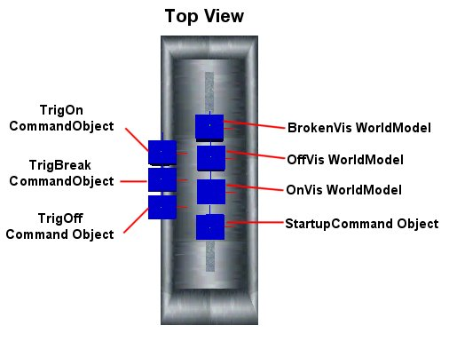
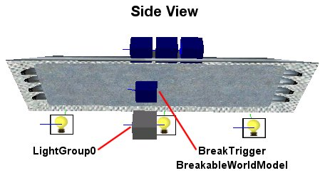

| ### Content Guide |  |
| --- | --- |

# Working With Prefabs

The Jupiter prefab system allows you to create prefabricated objects. These objects are essentially new instances of the same object, with new names for each of the internal components. Prefabs allow you to reuse common objects, and to institute changes in all of the objects inheriting from the prefab throughout all levels of a project.

A chair is a good example of a simple prefab. You can create the chair in DEdit (or import the chair from Max or Maya) and then save it as a prefab. Place the chair prefab wherever you have a need for this specific chair. If you later decide you want to modify the chair's geometry, textures, or perhaps add an AINodeUseObject - Chair node to the chair, you can open the prefab and make the modifications. After saving the prefab, all the modifications you made automatically get applied to all the instances of this chair prefab.

>

**Note: **Changes to prefabs do not immediately appear in DEdit. You must close and reload your level in order for DEdit to update all of the prefab references. This does not effect processing or gameplay, and while the changes you make do not appear immediately in DEdit, they do appear in the game when you process and run your level.

Prefabs have a specific syntax associated with them that also allows you to send command messages between standard world objects and objects contained in the prefab. Inside the prefab you use a #.<object name> syntax to send messages to other objects inside the prefab. From outside the prefab you use the <prefab name>.<object name> syntax to specify the object inside the prefab you are sending a command to. For more information about sending messages from inside and outside of prefabs, see the [Using Commands With Prefabs ](#UsingCommandsWithPrefabs)section.

Read the following topics to learn how to create, modify, and send commands to prefabs:

- [Creating a Prefab ](#CreatingaPrefab)
- [Modifying a Prefab ](#ModifyingaPrefab)
- [Using Commands With Prefabs ](#UsingCommandsWithPrefabs)
- [Using NOLF 2 Prefabs ](#UsingNOLF2Prefabs)
- [Using the Sample Lighting Prefabs ](#UsingtheSampleLightPrefab)

---

## Creating a Prefab

Creating a new prefab is a relatively simple process. You can create a prefab from a new blank world, or you can create prefabs instantly from any items in a level you are working on.

#### To create a prefab

1. Create the geometry and objects in any world level as you usually would.
2. Select the objects and brushes you want to become a prefab.
3. Right-click the selection, move to Selection, and then click Save as Prefab.
4. Browse to a location (typically the Prefabs folder).
5. Enter a name for the prefab, and click Save.

If you have objects in your prefab that send messages to other objects within the prefab, then you must append the object name in the message with #. in order to make the command operate. For more information, see [Using Commands With Prefabs ](#UsingCommandsWithPrefabs).

The brushes and objects you have saved as a prefab using the following procedure do not immediately become prefabs. They have simply been saved as prefabs and can be inserted from the Prefabs tab. If you want the brushes and objects you have just saved as a prefab to be replaced with the prefab you have created from them, then you must import the prefab from the Prefabs tab, and delete the geometry and objects you used to create the prefab.

If you want a thumbnail image to appear in the Prefabs tab of DEdit, then you must create a bitmap (.bmp) image of the prefab with the same name as the prefab and save it in the same folder as the prefab. The image must be perfectly square and the sizes must be a multiple of 2 (for example, 32 X 32, 64 X 64, 128 X 128 are all valid sizes).

[Top ](#top)

---

## Modifying a Prefab

You can modify any prefab by opening the prefab and changing it. When you open a prefab, it opens in a separate level of its own, containing nothing but the brushes and objects in the prefab. All changes you make, including the orientation of the geometry, the textures, and the object commands, are reflected in all instances of the prefab throughout all the levels the prefab exists in.

#### To modify a prefab

1. In the DEdit Prefabs tab, right click a prefab, and then click Open.
The prefab opens in a separate DEdit level.
2. When you have comple ted your modifications, simply save the prefab and close it.

Remember, changes to prefabs do not immediately appear in DEdit. You must close and reload your level in order for DEdit to update all of the prefab references. This does not effect processing or gameplay, and while the changes you make do not appear immediately in DEdit, they do appear in the game when you process and run your level.

[Top ](#top)

---

## Using Commands With Prefabs

When a prefab is placed in a level, the prefab and all of the objects contained within the prefab are given the same unique name. Because prefabs and all of their objects are given unique names, commands between prefab objects become invalid if they are not created using the special prefab syntax described in this topic.

For example, if you have a prefab with a door handle prop and a RotatingWorldModel object, you may be sending a message from the prop to the world model telling it to unlock when the door handle is successfully picked. The command from the prop might be msg RotatingWorldModel0 UNLOCK . If the prefab's name is GreenDoor, then when the prefab gets inserted into the level, the name of the RotatingWorldModel becomes GreenDoor0.RotatingWorldModel0 . In order for the prop to send a message without knowing the name RotatingWorldModel0 gets when it is inserted, you must prepend the name of RotatingWorldModel0 with the #. syntax. When the prefab gets inserted into the level, the # symbol always gets replaced with the actual name of the prefab. Thus msg #.RotatingWorldModel0 UNLOCK becomes msg GreenDoor0.RotatingWorldModel0 UNLOCK .

For objects outside of a prefab sending commands to an object inside of a prefab, use the name of the prefab followed by a period and then followed by the name of the object inside the prefab. This does result in the problem of not knowing the actual name of the object inside of the prefab you want to send the message to. To find this out, you must open the prefab and select the object to determine what its name is. To prevent this problem, you should always document your prefabs, explaining what the objects are inside the prefab, and what commands you intend them to send or receive.

>

**Note: **You can also use the #. syntax to append the name of objects in commands. For example, msg trigon.# TRIGGER can send a message to a TriggerObject outside a prefab (this does require that you create a trigger object with the name trigon.<prefab name> to receive the message). Regardless of its position, the # sign inside a prefab always gets replaced with the name of the prefab.

#### To send a message between objects in a prefab

- Use msg #.<object name> <Command> .

**Example: **A CommandObject inside a light prefab could send a message to several different objects in order to turn the light off.

  - msg #.BulbOn (Visible 0) could send a message to a WorldModel named BulbOn to turn off the visibility of bound light bulb brushes. This causes the yellow lit bulb to vanish.
  - msg #.BlubOff (Visible 1) could send a message to a WorldModel named BulbOff to turn on the visibility of bound light bulb brushes. This causes the dark unlit bulb to appear.
  - msg #.LightGroup0 OFF could send a message to a LightGroup to turn off all the lights bound to LightGroup0.

#### To send a message to an object inside a prefab

- Use msg <prefab name>.<object name> <Command> .

**Example: **A RotatingSwitch object might send a message to a light prefab telling it to turn on or off. If the name of the prefab is MyLight01, then the following messages would activate CommandObjects named TurnOn and TurnOff.

  - msg MyLight01.TurnOn START
  - msg MyLight01.TurnOff START

#### To send a message from an object inside a prefab to an object outside a prefab

- Use msg <object name>.# <Command> .

**Example: **You might want a computer prefab to activate an explosion SpecialFX object after it has been shot, but you want to be able to place the explosions after you place the prefab. The following messages could be sent from a Breakable WorldModel object to SpecialFX objects that do not exist until you place them.

  - msg MyExplosion1.# ON

After you create the prefab, place the SpecialFX object you want to call and name it MyExplosion1.<PrefabName>. For example, if the computer prefab gets named MyComputer01, then name the SpecialFX object MyExplosion1.MyComputer01.

[Top ](#top)

---

## Using NOLF 2 Prefabs

The NOLF 2 game code contains a variety of different prefabs to experiment with. The lights, in particular, contain many objects and commands, and require the creation of outside triggers to link them to the switch prefabs. Many of the lights also use variables to keep the lights from coming back on if the bulbs have been destroyed.

The best way to understand the operation of a NOLF 2 prefab is to simply open the prefab (as described in [Modifying a Prefab ](#ModifyingaPrefab)).

[Top ](#top)

---

## Using the Sample Lighting Prefabs

Two lighting prefab samples are included in the following directory:

- \Development\TO2\Game\Prefabs\Samples

The two prefabs, LightSample-Simple and LightSample-Fluorescent, show two different methods for creating dynamic lights that you can turn on or off.

### Using the LightSample-Simple Prefab

The LightSample-Simple prefab shows an example of how to create a simple light prefab. LightSample-Simple is an indestructible metal light designed to go in ceilings or along floors. You can turn the light on or off by sending it a message from another object.

#### To use the LightSample-Simple prefab

1. In DEdit, use the **X **key to position the marker where you want to insert the prefab.
2. In the **Prefabs **tab, open the **Samples **folder and then double-click the LightSample-Simple prefab.
3. From any object capable of sending a command (such as a RotatingSwitch object on a light switch) send the following commands:

  - msg <name>.CO_ON START to turn on the light.
  - msg <name>.CO_OFF START to turn off the light.

>

**Note: **Replace <name> in the previous syntax with the name of the prefab after you have inserted it in your level. For example, if the prefab gets named LightSample-Simple0 then use msg LightSample-Simple0.CO_ON START to turn on the light.

### Using the LightSample-Fluorescent Prefab

The LightSample-Fluorescent prefab shows an example of how to create a destructible light prefab. LightSample-Fluorescent turns on or off unless it is destroyed. Three WorldModels control the visibility of the off, on, and destroyed brushes in this prefab. Three command objects test the broken or unbroken state of the light, and switch between the on, off, or destroyed WorldModel brushes as appropriate. The command objects also turns on or off the light group.

#### To use the LightSample-Fluorescent prefab

1. In DEdit, use the **X **key to position the marker where you want to insert the prefab.
2. In the **Prefabs **tab, open the **Samples **folder and then double-click the LightSample-Fluorescent prefab.
3. From any object capable of sending a command (such as a RotatingSwitch object on a light switch) send the following commands:

  - msg <name>.TrigOn START to turn on the light.
  - msg <name>.TrigOff START to turn off the light.

>

**Note: **Replace <name> in the previous syntax with the name of the prefab after you have inserted it in your level. For example, if the prefab gets named LightSample-Fluorescent0 then use msg LightSample-Fluorescent0.TrigOn START to turn on the light.

### How the LightSample-Fluorescent Prefab Works

When considering how to construct a light, you must consider what you want the light to do. In the case of LightSample-Fluorescent, the light must break as well as turning on and off. To enable the three states of on, off, and broken, you must use a variety of different objects. There are many different ways you can enable the functionality of these states, and this example shows only one possible way of creating a breakable light.

The image above shows the top view of the LightSample-Fluorescent prefab. The objects in this image perform the following functions:

**TrigOn CommandObject— **Serves as the main interface for turning the prefab on. When TrigOn receives a START command, it sends the following commands:

- if (#.Broken == 0) then (msg #.OffVis (Visible 0)) **Turns off dark brushes. **
- if (#.Broken == 0) then (msg #.OnVis (Visible 1)) **Turns on light brushes. **
- if (#.Broken == 0) then (msg #.LightGroup0 ON) **Turns on lights. **

**TrigBreak CommandObject— **Serves as the main interface for setting the prefab to broken. When TrigBreak receives a START command, it sends the following commands:

- msg #.OnVis (Visible 0) **Turns off light brushes. **
- msg #.OffVis (Visible 0) **Turns off dark brushes. **
- msg #.BrokenVis (Visible 1) **Turns on broken brushes. **
- msg #.LightGroup0 OFF **Turns off lights. **

**TrigOff CommandObject— **Serves as the main interface for turning the prefab off. When TrigOff receives a START command, it sends the following commands:

- if (#.Broken == 0) then (msg #.OnVis (Visible 0)) **Turns off light brushes. **
- if (#.Broken == 0) then (msg #.OffVis (Visible 1)) **Turns on dark brushes. **
- if (#.Broken == 0) then (msg #.LightGroup0 OFF) **Turns off the lights. **

**BrokenVis WorldModel— **Controls the visibility of the broken brushes. All brushes to appear when the prefab gets broken are bound to this WorldModel object.

**OffVis WorldModel— **Controls the visibility of the dark brushes. All brushes to appear when the prefab lights are off and the prefab is not broken are bound to this WorldModel object.

**OnVis WorldModel— **Controls the visibility of the light brushes. All brushes to appear when the prefab lights are on and the prefab is not broken are bound to this WorldModel object.

**StartupCommand Object— **Initializes the #.Broken variable to zero. The #.Broken variable is used by TrigOn and TrigBreak to test the broken/unbroken state of the prefab. This keeps TrigOn and TrigOff from switching brushes and activating lights when the prefab is destroyed. Notice that Broken begins with #. so that if multiple LightSample-Fluorescent prefabs get placed in the same level, they all get unique Broken variable names. If you do not do this, then the same variable gets tested for all the LightSample-Fluorescent prefabs, and when one prefab gets broken, all of the other LightSample-Fluorescent prefabs in your level cease to work.

The image above shows the side view of the LightSample-Fluorescent prefab. The objects in this image perform the following functions:

**LightGroup0— **Controls all of the lights in the prefab. For more information about LightGroup objects, see [Inserting a LightGroup Object ](file:///C|/LithtechWork/Jupiter/JupiterToolsDWSite/Dedit/WorkWith/WObj/mObj.md#InsertingaLightGroupObject).

**BreakTrigger BreakableWorldModel— **Bound to an invisible brush that surrounds the fluorescent tubes in the prefab, this WorldModel sends the following commands from its DamageProperties - DeathCommand parameter:

- set #.Broken 1 **Sets the Broken variable to TRUE. **
- msg #.TrigBreak START **Activates the TrigBreak CommandObject. **

This concludes the description of the objects in the LightSample-Fluorescent prefab. The following information describes how the prefab works based in each of the three functions it performs: turning on, turning off, and breaking.

>

**Turning ON **

>

When the TrigOn CommandObject receives a START command, it turns off the dark brushes, turns on the light brushes, and turns on the lights in the LightGroup object. Each of these commands tests the Broken variable to see if the prefab is unbroken. If the prefab is broken, then none of these commands get sent.

**Turning OFF **

>

When the TrigOff CommandObject receives a START command, it turns off the light brushes, turns on the dark brushes, and turns off the lights in the LightGroup object. Each of these commands tests the Broken variable to see if the prefab is unbroken. If the prefab is broken, then none of these commands get sent.

**Breaking **

>

When the Breakable WorldModel gets destroyed, it sets Broken to one and starts the TrigBreak CommandObject. Setting Broken to one prevents any commands in the TrigOn and TrigOff CommandObjects from being sent. When TrigBreak starts, it turns off the visibility of the light and dark brushes, it turns on the visibility of the broken brushes, and it turns off the lights.

[Top ](#top)

---

Touchdown Entertainment, Inc. [Send feedback regarding this page. ](mailto:support@touchdownentertainment.com?subject=JupiterDevGuide Feedback: Dedit\WorkWith\WPrfabz\mPrfabz.md)2006, All Rights Reserved.
