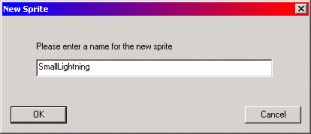
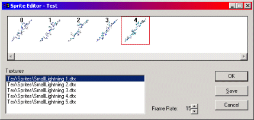

| ### Content Guide |  |
| --- | --- |

# Working With Sprites

Sprites (.spr files) are composed of a texture or textures linked together. You can use sprites to create animations or to create effects using objects that require a sprite. You can compose sprites from any texture, including transparent textures.

ScaleSprite objects perform operations using sprites created with the procedures in this section. For more information about ScaleSprites, see [Inserting a ScaleSprite Object ](../WObj/mObj.md#InsertingaScaleSpriteObject)in the [Working With Objects ](../WObj/mObj.md)section.

This section contains the following topics on basic sprite creation and use:

- [Creating a Sprite ](#CreatingaSprite)
- [Applying a Sprite ](#ApplyingaSprite)
- [Editing a Sprite ](#EditingaSprite)

---

## Creating a Sprite

Creating a new sprite is a simple operation that involves the use of the Sprites tab in DEdit. The following procedure assumes you have already imported the texture files to compose your sprite into the DEdit Textures tab. For information about importing textures into your world, see [Importing a Texture ](../WTextrz/mTextrz.md#ImportingaTexture).

#### To create a sprite

1. In the DEdit **Project Window **, click the **Sprites **tab.
2. Select the directory to store the sprite in.
3. In the window below **Name **, right-click and select **Create New **Sprite.
The **New Sprite **dialog box opens.

4. Type the name for the new sprite, and then click **OK **.
The **Sprite Editor **dialog box opens, and the **Project Window **switches to the **Textures **tab.

5. In the **Textures **tab, double-click each texture to add to the sprite. The textures you select are added to the **Sprite Editor **dialog box in the order you select them. To remove a texture from the **Sprite Editor **dialog box, double-click the texture.
6. Set the **Frame Rate **for the animation. The **Frame Rate **specifies the number of frames in the animation that appear each second. For example, the animation in the previous image has five frames and a **Frame Rate **of fifteen, therefore the entire animation appears three times each second.
7. Click **Save **to save the sprite.

---

## Applying a Sprite

You can apply a sprite to any brush surface in **Brush Edit **Mode or any polygon in **Geometry Edit **mode. Additionally some objects require sprites to operate correctly. For example, the ScaleSprite object requires a sprite to create a polygon that always faces the character.

#### To Apply a Sprite

You can apply a sprite in DEdit the same way you apply textures. Simply select the sprite in the Sprites tab, select the brush to apply the sprite to, and then press **CTRL + T **.

[Top ](#top)

---

## Editing a Sprite

There are two methods for edting sprite files:

- You can edit the textures composing the sprite.
—or—
- You can open the Sprite Editor to add or remove textures from a sprite.

The textures a sprite is composed of are referenced by the sprite, not contained in the sprite, so any edits you make to the textures the sprite is composed of are automatically applied to the sprite when your level is processed. For information about editing textures, see [Working With Textures ](../WTextrz/mTextrz.md).

#### To Edit a Sprite

1. In the DEdit **Project Window **, click the **Sprites **tab.
2. Double-click the sprite to edit. The **Sprite Editor **dialog box opens.
3. Double-click any sprite to remove it from the animation.
4. In the **Texture **tab, double-click any texture to add it to the animation.
5. When you have completed your edits, click **Save **.

[Top ](#top)

---

Touchdown Entertainment, Inc. [Send feedback regarding this page. ](mailto:support@touchdownentertainment.com?subject=JupiterDevGuide Feedback: Dedit\WorkWith\WSprites\mSprites.md)2006, All Rights Reserved.
