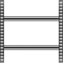
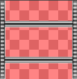
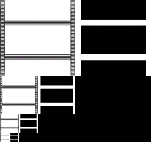
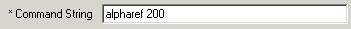

| ### Content Guide |  |
| --- | --- |

# Working With Textures

Textures are raster-based images that cover a brushes polygons. Think of textures as paint, and the surface of your brushes as the canvas. There are a variety of different applications that can create texture files, although all textures used by the LithTech Jupiter engine reside in .DTX format.

This section contains the following topics on creating, applying, and manipulating textures:

- [Creating a Texture ](#CreatingaTexture)
- [Importing a Texture ](#ImportingaTexture)
- [Applying Textures ](#ApplyingTextures)
- [Adjusting Textures ](#AdjustingTextures)
- [Using an Alpha Mask ](#UsinganAlphaMask)

---

## Creating a Texture

You can create textures as .TGA (Truevision Targa) files, and import them into your DEdit textures tab, or you can save them directly as .DTX files using plugins designed for that purpose. Which method you choose depends entirely on the application you use to draw your textures. Photoshop has a .DTX plugin that allows you to save in .DTX format, and other programs, such as PaintShop can make use of the .DTX plugin if they support Photoshop plugins. If you are making texutres in a program that does not support Photoshop plugins, then the best option is to save your textures as .TGA files. Saving as .BMP or .PCX may work, but is not officially supported and can result in errors.

### Texture considerations

- Because textures are often tiled, you should try and design the borders of your textures in a manner that allows them to seamlessly match together. Most image editors have tools allowing you to create seamless patterns, and you should research and use these tools whenever creating textures for tiling.
- You can create textures from virtually any digital image, but be wary of copying and using images that are not owned by your company. Copyright rules generally apply to all textured images.
- Alpha layers (also called "alpha masks") allow you to adjust the transparency or translucency of your textures. This technique allows you to create fences, grated windows, and ladders that require very little processing power in comparison to high polygon precision objects. It is not necessary to create an alpha layer for your texture if the texture will not be used for translucency. Textures using alpha layers can also use the alpharef command string to specify their level of translucency. For more information about alpha layers see [Using an Alpha Mask ](#UsinganAlphaMask).
- Texture sizes are limited by current video cards and of the DirectX API. Texture sizes are restricted to a power of 2 squared ((2^X)^2). For instance you can create a texture with any width and height combination of 8, 32, 64, 128, 256, 512, and so one. Some examples of valid sizes are: 32X64, 64X128, 128X256, 512X512.
- Smaller textures take less memory to store and use, so the smaller the texture, the less it costs to render. Tiling small textures results in very fast rendering. The exact number and size of textures that is appropriate for your game depends upon the amount of video memory available on your target platform.

---

## Importing a Texture

If you have created a .DTX file there is no need to import a texture. Simply save your texture directly into the folder where you plan to use it in your game. If you have created a .TGA file and wish to import it into your world, then use the following procedure.

#### To import a texture

1. In the DEdit **Project Window **, click the **Textures **tab.
2. Select the textures folder to import to.
3. Right-click in the list of textures, and then click **Import TGA files **.
4. Select the .TGA files to import, and then click **OK **.

DEdit imports the selected .TGA files and converts them to .DTX. The original source files remain in .TGA format at the source location.

| **Note: ** | Some image applications create .TGA files that use compression or other options that DEdit cannot understand properly. Be sure that you save your .TGA texture files without using any compression options or DEdit may corrupt the texture or crash. In PaintShop Pro, for instance, the **Options **button in the **Save As **dialog box for .TGA files allows you to turn off compression. |
| --- | --- |

[Top ](#top)

---

## Applying Textures

You can apply textures to any selected brush in DEdit. **Brush Edit **mode allows you to apply textures to entire brushes, while **Geometry Edit **mode allows you to apply textures to individual polygons.

To apply a texture

1. In the DEdit **Textures **tab, select the texture you wish to apply.
2. In any view, select the brush or polygon to receive the texture.
3. Press **CTRL + T **to apply the texture.

The texture becomes immediately visible. You can use this same process to apply a sprite from the **Sprites **tab onto a brush or face to create a simple animated surface.

[Top ](#top)

---

## Adjusting Textures

There are several adjustments you can make to textures: you can map them to the size and shape you want, you can set them to fit a polygon, you can wrap them around the surface of a brush, and you can reset them to their original wrapping. Use the following procedures to adjust the way your texture appears on the surface of any world geometry.

#### To map a texture

1. In **Brush Edit **or **Geometry Edit **mode, select the brush or polygon to edit, and then press the **A **key.
The Map Texture Coordinates dialog box appears:

>

1. Use the **Offset **area to move the texture horizontally ( **U **) and vertically ( **V **) across the surface of the selected object.
2. Use the **Scale **area to adjust the width ( **U **) and height ( **V **) of the texture.
3. Use the **Rotation **area to adjust the rotation of the texture on the surface of the selected object.
4. When you have finished your edits, click **OK **.

#### To adjust a texture with the mouse

1. In any mode, select the texture to adjust.
2. Press and hold the **R **key, then move the mouse to slide the texture over the surface of the selection.
3. Press and hold the **R **key and the **RIGHT MOUSE BUTTON **, then move the mouse to rotate the texture over the surface of the selection.
4. Press and hold the **R **key and the **LEFT MOUSE BUTTON **, then move the mouse to scale the texture over the surface of the selection.

**Note: **If you hold the **SHIFT **key while using any of the above commands, the texture will snap to precise degrees of motion or rotation instead of moving completely freely.

#### To fit a texture to a polygon

1. In **Geometry ****Mode **, select the polygon to fit.
2. Press **SHIFT + C **.
The texture adjusts its coordinates to fill the selected polygon. This command works across multiple faces, but will not work perfectly on faces with more or fewer than four sides (such as triangles) or on an entire brush at once.

#### To wrap a texture around a brush

>

**Note: **To use this command you may need to apply a shortcut key combination to the Texture Wrap action. For instructions on adding the shortcut key assignments, see [Changing or Adding a Shortcut Key ](../../EditKeys.md#ChangingorAddingaShortcutKey).

1. In **Brush Mode **, select the desired brush.
2. Press the key combination associated with the **Texture Wrap **action.
3. In any view, click and drag a line across the surface of the brush to designate the direction of the texture.

#### To reset a texture

1. In any mode, select the texture to reset.
2. Press the **K **key.
When pressed more than once, this command also aligns a texture to each edge of the selected polygons.

[Top ](#top)

---

## Using an Alpha Mask

Alpha masks allow you to designate the portions of a texture that are transparent or translucent. Transparent portions of a texture are invisible (not rendered), and translucent portions are ghost-like (partially visible).

#### To use an alpha mask

1. Create an image with an alpha mask using an image editor that supports alpha masking (such as Photoshop or PaintShop Pro). The following two images show a ladder created with an alpha mask. The image on the left shows the normal ladder illustration. The image on the right shows the mask for the illustration. The red portions of the mask are painted with black to specify complete transparency.

2. Save the file in .TGA or .DTX format.
3. Import the texture as specified in [Importing a Texture ](#ImportingaTexture).
4. In the **Textures **tab, double click the newly imported texture. A dialog box opens along with a preview of the texture and its alpha mask. The following image shows a preview of a ladder with it's alpha mask:

>
|  | The alpha mask appears directly to the right of the image. **White **portions of the mask are completely visible. **Black **portions of the mask are completely transparent. Any **shades ****of gray **you use in your alpha mask also appear here and create various levels of translucency. The darker the shade of gray, the more translucent that area of the texture. |
| --- | --- |

1. In the dialog box for the texture, you can type **alpharef X **where **X **indicates a value between 0 and 255. This command specifies the level of translucency allowed by the mask (translucency has a range of 256 gray shades). The alpharef command sets the cut-off tolerance of the translucency. The higher the alpharef value, the lighter a part of the alpha mask can be before it stops rendering entirely.

An alpharef of 200, for example, allows forces transparency for all gray shades from absolute black (255) to the dark gray shade specified by 201. All shades of grey from 0 to 200 are considered transparent, so those parts of the texture do not appear in the game. The following image illustrates where to place the alpharef command in the Texture Properties dialog box. Using an alpharef value helps to create a clean edge in transparent textures, and it can also help improve performance for large translucent textures if they have large areas that are almost totally invisible.

>

2. Click **OK **to close the dialog box, and then apply the texture to a brush or polygon as specified in [Applying Textures ](#ApplyingTextures).

| **Note: ** | Textures with alpha masks to not appear transparent or translucent in DEdit. Objects in your level only appear translucent after you process and run your world. |
| --- | --- |

[Top ](#top)

---

Touchdown Entertainment, Inc. [Send feedback regarding this page. ](mailto:support@touchdownentertainment.com?subject=JupiterDevGuide Feedback: Dedit\WorkWith\WTextrz\mTextrz.md)2006, All Rights Reserved.
