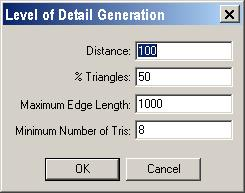

| ### Content Guide |  |
| --- | --- |

# Controlling Level of Detail

One of the best ways to optimize the rendering of models is to draw fewer of the model's polygons where appropriate. ModelEdit has a tool to create multiple levels of detail dependent upon a distance value. At lower levels of detail, ModelEdit creates a version of the model that uses fewer polygons to draw the same object. The game engine will take the distance from the rendering camera (either from the player's point of view or a cut scene camera) to the object seen and use the triangulation set for that distance.

#### To create an LOD for a model piece

1. In the Piece menu, choose the Build LODs option. The following Level of Detail Generation dialog will appear.

>

2. Enter a value in the Distance box. The distance is the threshold for the LOD being created. In the game when the view camera is that distance in game units from the object, your new detail level (the lower-polygon mesh) is used to render the model.
3. In the % Triangles box, enter the percentage of model triangles from the current mesh you want to keep in the new LOD mesh at this distance.
4. Click OK.

LOD 0 Reduced Triangle LOD

The images above are the result of an LOD operation. The image on the left (LOD 0) is the base model; the image on the right is the reduced triangle model. In the game, the renderer will automatically switch to the next LOD level when the distance associated with the LOD level has been reached.

## Model LOD Differentiation

The LOD operation affects the whole model, but the user can change how LOD affects different pieces of the model. Artists can make some important pieces stay detailed while other parts of the model become lower resolution.

#### To differentiate the pieces for the LOD operation

1. In the Level of Detail Generation dialog, pick a piece from the Piece Weights list.
2. Enter a value greater than one into the Piece Weights value box. The value represents the LOD priority for that piece. The larger the number, the later the piece will have LOD operations done on it. For example, if the value of one piece is three, it will take three vertex collapses before that piece's triangles start to collapse. This is useful for objects like heads or shields, where a small loss in detail can be very noticeable.

[Top ](#top)

---

Touchdown Entertainment, Inc. [Send feedback regarding this page. ](mailto:support@touchdownentertainment.com?subject=JupiterDevGuide Feedback: ModlEdit\LOD.md)2006, All Rights Reserved.
