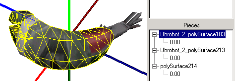
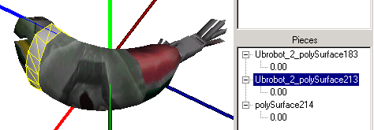
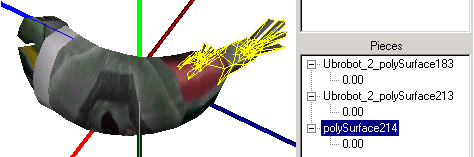

| ### Content Guide |  |
| --- | --- |

# Jupiter Model Issues

Creating models for Jupiter is conceptually straightforward:

1. Use a modeling package to create a polygonal mesh model.
2. "Skin" the mesh model over a bone hierarchy. Skinning involves weighting each vertex of the mesh to one or more bones.
3. Select a texture for the model.
4. Apply UV texture coordinates to it.
5. Animate the model’s bones.

The resulting model is ready to export.

The following issues relate to creating models for the Jupiter system:

#### Geometric Center

The geometric center of most models should be at the origin. For human character models, for example, this would be the pelvis.

#### Textures

Except for UVW Mapping, textures and material values are not explicitly assigned in the modeler. Instead, this information is specified in ModelEdit and DEdit. Each piece of a model can have up to four textures applied to it using RenderStyles. These four textures are applied one on top of the other, blended as the RenderStyle specifies. Each layer can have its own index value, which is used to specify which texture loaded for the model belongs on which piece/layer.

All textures in Jupiter are 32-bit by default and their height and width must each be a power of 2.

#### Meshes

The model can be made up of one or more separate meshes. Generally, splitting up models makes UV mapping easier and can create reusable parts such as hands, feet and so on. The UV mapping of a model has to be done in the modeling package. The following images illustrate a model composed of three separate meshes.

Texture indexes correspond to the indexes on your model's different meshes. This way, the game programmer or the level designer controls explicit texture assignment for each mesh in a model. There can be only one UV mapping per piece, with up to four textures in layers.

#### Surface Material Properties

Except for UVW Mapping, all surface material properties defined in the modeling package are ignored in the exporter. Vertex colors, lighting and so on are lost in the conversion.

#### Image Conversion

Use DEdit to convert images into the DTX format required for the game. DEdit can understand and import .PCX or .TGA files, though .TGA is definitely the preferred format.

The advantage to using a .TGA file is that since Targa files have a built-in alpha channel, DEdit can automatically generate an alpha mask for the texture without the need to import a second file as your alpha mask.

.PCX files require a second file for their alpha mask, adding a second step and a second file to keep track of.

#### Using Animation Sharing

If you want models to share animations via the child model system, then all models sharing a set of animations should have the exact same hierarchy. This is very important. Differently organized hierarchies cannot share animations. The skeleton offsets should be similar, but do not have to be exact.

There are problems using animation from a short character on a tall character, but most things like walks, runs, and general hand movement work fine. The biggest problem is two characters with different shoulder/arm proportions sharing an animation that requires using two hands together, like holding a rifle, or even something like clapping hands. This will almost never work right, but Jupiter supports overriding a shared animation on a per-character basis, so you can make a model-specific version of any animation when needed. Remember that you cannot scale bones.

#### .LTA File Format

An important concept to remember about the .LTA file format is that it is a database that contains the model's geometry, bone hierarchy, level of detail information, and mode. The model database can refer to other files, especially if many models share the same set of animations.

All of the models in TO2 were created to be exported from Maya 4.0 using our exporter.

[Top ](#top)

---

Touchdown Entertainment, Inc. [Send feedback regarding this page. ](mailto:support@touchdownentertainment.com?subject=JupiterDevGuide Feedback: ModlEdit\Modlisuz.md)2006, All Rights Reserved.
