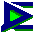

| ### Content Guide |  |
| --- | --- |

# Using ModelEdit

ModelEdit is the tool used to integrate models into the game. Typically, game designers use 3D applications such as 3D Studio Max or Maya to create and animate models, but ModelEdit is where you finish preparing them for use in Jupiter. This section describes the most frequently used and important features of ModelEdit.

Read the following sections to understand how ModelEdit works, and how you can use ModelEdit to prepare your models for use with the Jupiter engine.

| #### ModelEdit Topics | #### Description |
| --- | --- |
| [Understanding ModelEdit ](ModEdUI.md) | Describes the ModelEdit interface |
| [Controlling Level of Detail ](LOD.md) | Describes how to adjust the level of detail (LOD) |
| [Adding Animations ](Animat.md) | Describes how to add animations to your model |
| [Editing Animations ](EditAnim.md) | Describes how to add and edit animation frames |
| [Animation Blending and Weighting ](AniBlend.md) | Provides instructions for blending and weighting animations |
| [Adding Sockets ](Socket.md) | Describes how to add socket locations to models |
| [Jupiter Model Issues ](Modlisuz.md) | Discusses the issues involved with creating a model in Jupiter |
| [Creating a Character ](CharCrea.md) | Discusses the issues involved with creating a character in Jupiter |
| [Setting up a Player View Weapon ](PlayView.md) | Describes how to set up a player weapon |
| [ModelEdit UI Reference ](UIRef.md) | Describes the commands in the ModelEdit menus |

[Top ](#top)

---

Touchdown Entertainment, Inc. [Send feedback regarding this page. ](mailto:support@touchdownentertainment.com?subject=JupiterDevGuide Feedback: ModlEdit\mModEd.md)2006, All Rights Reserved.
