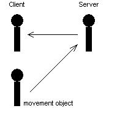

| ### Programming Guide | [  ](http://www.touchdownentertainment.com/jupiter.md) |
| --- | --- |

# Simple Physics Tutorial

The Simple Physics tutorial is an extension of the foundation created by [MPFlyCam ](FlyCam.md). In this tutorial we look at some of the problems and solutions that arise with physics in a multiplayer environment. We introduce several concepts such as gravity and stair stepping. This tutorial can be found in the following directory:

- \Samples\tutorials\simplephys

As with MPFlyCam, when you startup SimplePhys, the only thing visible is text from the console. You need to specify the game type that you want to start. The options are listed below:

- **Normal **—normal single player game. type: **normal **
- **Server **—start this as a multiplayer server. This is NOT a standalone server. type: **server **
- **Join **—connect to a server. type: **join <ip.ip.ip.ip> **or **join <computername> **

---

### Common Problems
A few typical problems that surface with designing multiplayer games is dealing with slow packet speeds, poor connection quality, and latency. While there is no way to "solve" these problems, as network routing is out of the control of the programmer. You want to make these problems transparent to the player. Players want fluid motion on objects in the gaming world, including other players. Players also demand fast response time. When they press "left", they want to go left **now **, not in 100 milliseconds.

#### Fluid Motion

You can solve fluid motion by using the velocity of the object to "predict" where it should be the next frame. To use prediction, set a velocity on all objects you wish to have the clients "predict" and you specify "prediction" "1" in the autoexec.cfg. This tells the engine to turn prediction on. You must have prediction enabled for all multiplayer games.

#### Input Response Time

Input response time is a slightly less trivial matter. In the LithTech client/server architecture, each client has a client-side and a server-side, client object. When you "move" the server-side client object it automatically moves the client object on the client-side. So, if you were to move the client-side client object, then send the moves to the server, the server would the send the moves back to the client. This results in moving the client object 3 times, and will certainly be disruptive to the fluid input response. To get around this you can use the client object as an object seen only by other players. Using this technique a player's client object is invisible and they never see it. When the player moves he is actually moving another object created on the client-side only. The moves are then sent to the server, which get propagated to all of the other connected players able to see this player. In the case of a 3rd person camera, the movement object is visible. This is the case of the SimplePhys tutorial. The image below displays a graphical representation of the process.

>


---

## Physics

This section provides a few notes about gravity and stair-stepping physics in the SimplePhys tutorial.

#### Gravity
There are a few important pieces needed in order to implement gravity using the Jupiter Engine. First you must set the actual amount of gravity you want to affect your player object.

>
```

ltclientshell.cpp
#define DEFAULT_GRAVITY     -2000.0f
...
void CLTClientShell::Update()
{
    ...
    LTVector vNewGlobalForce(0, DEFAULT_GRAVITY, 0);
    g_pLTCPhysics->SetGlobalForce(vNewGlobalForce);
    ...
}

```

Next you must manually update the physics system to take gravity into account. The **ILTClientPhysics::UpdateMovement **call does this for us.

>

**Note: **You must call either **SetVelocity **or **SetAcceleration **for the object prior to calling **UpdateMovement **. These two functions set a variable that tells the engine it is okay to affect this object's position.

```

playerclnt.cpp
void CPlayerClnt::RecalculatePosition()
{
    ILTClientPhysics* pCPhysics = (ILTClientPhysics*)g_pLTCPhysics;
    MoveInfo info;
    info.m_Offset.Init();
    info.m_hObject = m_hObject;
    info.m_dt = g_pLTClient->GetFrameTime();
    pCPhysics->UpdateMovement(&info);
    ...
}

```

#### Stair Stepping
On the object you must specify the **FLAG_GRAVITY **flag.

>
```

playerclnt.cpp
void CPlayerClnt::CreatePlayer()
{
    ...
    objCreateStruct.m_Flags = FLAG_SOLID | FLAG_GRAVITY | FLAG_STAIRSTEP | FLAG_VISIBLE;
    ...
}

```

Next, you must set the stair stepping height. This is the maximum increment at which the object is able to step up.

>
```

ltclientshell.cpp
void CLTClientShell::Update()
{
        ...
        if( m_bFirstUpdate )
        {
	     ...
             g_pLTCPhysics->SetStairHeight(16.0f);
	     ...
	}
	...
}
```

If you have any questions or comments, please send them to [support@touchdownentertainment.com ](mailto:support@touchdownentertainment.com)

---

Touchdown Entertainment, Inc. [Send feedback regarding this page. ](mailto:support@touchdownentertainment.com?subject=JupiterDevGuide Feedback: ProgGuid\Prog\SimpPhys.md)2006, All Rights Reserved.
