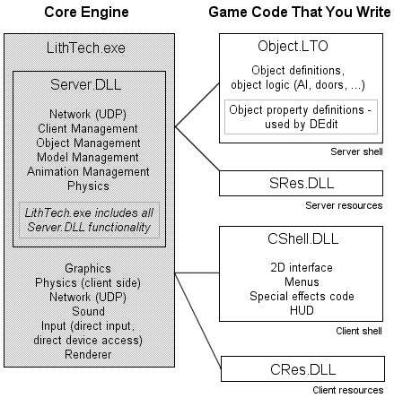

| ### Programming Guide |  |
| --- | --- |

# System Overviews

There are many areas of Jupiter code that you must familiarize yourself with in order to successfully complete a game. This section provides short overviews of the following primary Jupiter systems:

- [System Architecture Diagram ](#SystemArchitectureDiagram)
- [Client Shell ](#clientshell)
- [Server Shell ](#servershell)
- [Interface Manager ](#interfacemanager)
- [Input ](#input)
- [Lighting ](#lighting)
- [Physics ](#physics)
- [Rendering ](#rendering)
- [Simulation Objects ](#simulationobjects)

Since Jupiter is based on a client-server model, the Client Shell and Server Shell systems are of utmost importance and are discussed first.

---

## System Architecture Diagram

The following image illustrates the system architecture of the LithTech Game Development System:

>

The Core Engine section is the primary component supplied by LithTech for the creation of your game. The Game Code That You Write is the portion of your game that you must create. The game code supplied with your build only serves as a reference for you to research when determining how to design your game. Actual implementation of Game Code varies greatly from game to game, and depends on many aspects of how you want your game to operate. Read the following sections for descriptions of the components in the System Architecture Diagram.

---

## Client Shell

Client Shell is a term used to encompass all client-side game code operations and logic. The client shell game code provided with Jupiter is located in the \Game\ClientShellDLL\ folder. You can use this code as a starting place for your own game’s client shell.

The client shell communicates with the Jupiter engine code to initiate a variety of operations. Jupiter, in return, notifies the client shell of various events, such as engine initialization, messages from the server, input status changes, and so on.

The client shell performs the following required tasks:

- It calls the **SETUP_CLIENTSHELL **macro to set up required .DLL exports and some global variables. This macro is defined in the \Engine\sdk\inc\iclientshell.h header file.
- It creates an **IClientShell **-derived class instance. Jupiter sends notifications to this derived class to inform your game of various events. There are a variety of notification-handling functions that may be implemented. The two most important of these are **OnEngineInitialized **and **Update **. This class is a good starting point for your game code and is defined in the \Engine\sdk\inc\iclientshell.h header file.
- The **ILTClient **class is instantiated by Jupiter and provides significant functionality to your game code, such as the **ILTClient::PauseMusic **function. You can obtain a pointer to the instance using the Interface Manager’s **define_holder_to_instance **macro, defined in the \Engine\sdk\inc\ltmodule.h header file.

[Top ](#top)

---

## Server Shell

Server Shell is a term used to encompass all server-side game code operations and logic. The server shell game code provided with Jupiter is located in the \Game\ObjectDLL\ folder. You can use this code as a starting place for your own game’s server shell.

The server shell communicates with the Jupiter engine to initiate a variety of operations. The Jupiter engine code, in return, notifies the server shell of various events.

The server shell performs the following required tasks:

- It calls the **SETUP_SERVERSHELL **macro to set up required .DLL exports and some global variables. This macro is defined in the \Engine\sdk\inc\iservershell.h header file.
- It creates an instance of the **IServerShell **class. Jupiter sends notifications to this class to inform your game of various events. There are a variety of notification-handling functions that you may implement. Two important functions are **OnClientEnterWorld **and **OnClientExitWorld **. The **IServerShell **class is defined in the \Engine\sdk\inc\iservershell.h header file.
- The **ILTServer **class is instantiated by Jupiter and provides significant functionality for your game. You can obtain a pointer to the instance using the Interface Manager’s **define_holder_to_instance **macro.

[Top ](#top)

---

## Interface Manager

The Interface Manager provides a consistent, modular method by which game and engine code can define, implement, instantiate, and retrieve interfaces. Jupiter instantiates a variety of interfaces that offer a wide assortment of operations: client ( **ILTClient **) and server ( **ILTServer **) procedures, physics ( **ILTPhysics **), sound ( **ILTSoundMgr **and **ILTClientSoundMgr **), text and user interface ( **ILTFontManager **and **ILTWidgetManager **), custom rendering ( **ILTDrawPrim **), and more.

To retrieve engine interface instances, the game code uses the Interface Manager. The Interface Manager provides a set of macros, such as **define_holder **or **define_holder_to_instance **, that game code can use to acquire global pointers to instances of various engine interfaces. The Interface Manager macros are defined in the \Engine\sdk\inc\ltmodule.h header file.

### Notification Calls from Jupiter

Jupiter often notifies game code of events by calling a variety of functions on your implementations of various class instances. The most common notifications from Jupiter are directed at your **IClientShell **and **IServerShell **-derived interfaces. You will also instantiate other classes that receive notifications from Jupiter, such as **BaseClass **and **BaseClassClient **.

Before any of your interfaces can receive notifications from Jupiter, Jupiter must know about them. You can register your interface instances with Jupiter using the **declare_interface **macro.

[Top ](#top)

---

## Input

Jupiter can support input from a variety of devices. When input is detected from such a device, Jupiter checks to see if you have bound any actions to that input event. If you have, Jupiter notifies your game code of the input event. Your game code can then take appropriate action.

To bind an input event to an action, you must define it in the autoexec.cfg file. The game source autoexec.cfg file is located in the \Development\TO2\ folder. This is a text file that lists the various input events that initiate notifications from Jupiter to your game code. It uses the **addaction **, **enabledevice **, and **rangebind **commands to define desired events.

Jupiter notifies game code of input events through the **IClientShell::OnCommandOn **and **IClientShell::OnCommandOff **functions. Each of these notification calls will pass in an integer value identifying the command associated with the input event. Your game code must know what the integer value means so that the appropriate action can be taken.

[Top ](#top)

---

## Lighting

There are two kinds of lighting in Jupiter: static and dynamic.

Static lighting is set by level designers in the world .LTA file using DEdit.

Dynamic lighting is a simple process. Merely create an object using the **ILTServer::CreateObject **function and the **ObjectCreateStruct **structure with the **m_Type **member variable set to **OT_LIGHT **. Then you can use **ILTClient::SetLightColor **and **ILTClient::SetLightRadius **to alter the lighting effects. You can change the size and position of the light as you would any other object. Dynamic lights have a performance impact, so consider their use carefully.

[Top ](#top)

---

## Physics

The object physics in Jupiter are dictated by setting the acceleration and velocity of an object. Over time, the acceleration changes the velocity, and the velocity changes the position of an object.

The default model for collision is the axis aligned bounding box. If an object is a world model, the object is treated as a BSP unless the **FLAG_BOXPHYSICS **flag is set for the object. To use cylinder collision detection on objects that are not world models, set the **FLAG2_PLAYERCOLLIDE **bit or the **FLAG2_CYLINDER_CD **bit of the **LTObject::m_Flag2 **member. Cylinder collision detection is intended to be used with the player object.

The **ILTPhysics **interface provides a method of controlling the attributes of the objects in relation to the physics, both locally to the object, and globally for the entire world. Each of the object attribute accessor functions has a Get and Set version for retrieving and storing the attribute. This interface is defined in the \Engine\sdk\inc\iltphysics.h header file.

The **ILTClientPhysics **interface defines a way of simulating physics using only the client-side version of the world.

[Top ](#top)

---

## Rendering

Rendering in Jupiter is handled by engine code. A variety of exposed engine interfaces allow the game code to render primitives, objects, and world geometry.

Use the **ILTClient::SetRenderMode **function and the rendering console variables to initialize the renderer.

The **ILTDrawPrim **and **ILTTexInterface **interfaces expose functions that enable you to render custom effects, such as low-level primitives and textures.

[Top ](#top)

---

## Simulation Objects

Simulation objects represent items in a Jupiter application environment. Players, monsters, guns, ammunition packs, lights, key framers, and more are all created as simulation objects. Simulation objects are represented in code by game objects and an associated engine object.

To create a simulation object, you must define a class based on the **BaseClass **class in the Server Shell, or **BaseClassClient **in the Client Shell. Objects receive event notifications from Jupiter through the **EngineMessageFn **and **ObjectMessageFn **functions. You must override these notification functions to handle events of your choice.

Level designers need access to your simulation objects so that they can place them in their levels using the Jupiter DEdit tool. Simulation objects are published to DEdit using the **BEGIN_CLASS **and **END_CLASS **macros.

[Top ](#top)

---

Touchdown Entertainment, Inc. [Send feedback regarding this page. ](mailto:support@touchdownentertainment.com?subject=JupiterDevGuide Feedback: ProgGuid\Prog\SysOver.md)2006, All Rights Reserved.
