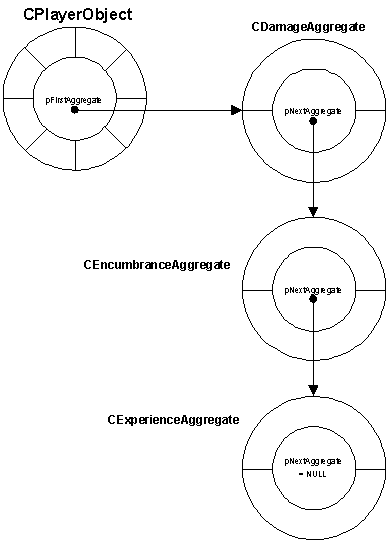

| ### Programming Guide |  |
| --- | --- |

# Defining Simulation Objects

Simulation objects that you use in your game must be declared as game object classes in your game code. Game object classes must derive from the **BaseClass **class. In addition to the **BaseClass **functions and variables, your inherited class can implement all the customized functionality that your game requires.

Engine objects have a type, as defined by the **OT_* **defines in ltbasedefs.h. Game objects must also define both messaging functions: **EngineMessageFn **and **ObjectMessageFn **. All simulation objects must be initialized using the **BEGIN_CLASS/END_CLASS **macros. This also publishes the object to DEdit. Simulation objects can have associated aggregates, which can be used to provide generic functionality across different objects. Finally, simulation objects automatically have universal properties and may have custom properties.

This section contains the following simulation object topics:

- [Object Types ](#ObjectTypes)
- [Volume Effects ](#VolumeEffectsFn)
- [EngineMessageFn Function ](#EngineMessageFn)
- [ObjectMessageFn Function ](#ObjectMessageFn)
- [Aggregates ](#Aggregates)
- [Simulation Object Properties ](#SimObjProperties)

---

## Object Types

Each engine object has a type. A type gives LithTech information on how to handle the engine object. Object types are defined by the **OT_* **defines. The type is part of the **ObjectCreateStruct **used to create the engine object. LithTech supports the following object types:

**Camera (OT_CAMERA) **—Camera objects define specific views with position and rotation in the world.

**Canvas (OT_CANVAS) **—A canvas object is an object that is rendered by the game code, not the engine code. For example, canvases can be used in conjunction with the **ILTDrawPriminterface **and the **LT_VERT* **, **LT_LINE* **, and **LT_POLY* **structures.

**Container (OT_CONTAINER) **—A container object defines a volumetric space. Other objects can be tested to determine whether or not they are within the container.

**Dynamic light (OT_LIGHT) **—A light object defines a radial or directional light located at a specific point in the world.

**Invisible object (OT_NORMAL) **—Normal objects are the most basic types of objects. Clients are often normal objects.

**Line system (OT_LINESYSTEM) **—A line system object is composed of many lines, all relative to a specific origin.

**Model object (OT_MODEL) **—A model object defines a model, such as a player, a monster, a gun, and so on.

**Particle system (OT_PARTICLESYSTEM) **—A particle system object defines a procedurally generated system that consists of textured particles.

**Poly grid (OT_POLYGRID) **—A polygrid object defines a moveable, dynamic grid of polygons. This can be used to simulate waving flags or curtains, shimmering forcefields, or water surfaces.

**Sprite (OT_SPRITE) **—A sprite object defines a two-dimensional image that may or may not be animated.

**WorldModel (OT_WORLDMODEL) **—A world model object defines an object in worldspace that possesses physics data. Doors, windows, and destructible walls are examples of worldmodels. WorldModels are added in DEdit and have brushes bound to them that define their structure.

**Volume Effect (OT_VOLUMEEFFECT) **—A volume effect. The object defines an area in which some type of volumetric effect transpires, such as snow.

[Top ](#top)

---

## Volume Effects

The **OT_VOLUMEEFFECT **object type is used for generic effect rendering by game code. An object of this type basically defines a volume in which an effect will take place. Currently the only type of volume effect is the Dynamic Particles type. This effect basically passes a vertex buffer to the client side game code, which fills in the vertex information, as well as some optional lighting information. The best example within the TO2 code base is the SnowFX.cpp file in ClientShell.

### Creating Volume Effects

Your client code creates a client-side object just as you would for any other object, of type **OT_VOLUMEFFECT **. The key flags are **FLAG_VISIBLE **and **FLAG2_FORCETRANSLUCENT **. The former is used to determine if the volume effect should be updated and rendered. The latter renders the triangles with AlphaRef=0 and no Z Buffering. Both of these flags can be changed every frame if needed.

After creating the object, the volume effect specific information needs to be set. This is done through the **ILTClient::SetupVolumeEffect **function defined in iltclient.h.

>

LTBOOL (*SetupVolumeEffect)(HLOCALOBJ hObj, VolumeEffectInfo& info);

The **hObj **parameter is the **OT_VOLUMEEFFECT **object. The **info **parameter is a populated **VolumeEffectInfo **structure.

### VolumeEffectInfo

The **VolumeEffectInfo **structure is the initialization structure for volume effect objects. It is defined in ltbasedefs.h. Every volume effect contains the same two pieces of information, the effect type ( **m_EffectType **), and the dimensions of the effect ( **m_Dims **).

Currently, the only valid setting for **m_EffectType **is **kDynamicParticles **. The **kUninitialized **value will result in nothing being rendered.

The following data must be set when calling **SetupVolumeEffect **on a Dynamic Particle volume effect ( **VolumeEffectInfo.m_EffectType=kDynamicParticles **):

**m_DPUpdateFn **—A function that fills in the vertex buffer. The function is of this form:

>

bool VolumeEffectDPUpdateFn(

>

void* pUser,

void* pVertexBufferData,

void* pLightingData,

uint32 nVBNumVerts,

uint32 nPrevFilledVerts,

uint32& nNumFilledVerts

);

**pUser **is set to the value the client passed in **m_DPUserData. pVertexBufferData **is a pointer to a locked, write only (!) vertex buffer. **pLightingData **is a pointer to an array of information that should be set if lighting is something other than kNone. **nVBNumVerts **is the number of free vertices in the vertex buffer. **nPrevFilledVerts **is the number of vertices already filled this frame. **nNumFilledVerts **should be set to the number of vertices (less than or equal to **nVBNumVerts **) that the game code filled in the vertex buffer.

The passed vertex buffer may not be large enough to store all of the particles in the particle system. In this case the update function should return false until it is done filling the vertex buffer. This is where the **nPrevFilledVerts **is useful to know.

**m_DPUserData **—User data pointer passed back to the update function.

**m_DPPrimitive **—Primitive type to be used for rendering. If this is set to type **kTrilist **, then the update function should fill in all three vertices in sequence for each particle in the particle system. (Note that UV wrapping is set to clamp when rendering these tris, so you can treat the tri as a quad with overhangs) If the primitive type is **kQuadlist **, then the update function should fill in four vertices in sequence for each particle in the particle system.

**m_DPLighting **—Lighting type to be used. If this is set to **kNone **, then the update function needs to fill in the vertex color information manually. If **m_DPLighting **is **kSinglePointNonDirectional **, then the update function should place the light sample point into **pLightingData **(one point per primitive, not per vertex) as well as the alpha to use for the particle.

**m_DPLightConstant **—Constant light value to be used if lighting is **kConstant **.

**m_DPSaturate **—True if saturated lighting ( **MODULATE2X **) should be used.

**m_DPTextureName **—Filename of the texture to be used for this particle system.

[Top ](#top)

---

## EngineMessageFn Function

**BaseClass::EngineMessageFn **is an event notification function that receives calls from LithTech. All classes derived from BaseClass must define this function.

>

uint32 EngineMessageFn(

uint32 messageID,

void *pData,

LTFLOAT lData

>

>

);

LithTech calls this function with three parameters: a message identifier ( **messageID **), a pointer to data appropriate to the message ( **pData **), and a float appropriate to the message ( **lData **). Only the first parameter is required, the other two are provided only if the message requires them. The return value of this function may be used. It is dependant on the particular message.

**EngineMessageFn **receives predefined message types from LithTech (the **messageID **parameter). These messages are the **MID_* **defines and are defined in the iltbaseclass.h header file:

>

MID_PRECREATE

MID_INITIALUPDATE

MID_UPDATE

MID_TOUCHNOTIFY

MID_LINKBROKEN

MID_MODELSTRINGKEY

MID_CRUSH

MID_LOADOBJECT

MID_SAVEOBJECT

MID_AFFECTPHYSICS

MID_PARENTATTACHMENTREMOVED

MID_GETFORCEUPDATEOBJECTS

MID_ACTIVATING

MID_DEACTIVATING

At the end of your implementation of **EngineMessageFn **you should call the **EngineMessageFn **function of the parent class, passing in the same parameters received from LithTech. This allows behaviors to be inherited down the class hierarchy. When the notification reaches the **BaseClass::EngineMessageFn **, it will handle any aggregates (see [Aggregates ](#Aggregates)below).

[Top ](#top)

---

## ObjectMessageFn Function

**BaseClass::ObjectMessageFn **handles messages sent from game object to game object. All such messages are defined by the game code, not the engine. Classes derived from **BaseClass **should define this function if they will receive messages from other game objects.

>

uint32ObjectMessageFn(

HOBJECT hSender,

uint32 messageID,

HMESSAGEREAD hRead

>

>

);

At the end of your implementation of **ObjectMessageFn **you should call the **ObjectMessageFn **function of the parent class, passing in the same parameters received from LithTech. This allows object behaviors to be inherited down the class hierarchy.

[Top ](#top)

---

## Aggregates

Game objects may have aggregates. An aggregate is a class that extends the functionality of a game object. When a game object receives an event notification from LithTech or another game object (through the **EngineMessageFn **or **ObjectMessageFn **), the **BaseClass **forwards that message on to all associated aggregates.

Aggregates are useful for enabling functionality common to several different game objects. For example, monsters, players, and vehicles can be damaged in a game. Instead of implementing damage logic in each of the monster, player, and vehicle game object classes, you can create a damage aggregate and associate instances of it to the monster, player, and vehicle instances. You can implement your damage logic within the damage aggregate and communicate important information back to the associated game object.

Aggregates have unique advantages over inheritance. They can be added and removed dynamically and they can be flexibly included in multiple inheritance trees without conflict.

### Associating Aggregates with Objects

Aggregates are associated with and disassociated from a game object using the **AddAgreggate **and **RemoveAggregate **functions of the **BaseClass **class. These functions are defined in the ltengineobjects.h header file.

>

void AddAggregate(LPAGGREGATE pAggregate);

LTBOOLRemoveAggregate(LPAGGREGATE pAggregate);

Each of these functions takes an **LPAGGREGATE **, a pointer to an **IAggregate **instance, defined in ltbasedefs.h. The **AddAggregate **function associates an aggregate instance with a game object instance by prepending it to the game object’s linked list of aggregates. The **RemoveAggregate **function removes an association between a game object and an aggregate by removing it from the list.

One instance of an aggregate can be associated with only one game object. If another game object requires the same aggregate functionality, another aggregate instance must be created and associated with the second game object.

### The IAggregate Class

The **IAggregate **class receives notifications from the associated game objects. It is defined in the iaggregate.h header file. In addition to its constructor and destructor, the **IAggregate **class has two pre-defined functions and one member variable.

Both the **IAggregate::EngineMessageFn **and **IAggregate::ObjectMessageFn **receive notifications from the associated object. The associated object forwards the event notifications that it receives to the aggregate’s **EngineMessageFn **and **ObjectMessageFn **. All your **IAggregate **-derived classes must implement these two functions.

| **Note: ** | The **IAggregate **base class does not implement any functionality beyond receiving notifications and maintaining pointers to the next aggregate in the linked list. If you use an aggregate, you must add your desired logic to an **IAggregate **-derived class of your own creation. |
| --- | --- |

The following example code shows how **EngineMessageFn **and **ObjectMessageFn **might be implemented.

>

uint32 IAggregate::EngineMessageFn(

LPBASECLASS pObject,

uint32 messageID,

void *pData,

TFLOAT lData);

uint32 IAggregate::ObjectMessageFn(

LPBASECLASS pObject,

HOBJECT hSender,

uint32 messageID,

HMESSAGEREAD hRead);

In addition to message type ( **messageID **parameter) and data information ( **pData **and **lData **or **hRead **), these functions also receive a pointer back to the associated game object ( **pObject **). **ObjectMessageFn **also expects a handle ( **hSender **) to the game object that originated the message.

The **IAggregate::m_pNextAggregate **member variable is a pointer to the next **IAggregate **instance in the linked list of aggregates associated with an object. When an aggregate is associated with an object, the aggregate instance is prepended to the beginning of the linked list.

The **IAggregate **class provides an interface to engine and object notifications and maintains a pointer to the next aggregate, but does not provide any other functionality. When you use aggregates, you must derive your own classs from **IAggregate **and extend it with the appropriate logic. For example, if you create a **CDamageAggregate **class, you could add death and unconsciousness logic to the notification functions.

### Aggregate Example

A **BaseClass **-derived class, **CPlayerObject **, is defined. All **CPlayerObject **instances (and possibly other game objects) are subject to damage, encumbrance, and experience. Instead of incorporating this functionality directly into the **CPlayerObject **class, three aggregate classes are created: **CDamageAggregate **, **CEncumbranceAggregate **, and **CExperienceAggregate **.

In order to associate these aggregates with the **CPlayerObject **, **AddAggregate **must be used, most likely in the **CPlayerObject **constructor. The aggregates are added in the following order: **CExperienceAggregate **, **CEncumbranceAggregate **, and then **CDamageAggregate **.

**TheCPlayerObjectnow **has three associated aggregates, as shown in the chart below.

The order in which the aggregates are listed in the aggregate list determines in what order they receive notifications from the game object. In this case, **CPlayerObject **forwards notifications to **CDamageAggregate **, then to **CEncumbranceAggregate **, and then to **CExperienceAggregate **.

The aggregates can also be associated with other game objects. For example, **CDamageAggregate **instances can also be associated with **CMonsterObject **, **CVehicleObject **, or **CBarricadeObject **.

[Top ](#top)

---

## Simulation Object Properties

A simulation object can have numerous properties. Simulation object properties define specific attributes, such as position, color, filename, and so on. There are two different kinds of properties: universal and custom.

Properties can be accessed and modified before and during the creation of a simulation object. After a simulation object has been created, you can access and modify the member variables of the simulation object’s game object and engine object.

### Universal Properties

Universal properties are those properties that are handled by LithTech and are applied to the engine object. LithTech manages all universal properties. Your code can access and modify universal properties, but LithTech handles the logic behind them.

The **ObjectCreateStruct **structure is used to set values for the universal properties.

The universal properties include the following **ObjectCreateStruct **member variables:

m_ClassName

m_ContainerCode

m_CreateFlags

m_fDeactivationTime

m_Filename

m_Flags

m_Flags2

the following **m_flags **are supported:

>

FLAG_VISIBLE

FLAG_SHADOW

FLAG_ROTATEABLESPRITE

FLAG_RAYHIT

FLAG_SOLID

FLAG_TOUCH_NOTIFY

FLAG_GRAVITY

the following **m_flags2 **are supported:

>

FLAG2_CHROMAKEY

m_Name

m_NextUpdate

m_ObjectType

m_Pos

m_RenderStyleNames

m_Rotation

m_Scale

m_SkinNames (for non-model objects)

m_SkinNames (for model objects)

m_UserData

These are the only properties that are automatically assigned to the engine object by LithTech. All other properties are called custom properties.

For manually created simulation objects, you set the universal property values by instantiating an **ObjectCreateStruct **structure. You assign values to the structure’s member variables and then pass the structure to the **ILTServer::CreateObject **function. The universal properties are applied to the engine object.

For automatically created simulation objects, including those placed in a world using DEdit, you can access the universal properties in two ways:

- Prior to engine object instantiation, your game code can read and modify universal properties by using the **ObjectCreateStruct **pointer received in the **MID_PRECREATE **notification to the game object’s **EngineMessageFn **.
- After an engine object is instantiated the **ObjectCreateStruct **longer exists. Instead your game code can read and modify the engine object’s member variables by using the **HOBJECT **handle received in the **MID_INITIALUPDATE **notification to the game object’s **EngineMessageFn **. The following functions use the **HOBJECT **handle to access engine object member variables, defined in iltserver.h, iltclient.h, and ILTCommon.h:

>

ILTServer::GetObjectPos

ILTServer::GetObjectRotation

ILTServer::SetObjectPos

ILTServer::SetObjectRotation

ILTClient::GetObjectFlags

ILTClient::GetObjectPos

ILTClient::GetObjectRotation

ILTClient::SetObjectFlags

ILTClient::SetObjectPos

ILTClient::SetObjectPosAndRotation

ILTClient::SetObjectRotation

ILTCommon:GetObjectFlags

ILTCommon::SetObjectFilenames

ILTCommon::SetObjectFlags

The **ILTServer **functions should be used on server-side simulation objects. The **ILTClient **functions are for client-side objects. The **ILTCommon **functions are for either client or server-side objects.

### Custom Properties

Custom properties are properties defined by the game code and applied to the game object. Custom properties do not interact with the engine object.

Custom properties set by the level designer in DEdit are not automatically applied to the game object instance because the engine object does not recognize custom properties. Your game code must retrieve and apply custom properties available to the game object. To do this, use the **ILTServer::GetProp* **functions, defined in iltserver.h:

>

GetPropBool

GetPropColor

GetPropFlags

GetPropGeneric

GetPropLongInt

GetPropReal

GetPropRotation

GetPropRotationEuler

GetPropString

GetPropVector

| **Note: ** | These functions only operate within the MID_PRECREATE notification to the game object’s EngineMessageFn. That is, you can only call them successfully in the EngineMessageFn during a MID_PRECREATE notification. |
| --- | --- |

Your game code can retrieve custom properties of various data types using these functions. For example, the **GetPropBool **function retrieves the value of a Boolean custom property.

LTRESULT (*GetPropBool)(

>

char *pPropName,

LTBOOL *pRet

);

The **pPropName **parameter is a string identifying the custom property that you want to retrieve. The **pRet **return parameter is a pointer to the Boolean value of the property. If the game object does not support the property identified by the **pPropName **parameter, the function returns **LT_NOTFOUND **. The other **GetProp* **functions operate in a similar manner.

For each of a game object’s custom properties, your **EngineMessageFn **should include a **GetProp* **retrieval block in the **MID_PRECREATE **case. Within this retrieval block, you can store the custom property value for use by your game code, perhaps by assigning them to game object member variables. The custom properties are only accessible when the game object receives the **MID_PRECREATE **message, so be sure to save any properties that you will need later.

[Top ](#top)

---

Touchdown Entertainment, Inc. [Send feedback regarding this page. ](mailto:support@touchdownentertainment.com?subject=JupiterDevGuide Feedback: ProgGuid\SimObj\DefSimOb.md)2006, All Rights Reserved.
