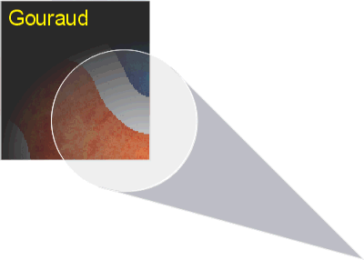
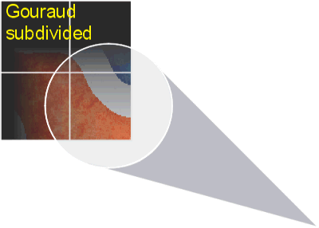
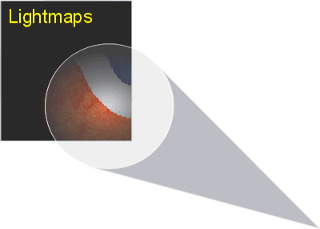

| ### Content Guide |  |
| --- | --- |

# —TUTORIAL—
Lighting Your World

The purpose of this section is to familiarize you with the methods you can use to apply lighting to your world that will be appealing and atmospheric but also as inexpensive as possible. This section discusses the various types of lighting available to you, the methods used by the engine to apply lighting, and shows some examples of lighting at work.

This section contains the following lighting topics:

- [About Lighting ](#AboutLighting)
- [Vertex Lighting ](#VertexLighting)
- [Lightmap Lighting ](#LightmapLighting)
- [Lighting for Models ](#LightingForModels)
- [Ambient And Fill Lighting ](#AmbientAndFillLighting)
- [Hardware Lighting ](#HardwareLighting)
- [Lighting Sample Level ](#LightingSampleLevel)

---

## About Lighting

Jupiter world lighting is applied using two different methods: vertex-based lighting and lightmap-based lighting. These two methods each have strengths and weaknesses, but both are used when lighting a typical level. You can choose the type of lighting on each brush in your level. If you want to use a different type of lighting on a single brush face, then you must break that face out into its own brush. If you select a brush and look at its properties, you will see one called Lighting. This property is what you will use to set the brush’s lighting type. Flat, Gouraud, and ShadowMesh lighting are all vertex-based lighting methods. The Lightmap option sets the brush to use lightmap-based lighting.

You also have many different types of lights available to you, each with a different purpose. The main class of light, the Light object, is an omni-directional light whose radius, color and brightness you can choose. It will apply light to any polygons that are inside of this radius, but its light attenuates quickly, following an inverse-quadratic curve similar to the image below.

>

**Inverse quadratic lighting curve **

Natural lights in the real world fade rapidly at first, and then slowly lose the rest of their brightness over a much longer distance until they cease to have a meaningful effect. An inverse-quadratic curve as shown in the previous image simulates this effect very well. Some older engines, including older Jupiter SDKs use a linear fall-off for each light. Linear falloff means that at the center of the light’s radius, its brightness is 100 percent of the light’s maximum, while halfway to the edge of the light’s radius, its light is exactly 50 percent of maximum. At the light’s exact edge, it reaches zero and goes completely dark. This leads to a light that falls off much more evenly than lights do in the real world. If you are used to working with such a lighting model, you will find that lights in Jupiter seem dimmer than you expect, and that they need to be larger than you might expect in order to effectively light an area. Typically, most of the meaningful light from a light object in Jupiter falls in the first third of the light’s radius, so make your lights based on that expectation. Lights will often overlap significantly in order to cover an area thoroughly.

Jupiter’s standard lights are used to provide most level lighting. You can also add DirLight objects, which add field of view (FOV) control. DirLights act like spotlights, projecting a directional cone of light instead of an omni-directional sphere. A DirLight’s FOV property controls how widely it will spread its light. Larger numbers will create a wider spot, while smaller numbers can create a pin-point spot.

Another form of lighting is the StaticSunLight, which is a true directional light in the sense most commonly used in 3D modeling and rendering: the light beams it emits always travel parallel to one another as if they were coming from an infinite distance away, instead of radially from a definite point. Rather than projecting from the StaticSunLight object itself in the level, this light enters the level through SkyPortal brushes as if from a star in the sky. If you rotate the StaticSunLight, the angle at which the light enters will change. However, only the rotation of the StaticSunLight will affect the light. You can place a StaticSunLight anywhere in your level or outside it.

Finally, there is ambient lighting. You can apply ambient lighting to the whole level or to specific brushes. Ambient light values set the minimum amount of light allowable on brushes and objects. You can use it to apply an even lighting fill to your entire level or to reduce the depth and darkness of shadows in it. You can also use ambient lighting on specific brushes either to help them match up more closely with their surroundings in places where they are otherwise too dark, or, if you also turn off the brush’s ReceiveLight property, to make them appear to glow independently of the rest of the level’s lighting.

To set the ambient lighting on a single brush, use the AmbientLight property on the brush, listed under LightControl. Choose the color you want for the light and process the level. Your brush will have the color you selected added into its overall lighting. To set the ambient lighting for the entire level, you should add an AmbientLight parameter to the World\World Info dialog. The AmbientLight parameter includes a 0-255 value for the red, green and blue light values in your level. For example, if I want the whole level to have a very dim reddish-brown glow, I would enter “AmbientLight 20 15 15”. Once I process the level, all lights will have a small amount of red added to them, as well as a smaller amount of green and blue. Bright lights will be a little brighter and tinted very slightly red. Shadows that would normally be black will now be very slightly lighter, reducing their depth.

[Top ](#top)

---

## Vertex Lighting

Vertex lighting uses color values stored at each vertex on a polygon to apply a color shade to the polygon, either by averaging the colors or by blending them together. In Jupiter, these colors are determined when the level is processed in DEdit and generally do not change. Since the color data is in the form of numeric values stored at each vertex, the space required to store a level’s vertex lighting data is very, very small. It’s also very inexpensive to render, since rendering of vertex lighting data doesn’t require an additional texture layer and thus can be performed in a single pass on almost all video cards.

Vertex lighting works best on objects with a large number of polygons. The more vertices an object has, the more detailed the lighting can be, since the additional vertices provide more places to store data. Gouraud lighting can also be very smooth looking, since the color of each vertex blends evenly over the surface of the polygons it sits on. Even a very sharp-sided object can look quite smooth when Gouraud lighting is applied to it. Gouraud lighting is often used to make a rough surface appear smoother. Finally, for small objects and surfaces, the difference between lightmapping and Gouraud shading is usually unnoticeable. As a result, most surfaces smaller than 4 game units on a side use Gouraud shading rather than lightmapping.

Gouraud shading can be used on large surfaces, provided either that they are very evenly lit, or that you can subdivide them into smaller parts to add extra vertices for more detail in the lighting (see the following Gouraud illustration). Another possible disadvantage is that polygons lit using Gouraud shading are only lit by light that falls on one of their vertices (see the following Gouraud subdivided illustration). As a result, if the light falling on one of the vertices is blocked, the lighting for the whole polygon changes dramatically.

Appropriate uses for Gouraud lighting include: small objects, large complex objects, and any simple shapes that are very evenly lit. It is less appropriate for objects that are unevenly lit, or for areas with extremely distinct shadows.

|  **Gouraud light blending across vertices ** |  ** Gouraud on a brush subdivided to add vertices. ** |
| --- | --- |

[Top ](#top)

---

## Lightmap Lighting

Lightmap lighting uses a second texture layer generated at processing time to store lighting information. This second layer is applied additively over the existing textures to provide color and shadow. You can vary the resolution of lightmaps on the entire world and also on each brush individually. Lightmaps of higher resolution are more detailed. However, they are also much more expensive. Lightmap lighting requires an additional rendering pass on almost all video cards. It also requires a great deal of memory for the storage of lightmaps, more pre-processing time to create, and the creation of extra polygons at lightmap boundaries in order to store the lightmaps efficiently. As a result, a lightmapped polygon is about three times more expensive than an identical Gouraud polygon. Also, lightmaps have a minimum size, which means that on very small brush faces, lightmaps take up extra space as well. This makes lightmapping much less appropriate for polygons less than 4 units on a side. Finally, lightmaps do not smooth across polygons in the same way as Gouraud shading can do.

Lightmaps are highly detailed and can provide a great deal of shade and color to your levels (See the image below). However, you should try to reserve lightmapping for surfaces where it will have a large and noticeable impact. Some surfaces that benefit from lightmapping include: large regular shapes that are unevenly lit, areas of highly defined shadows, and surfaces that have few vertices. It can also be useful to emphasize edges. Avoid using lightmapping on outdoor terrain, small surfaces or areas with little variation in their lighting.

>

**Lightmaps accurately represent a light’s radius. **

You can alter the resolution of lightmaps on a brush using the LMGridSize brush property, which is found under the LightControl property. If a brush’s LMGridSize is set to 0, then the brush uses the level’s default of 24 regular texture pixels per 1 lightmap pixel. In other words, each lightmap pixel covers 24 regular pixels on a given polygon at the default texture scale. Lightmaps do not scale with the texture they cover. If you enter a smaller number, lightmaps on the brush will be more detailed and occupy more space in memory. For example, if you use a value of 4, each lightmap pixel on the brush will only cover 4 normal texture pixels. This will lead to a great increase in detail, but also a great increase in the amount of space that the lightmaps for that brush will take up. It is highly unwise to use an LMGridSize of 1 for performance reasons.

[Top ](#top)

---

## Lighting For Models

You can use the same lights for your models that you use to light your world (the Light and DirLight objects). By default, all lighting applied to a model is added to its ambient light, which covers the entire model and is not directional. This causes light to hit the model from all directions evenly rather than hitting the model from one specific direction or location. These lights do not require hardware support to render and are thus very inexpensive.

You can also change lights into D3D hardware lights. Hardware lights are more expensive and must be rendered in the hardware of the video card. However, they are directional, so they can be used to create a very realistic light on your models. The number of directional hardware lights you can have on each of your models is limited by the maximum number of lights your video card can render in hardware. Most cards today can handle eight lights in hardware, but their performance with eight lights is usually very limited. A wiser limit would be three lights at once per model.

Creating good lighting for your model involves balancing performance and quality. You must place enough directional light in your level to be believable and to render the appearance that each of your level lights has a source. However, you also need to ensure that there is enough "fill lighting" to make your models bright enough overall to be believable. Just as with ideal world lighting, ideal model lighting requires a mix of techniques.

[Top ](#top)

---

## Ambient And Fill Lighting

Your level's fill lighting comes from a number of sources. The first source of fill lighting for your models is your level's ambient lighting. Your level-wide ambient lighting effects your models as well as your brushes. The ambient light keeps your models from ever appearing completely dark, which can reduce harsh contrast in areas where there is a lot of variation in the lighting.

The next source of light for your models are your basic world lights. Your Light and DirLight objects are configured by default to light models via their ambient light value. By default, your lights will apply the same amount of light to models as they do to the world. However, due to the way that D3D lighting formulas are defined, your models may appear differently lit than the brushes in your level. This is more of a problem with lightmapped brushes, which tend to be brighter than Gouraud-shaded brushes. You can adjust the brightness of a light for models independently from its brightness on the world. Lights have both a BrightScale property that controls their brightness for the world and an ObjectBrightScale that controls their brightness for models. You can increase or decrease brightness on the world without affecting models and vice versa.

You can also add ObjectLights to your level in areas where you can't place additional regular lights. ObjectLights only light models and game objects and don't apply any of their lighting to the brushes that they touch. You can use ObjectLights to supplement your regular level lighting without affecting the lights you've already placed in the level, or to add lights in places where your world lights aren't doing the job.

In some cases you may also wish to stop certain world lights from lighting models and game objects. A few very bright, small lights in places where they can reach your models may cause sudden changes in the lighting of your models where you don not want them. To avoid sudden changes in lighting on models, you can either set the ObjectBrightScale property to a very small number, or you can set the LightObjects property to FALSE. Afterward, the selected light will no longer cast any light on models. This is also useful for creating unnatural lighting effects.

[Top ](#top)

---

## Hardware Lighting

You change a regular light into a hardware light by modifying its FastLightObjects property. By default, this is set to TRUE, which tells the light to use the faster software lighting mode instead of using D3D hardware lighting. If you change that property to FALSE, then the light will become a hardware light. When your models pass through this light's radius, you will be able to clearly see the direction it comes from, which will be the center of the light object.

Ordinary Light objects with FastLightObjects FALSE will radiate light on models from their center point in all directions. So will ObjectLights. One important thing to remember is that hardware lights in Jupiter do not clip where they hit a brush, which means that they will pass through walls and other objects that block normal light. This is due to the high cost of calculating the light's clipping while the game is running. World lighting can be calculated before the game is running, so its cost doesn't affect the player, but model lighting must be updated almost every frame, making it very expensive to do on today's hardware.

If you are constructing a scene where there is a very brightly lit room that contains a dark closet, for example, and you want the player to be able to hide in the darkened closet, you must place your room lights very carefully. This is a case where you should probably use separate ObjectLights to light your models instead of the regular world lights. Build small fill lights around the closet and add some directional sources in the room, being careful not to allow them to overlap with the closet itself. If you design and build with these rules in mind, then you should not encounter many problems with models being brightly lit in dark parts of your level.

Finally, if you want to create specific focused light on your objects such as a spotlight or a beam of light through a window, you can use a DirLight with its FastLightObjects property set to FALSE. DirLights will only illuminate models that are within the cone defined by their FOV property. This effect is very usefuk for things like pools of sunlight, cracks in a wall, and other areas where you need directional light but want to control where it falls.

---

## Lighting Sample Level

The Tut_Lighting sample level included in the LithTech Jupiter SDK provides examples of Gouraud lighting and Lightmap lighting. You can locate the sample level in the following directory:

- \%install%\LithTech\LT_Jupiter_Src\Development\TO2\Game\Worlds\RetailSinglePlayer\Tut_Lighting.ltc

In the room where you will enter the level, lighting is provided by a mixture of lightmapping and Gouraud shading. Lightmaps are used in places where defined shadows are needed on a large surface, while Gouraud shading is used on all small surfaces and also on many larger surfaces whose lighting was relatively uniform. The designer has split up some large surfaces, such as the columns, in order to provide more vertices and add more complexity to the Gouraud lighting on them. Note the smooth appearance of the columns. While they have only eight sides, it is difficult to tell this without looking closely at their tops.

The level also has two other rooms: one using only Gouraud shading, and the other using only lightmaps.

In the Gouraud room, more surfaces have been subdivided, which allows for additional detail. Angled surfaces in this room look very smooth, but even objects like the railing at the back of the room do not cast sharply-defined shadows.

In the lightmapped room, many of the subdivided surfaces have been replaced by single polygons, saving space in memory and on disk. The shadows in this room are very detailed, with clear, sharp edges that are harder to get with Gouraud shading. However, the faces on the columns and arches are suddenly very apparent, so they appear much less rounded and smooth. On surfaces such as the wall behind the railing, the LMGridSize brush property has been altered from its default of 24 down to 8 or lower, increasing the detail of the lightmaps and their resolution.

The sample level also includes a StaticSunLight object which projects light into it from the sky through windows. The effect of sunbeams falling on the floor was created using very translucent WorldModels with texture that pan across their surface using a texture script. The halos around the work lights in the connecting hallway are sprites that are placed in front of the lights.

All the rooms are designed to provide good model lighting. Each window in the three main rooms has a DirLight object with FastLightObjects set to FALSE pointed through the window to brighten up models as they pass through the sunbeams coming from the window. You can see this effect by picking up one of the weapons on the floor in the room where you enter the level and walking around it. These lights are grouped together in the Nodes view under the nodes labeled "Directional Model Lights." All of the work lights in the main hallway are hardware lights as well. Each room also has several fill lights near the floor to add to the overall brightness of models in the rooms, rounding out their appearance.

To see a clear example of the level's model lighting at work, look for a button on a post in the floor in the room where you enter the level. It is to the left of the spot where you enter the level. When you press the button, a sphere-shaped model will begin to move through the level and a camera will follow it. You can watch the model pass through various lights and see how they affect it.To exit the cut scene, press the space bar at any time.

To learn about other details of the level, examine how the level is constructed using DEdit.

[Top ](#top)

---

Touchdown Entertainment, Inc. [Send feedback regarding this page. ](mailto:support@touchdownentertainment.com?subject=JupiterDevGuide Feedback: Tutorials\WrldLitn.md)2006, All Rights Reserved.
