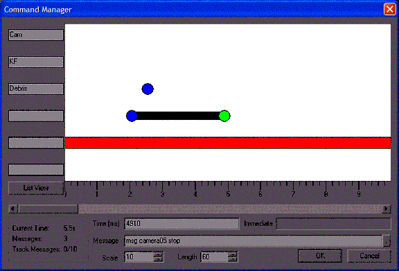

| ### Programming Guide | [  ](http://www.touchdownentertainment.com/jupiter.md) |
| --- | --- |

# —TUTORIAL—
Creating a Cut Scene

A cut scene in game terms is a non-interactive or semi-interactive scene in the game that game designers use to advance the story, or to place new elements in the game in a way that would be hard to do without taking some control from the player. Cut scenes commonly include things like having the camera cut away from the player to other characters in a different place, “cinematic” sequences where the player’s character stays in the scene but is controlled by the game, and small semi-interactive sequences where the player’s actions are scripted, but they’re allowed to make decisions within the script.

Cut scenes can be as small as a single camera cut to a door opening when the player presses a switch, or as complex as the opening ten minutes of an action film. Some really extensive cut sequences may even span multiple levels. Cut scenes in each game can be very different: Some games use the same models and levels that the player will see while playing, and others use specific “set” levels and high-polygon versions of their characters. Some games use even more unusual approaches, such as still images.

This section explains some of the mechanisms you can use in Jupiter to create your own cut scenes. It is not a complete list. You should expect to customize the objects described here to fit your own vision of your game’s cut scenes, and you may even decide to create new objects to get effects that are outside of the scope of the Jupiter defaults.

---

## Starting a cut scene

Your first step when planning a cut scene should be to create either a drawn or text storyboard. This can be a very rough description of one or two sentences, but it should map out the full “story” of the cut scene. Later, you will want to make a detailed storyboard or flow chart that describes all the resources you’ll use in the cut scene and all the changes the cut scene will make to the game world and game state when it ends. This is to help with resource management, game continuity and debugging.

For example, your game includes a cut scene where the player is betrayed by a friend and loses a valuable weapon. You should note that in later levels the former friend is now a hostile target who can be attacked. You should also remove the weapon from the player’s inventory, and from their character model, if it’s usually visible there. Keeping track of the changes caused by a cut scene will greatly simplify your life when you’re doing testing or going back to make changes to the game during the end of the development cycle.

[Top ](#top)

---

## Tools for Cut Scenes

You have many tools available to you when making a cut scene.

You can use 3D Studio Max or Maya to create custom cut scene animation for your models, or to create sets and animating worldmodels for your levels.

You can use ModelEdit to define keyframe command strings within a model that will trigger events or effects during a cut scene.

You can use FXEd to create custom visual effects.

Finally, you can assemble all these resources in DEdit and use the game objects you’ve learned about to bring them together and create a finished product.

[Top ](#top)

---

## How cut scenes are triggered

Your cut scene can be attached to a number of different “events” in the game. For example, it can be fired:

-
at the beginning of the level,
-
at the end of the level,
-
upon the death of an enemy,
-
upon activation of an object,
-
when a trigger volume is triggered.

Many game objects in Jupiter can be told to send a message if they enter a certain condition. For example, **GameStartPoints **have a Command field where you can enter a command or commands that will run immediately when the level loads. The **RotatingDoor **object has many command fields: **OpenCommand **for messages to send when the door is opened, **ClosingCommand **for messages to send *while *the door is closing, and **ClosedCommand **for messages to send as soon as the door is actually closed. There are also fields in the **RotatingDoor **object for messages to send when the door is damaged or destroyed. Triggers, cameras, and keyframers all have similar fields.

[Top ](#top)

---

## Using Messages

Many of Jupiter’s objects can receive and understand messages sent to them. Each object can understand a different set of commands, and there are a vast number of both objects and commands. They will not all be covered here. Your best resource to learn about a specific object’s commands is either to use the DEdit debugging window ( **View>Debug Window **in DEdit) to test out commands and learn the syntax that the object uses, or else to review the comments about the object in its game code.

A command typically looks like this:

>
```
msg Camera05 FOV 90 90 5; msg Camera05 on
```

This command tells the object **Camera05 **to set its field of view (FOV) to 90 degrees in both the X and Y planes, over the course of 5 seconds.

The second message in the command tells the camera to switch on and take the view away from the player or whatever other camera currently has it. The **msg **command tells the game code to display this message to all game objects.

The next item in the command is the name of the object that should respond to this message. If more than one object shares the same name, then *all *objects will try to respond to the command. Therefore, you should be careful that you only use identical names when you actually want this to happen.

The semicolon (;) is used to separate messages from one another so that you can enter more than one message into a given command field. This way you can fire three different objects or changes from one single event happening in your world.

Messages are the “script” for your cut scene. Large scenes may have dozens or more messages going from one object to another as cameras move and cut, characters interact and special effects play. It is because of this that you would be wise to make a flow chart for each scene and a list of game state changes that result from it. Otherwise, you can become hopelessly lost trying to figure out what objects control a given sequence and debugging the order in which each event occurs.

[Top ](#top)

---

## Cameras and Keyframing

To shoot a scene from multiple angles, as in movies, you need cameras. Jupiter’s Camera objects can be placed anywhere in your level and activated or deactivated as needed. The Camera object is only visible in DEdit. Once you place a camera, you can aim it, set its FOV, change its type between the normal full-screen player view and a movie-style “letterbox” mode, and do many other things.

Most of the Camera object’s properties are obvious, based on their names. **CleanupCommand **is not obvious and is very useful. This command is run when the camera finishes, either because the cut scene is over or because the player skipped the scene. You can use this field to run commands that destroy objects that are no longer needed after the cut scene, to set new objectives for the player, and generally to do whatever work needs to be done by the time the cut scene is over. This is most useful in cases where the player skips the cut scene, since some commands may not be triggered if their triggers are inside the cut scene and the scene doesn’t run through fully.

### Quick Camera Cuts

In some cases, you may need to move the camera from one point to another to change shots. In this case, you can use a camera’s **MoveTo **message to move a camera to a specific location in the level. To do this, you use an object called a **CameraPoint **. This is a very, very simple object whose only properties are name, position and location. A camera told to **MoveTo **a specific camera point will go to the named camera point and take on its location and position. If you do not want to create a keyframed sequence, you can use this simpler technique to quickly create a series of camera cuts with simple commands.

### Keyframers

Cameras can’t move freely through the level by themselves. If you want to create a panning shot or to have a camera follow characters as they move, then you will need a Keyframer object in your level to control motion. A Keyframer takes a target object and a path defined by points in the level and moves the object along the path. You can use Keyframers not just for cameras, but for moving WorldModels and moving special effects as well. Keyframers can also be controlled by other objects through messages. A Keyframer can pause, stop, reverse or change targets in the middle of a cut scene.

The location of the Keyframer does not matter, although it is usually best to place it somewhere that the player can’t reach, to make certain it doesn’t interact with other objects. Keyframers require two main properties, and can move an object with just these two parameters filled in:

**ObjectName— **sets the name of the object that the Keyframer will control.

**BaseKeyName **—the name you use as the basis of the sequence of key objects you will use for your movement path. **BaseKeyName **seeks out objects whose name is the string you entered under **BaseKeyName **, followed by a number. For example, if you created CamKey0 followed by CamKey01, Camkey02, CamKey03, etc. then your **BaseKeyName **would be CamKey. Note that although the first key in the sequence is named CamKey0, the second is named CamKey01. This naming convention must be followed when you create sequential keys or the Keyframer may not be able to find your first key.

The Keyframer’s other parameters allow you to change its basic behavior.

**Looping **—You can make the Keyframer loop back to its starting point and continue.

**PushObjects **—Change its physics behavior.

**AlignToPath **—Change whether or not the keyframed object will align its orientation to the path you create.

**IgnoreOffsets **—Set the keyframed object to ignore offsets in space from the path. This willcause the object to jump from wherever it is in the level and center itself physically on the path you created. This is useful if you want to create an object out of sight for use in a cut scene, or if you want to combine multiple objects and have them move along the same path at once.

**Waveform **—Controls the speed of the keyframed object on its path and the sort of acceleration curve it follows. **Waveform **has two sub-properties. The first, **TotalPathTime **, controls the total time (in seconds) that the keyframed object will take to go from one end of its path to the other. The smaller the value for **TotalPathTime **is, the faster an object will move on its path. Alternately, you can also set path times on each individual key in your path if you want the keyframed object’s speed to vary from place to place on the path. The **WaveType **option controls the acceleration curve of the object as it moves on the path. You can have objects move at a constant speed, start or stop quickly, or gradually accelerate and decelerate throughout the course.

**TargetName **—Aims the Keyframer’s controlled object in the direction of a specific target. This is useful if you want to make a camera that will track a specific character.

[Top ](#top)

---

## Paths, Keys and Curves

Your camera and Keyframer rely on Key objects to tell them the path they should be following. A Key is a very simple object with only a few properties.

Creating a basic path is very easy.

First, you place the Keys that will make up your path’s main points. These points are either locations where the path will need to turn, or locations where you need to trigger a message. Remember that your path will be joined together by a Bezier curve if you create the path in DEdit, so you don’t need keys for every turn the path may take.

Next, you should turn the keys into a path. This is not required, but will allow you to see your keyframed path more clearly in the editor. To make a path out of a sequence of keys, select them and group them under one node in the Nodes list. Then right-click on the container node in the Nodes list and select **Set Path **from the context menu. The container’s icon will change to an image of connected dots, and you will see a line connecting your key points in DEdit’s view ports. You must un-set and re-set the path each time you add or delete a key to update DEdit’s display.

### Curved Paths

By default, the lines will be straight from one key to the next. However, you can turn your path sections into curves by changing a key’s **BezierPrev **and **BezierNext **properties. In these properties, you specify the location of a Bezier control point for either the previous or next segment of the path which this key is a part of. Each segment’s curve shape can be controlled by moving the two control points that affect it, allowing you to make curved path segments. If you set these properties on one of your keys, you will see the path change shape in the DEdit view ports to become a curve. The locations of the control points for a curve will appear as arrows coming from the key whenever it is selected.

You can also control the shape of the curve directly using your mouse. To do this, select the key you want to change in DEdit’s view ports, hold down the P key and left-click and drag to move the control point. The first control point you drag out will be the one controlled by **BezierPrev **. The second will control **BezierNext **. If you don’t get the effect you desire with the first control point, don’t forget to drag out the second one.

### Smooth Looping Paths

To create a path with a smooth loop, you must create an extra Key for your end position that sits at exactly the same location as your first key. Otherwise, your object will jump from the last key location back to the very first key without appearing to move there through space. Creating the extra key is necessary to tell the object that it must move through the space back to its start location. Also, the path point at the beginning and end of your path will only have one working control point, since one of them has no “previous” section and the other has no “next” section. This is only important for you to be aware of. It will not affect your ability to shape your path as you want to.

### Path Timing

Keys also allow you to do other useful things. Each key can have a **TimeStamp **property that controls the length of time in seconds required to move to it from the previous key, allowing you to vary the object’s speed along each segment of the path if you want.

### Keys and Events

You can also attach sounds or commands to keys, which allows you to trigger events precisely at the point when an object passes a given key. These commands are typically used to do things like open a door in front of the camera, cue an AI to begin its section of dialogue, or change the settings of the camera.

##

[Top ](#top)

---

## The Command Object

In cases where you will be controlling a lot of events on a timed schedule, you can use a Command object to create a timeline with a series of events on it instead of using a Keyframer. This method works well for scenes with a lot of objects to control, as well as scenes where most of the camera action is cuts between still cameras. The Command object’s main properties are listed under **EventCommands **. In this view, you will see the Command Manager UI.

>



On the left hand side are a series of empty boxes where you can type track titles. On the right is the timeline view of the events managed by this Command object. The red line indicates the track your mouse is currently hovering over. The blue dots are events, and the green dot is the currently selected event. At the bottom are the controls for editing an event, as well as statistics about this object’s total set of commands.

A Command object works by sending messages to other objects, like cameras and Keyframers or AI characters.

To add commands, right-click on the track at the time where you want an event to occur and select **Add Event **from the context menu. Then type your command into the **Message **field at the bottom of the dialog. Continue adding events until you have added all the commands you need for a specific scene, or until the UI becomes cluttered and you want to add another Command object with more free space. Then click **OK **to store the Command object’s timeline.

When the command object is triggered, either by scripted commands from another object or by a trigger, it will run through its list of commands in order along their timelines, stopping when it reaches the end of its length.

Command objects allow you to manage very complex, dense scenes where a lot is going on, and to lay out those scenes in time with great precision. They are a vital part of making really complicated cut scenes in a way that allows you to make sense of your work later on.

[Top ](#top)

---

## Using AI, effects and Props in Cut Scenes

Most AIs in cut scenes are driven by events or messages. An AI in a scripted sequence will have its animations, movement and dialogue fed to it by messages or other objects.

Jupiter includes a Dialogue object that allows you to create conversations between AIs by filling out its list of commands, sound files and characters to speak them. You can also feed lines to an AI via script, or play back a sound from the AI’s location the same way.

Movement for AIs is done by scripted commands as well. You can teleport an AI, have it walk to a location, change its mood or remove it entirely within the scripting system. Different types of AI respond differently and have different options or goals available, so your best resource on how they behave are the source levels and game code included with the Jupiter SDK. You will also probably want to write in your own custom commands for your AI if you want to be able to create specific new behaviors that the Jupiter AI does not exhibit.

Props or effects can be manipulated by scripting commands for simple behavior such as changing animation and turning on or off. For complex effects, Keyframers and Command objects will allow you more complete control and more flexibility.

[Top ](#top)

---

## Making Special Effects

You can create custom effects for your cut scenes using either your own game code, or by using FXEd. For any scenes that take place within a normal game level, an FX file will operate just as it does at any other time in the game. You can create complex effects that are controlled by FXEd, or you can make multiple simple effects and use a Command object to control them instead, depending on whether you need speed or flexibility in a given scene. Making multiple small effects will allow more re-use of effects later on in your production.

You can also use keyframe command strings in ModelEdit to trigger effects at a precise point in a character’s animation. Keyframe commands can be used for routine things such as making muzzle flashes or playing footstep sounds, but they can also be used for effects such as swapping attachments or attaching and triggering effects on a model during a cut scene. A keyframe command string on a model functions exactly the same as a command attached to a game object, and you can write your game code to interpret these commands and trigger events.

You can also create complicated WorldModel animation and paths using the Max and Maya world exporters. If you create keyframe animation for non-deforming objects in either package, you can export these objects as animated worldmodels, complete with keyframe paths. The exporter will not create Bezier curves, but it is acceptable to use a dense placement of keyframes to duplicate a curved path. This feature of the Jupiter exporter allows you to make very detailed and believable animation for world objects, such as the collapsing radio tower in the Siberia sample level included with your SDK. You can use these exporters whenever you are trying to create an animating world object that follows a path too complex or intricate to set up easily in DEdit.

[Top ](#top)

---

Touchdown Entertainment, Inc. [Send feedback regarding this page. ](mailto:support@touchdownentertainment.com?subject=JupiterDevGuide Feedback: Tutorials\cutscene.md)2006, All Rights Reserved.
