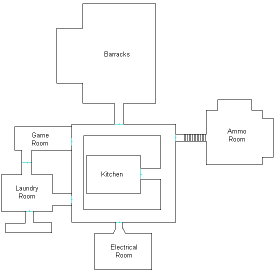
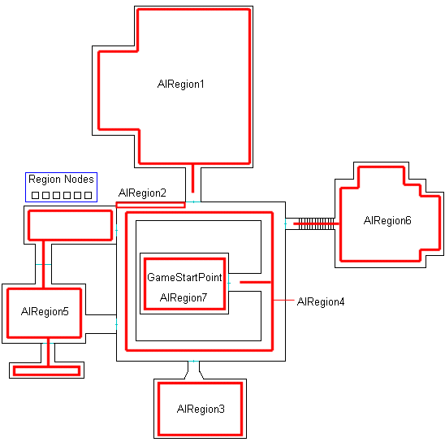
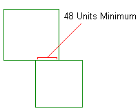
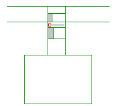
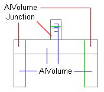
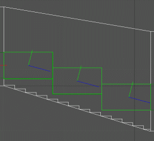
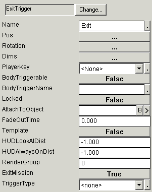
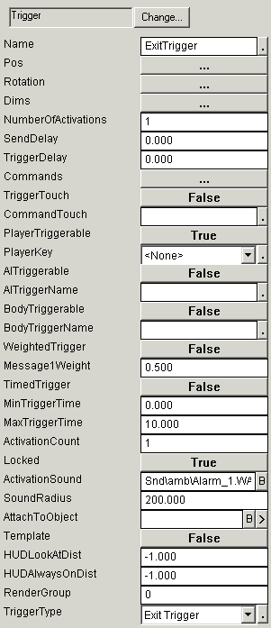

| ### Content Guide | [  ](http://www.touchdownentertainment.com/jupiter.md) |
| --- | --- |

# —Tutorial—
Using NOLF 2 AI

This section walks through the creation of AI interaction using the Tut_AI file. Tut_AI.ltc was created by LithTech as a tutorial showing how you can place and use NOLF 2 AI in a simple sample level. The Tut_AI.ltc file is located in the following directory:

>

\%install%\LithTech\LT_Jupiter_Src\Development\TO2\Game\Worlds\RetailSinglePlayer\Tut_AI.ltc

Read the following sections to learn how to place character AI, AIVolumes, and AINodes:

- [About the Tut_AI Sample Level ](#AbouttheTut_AISampleLevel)
- [Placing AIRegions ](#PlacingAIRegions)
- [Placing AIVolumes ](#PlacingAIVolumes)
- [Setting a Rat Patrol ](#SettingaRatPatrol)
- [Setting a SovietSoldier Patrol ](#SettingaSovietSoldierPatrol)
- [Setting Initial Goals ](#SettingInitialGoals)
- [Creating an Alarm ](#CreatinganAlarm)
- [Creating Places to Hide ](#CreatingPlacestoHide)
- [Specifying a Smoking Area ](#SpecifyingaSmokingArea)
- [Specifying a Place to Sleep ](#SpecifyingaPlacetoSleep)
- [Specifying a Place to Sit ](#SpecifyingaPlacetoSleep)
- [Spawning New AI ](#CreatingaPlacetoSpawn)
- [Using Variables ](#UsingVariables)
- [Exiting a Level ](#ExitingaLevel)

---

## About the Tut_AI Sample Level

The Tut_AI sample level is a simple six room level designed to show how to set up and use the NOLF2 AI. The following image shows the layout of the level.

>



When playing the Tut_AI, the goal of the game is to blow up the two bombable pallets in the Ammo room. The bombs are located in the utility cabinet in the Electrical room. The Kitchen (the starting area) is a safe location that AI cannot enter. Gameplay is set so that additional guards are spawned after some of the guards are killed (this uses an EventCounter object). In addition, guards are also spawned when the alarms in the Ammo room and the Barracks are sounded, and when the pallets are destroyed.

The creaky floorboard trigger outside the Laundry room also sounds an alarm to attract the Laundry room guard. The Laundry room alarm does not set off an audible alarm, but rather simply attracts the Laundry room guard to investigate the sound of the floorboard.

This tutorial walks you through the steps involved in adding AI to a level. There are many objects you must place in your level to get the NOLF2 AI to operate appropriately. The following list describes some general steps for adding AI object nodes:

#### General AI implementation steps

1. Place AIRegion nodes in e ach of the locations you wish to separate.
2. Place AIVolumes in the areas you want AIs to see, pathfind, and travel. Bind all volumes to a specific AIRegion when you place them. Make sure the AIVolumes are close enough together or AIs cannot path between the volumes.
3. Place CAI nodes in AIVolumes where you want an AI to start the level.
4. Place CAI template nodes near where you want to place their spawners.
5. Place Spawner objects where you want AIs from templates to appear when you trigger the Spawner.
6. Place AINodes in locations where you want an AI to perform an action or operate in a specific manner. Make sure each region has at least one AINodeSearch node.
7. Place Alarm props in locations where you want AIs to respond when the alarm is activated.
8. Place triggers or alarm swi tches in locations where AIs can activate them, and set them to trigger the appropriate Alarm prop object.

[Top ](#top)

---

## Placing AIRegions

Tut_ai.ltc contains six AI region nodes. The only area without connecting AIVolumes is the kitchen where the character starts the level. This gives the character one safe area to collect gear and recuperate.

Aside from grouping the AIVolumes, the regions also control the response of the AIs to the alarms in the level.

The following images shows the placement of regions in Tut_AI.lta:

>



The area marked "Region Nodes" in the previous image contains the AIRegion nodes for each of the regions.

In DEdit, click the Nodes tab, expand the GamePlay folder, then expand the Character AI folder. Each set of character AI are grouped by region. This allows you to view the CAI in any AIRegion by selecting the desired folder.

The following list describes the AI content in each region:

>
| **AIRegion1 ** | This region is the barracks area containing six soviet soldiers. Each guard in this region is named "BarracksGuard<number>" where <number> indicates the unique ID name for the guard. Three of them are set to SleepGuard, two are set to Guard, and one is set to Patrol. The guard on patrol may be attracted to the nodes in the hallway, and sometimes takes that patrol path in the hallway if the HallGuard in AIRegion4 is not using it. |
| --- | --- |
| **AIRegion2 ** | This region contains one rat patrol. |
| **AIRegion3 ** | This region is the electrical room. It contains one soviet soldier. The soldier, named "ElectricalGuard," is set to guard. |
| **AIRegion4 ** | This region is the hallway. It contains one soviet soldier. The soldier, named "HallGuard," is set to patrol around the hall. This soldier has use nodes for smoking, and may be attracted to the use nodes in other regions. It is possible that this guard will leave the hallway. |
| **AIRegion5 ** | This region is the laundry room. It contains one soviet soldier. The soldier, named "LaundryGuard," is set to guard. There are three smoking nodes in this region, two on the couch and one on the chair. There is also a vending machine that the guard can kick and curse at. |
| **AIRegion6 ** | This region is the Ammo room. It contains two soviet soldiers using winter models. The soldiers, named "AmmoGuard<number>" are set to guard. There is also a smoking node and a pour coffee node in this room. |
| **AIRegion7 ** | This region is the kitchen and starting area. The AIVolume in this region does not extend to the door, so the AI outside this region cannot enter. |

[Top ](#top)

---

## Placing AIVolumes

Each AIRegion has a group of AIVolumes bound to it. AIVolumes control the navigation of an AI, and are required to allow an AI to pathfind from location to location. The AIRegions only control search areas and alarm response. AIVolumes allow the AI to pathfind and move through the areas of neighboring volumes.

After you have placed the AIRegion nodes for your level, have a careful look at your level design and plan the placement of your AIVolumes. Typically, you should use a generic AIVolume node for most areas. Special AIVolumes, such as AmbientLife, JumpOver, JumpUp, Junction, Ladder, Stair, and Teleport all allow for specific actions to occur. The generic AIVolume simply allows the AI to pathfind and move through the volumes. CAI objects placed in an area without an AIVolume cannot operate and simply stand in place, even if they are shot.

It is important to place AIVolumes directly against each other or AIs cannot across them. Additionally, AIVolumes placed against each other must have a 48 unit abutment (connection) between them or AIs cannot travel across them. The following image illustrates the required abutment distance:

>



### AIVolumes and Doors

Doors create a special problem for AIVolumes. The AI perceives the WorldModel controlling the door (such as a RotatingWorldModel object) to exist in the volume where the door exists. This causes AIs to play their opening door animations wherever they encounter an AIVolume containing a WorldModel with AIActivate set to TRUE. The opening door animation plays where the AI first enters the volume containing the door, and if the door is some distance from the start of the AIVolume, then the animation then occurs some distance from the door. This results in the appearance of the AI opening the door where the door does not exist. To avoid this you must place WorldModels with AIActivate set to TRUE in their own AIVolume. The following image illustrates how to set the AIVolumes surrounding a door that opens into a hallway:

>



The small red square indicates the RotatingWorldModel object controlling the door, and the two gray areas indicate locations where there are no AIVolumes. The areas with no volumes keeps the AI from attempting to walk through the door when it is open from either direction. Make sure that each the abutment areas between the volumes are 48 DEdit units wide.

### AIVolumeJunction Volumes

The AIVolumeJunction volumes allow AIs to lose track of the character. Like all AIVolume nodes, they require a region, and must border other AIVolume nodes. Typically junctions are placed at corners. The following image shows three junctions used in a hallway.

>



Junctions have the following effects and requirements:

- If an AI enters a junction and he cannot see his target, and has not seen his target past the junction, then he gets lost.
- If an AI gets lost in a junction, then he randomly chooses a connecting volume, and randomly chooses an action from those specified in the junction's parameters.
- As the players stealth skill increases, the odds decrease for a lost AI at a junction to choose the volume the player took.
- If an AI enters a junction and he can see his target, then the junction gets ignored and chase continues as normal.
- Junctions must have at least two connected volumes on their borders.
- Junctions must be at least 48 X 48 DEdit units in size.
- When the AI gives up a chase, he automatically searches all the search nodes in the region where the chase ended.

Notice in the hallway area of the tutorial level, each corner of the hallway has junction. Refer to the settings in these junctions for an example of how to set the properties of an AIVolumeJunction volume. These specify the bordering volumes and what actions the AI should perform when they enter the junction.

### AIVolumeStairs Volumes

The stairs leading down to the Ammo room (AIRegion6) illustrate how to place stair volumes. The only purpose for stair volumes is to indicate to the AI which direction their body should roll when they are killed. Without a stair volume the AIs corpse simply falls in place on the stairs and remains there. The following image shows the placement of the AIVolumeStairs volumes used outside the Ammo room in Tut_AI:

>



Notice the blue arrows all point down towards the bottom of the staircase. This indicates the direction the AI's body falls when killed.

[Top ](#top)

---

## Setting a Rat Patrol

There are two rat patrols in the AI tutorial. Each rat patrol uses an AIVolumeAmbientLife volume to path and travel through. Like human AIs, rat animal AIs can also follow a path. In order to patrol, the you must set patrol nodes for AIs with a patrol goal to follow.

In general, the rats don't do much except add ambience to the game. They follow their patrol paths, and stop when anything suspicious comes nearby. They can sometimes startle the guards, and likewise can be startled by the guards. Sometimes rats can become startled enough to panic and leave their set patrol routes. When this occurs, they wander around the level in a panic until they calm down and return to their normal behaviour and patrols.

#### To set a rat patrol

1. Place an AIRegion to bind the rat volumes to.
2. Place AIVolumeAmbientLife nodes where you want the rat to live. Bind all AIVolumes to the AIRegion you created in the previous step.
3. Place AINodePatrol nodes in the volumes you created for the rat, and bind each node to the next in the path.
4. Place a CAIHuman node in the volume, and select Rat for the ModelTemplate, Rat for the brain, and RatPatrol for the goal.
5. You may also want to set the SearchProperties - RandomItemSet to None for the Rat so that players are not prompted to search rat bodies for items.

[Top ](#top)

---

## Setting a SovietSoldier Patrol

There are two SovietSoldier patrols in Tut_AI. One is in the hallway surrounding the kitchen area, and the other is in the barracks. Unlike Guards, Patrols do not own specific AINodeUseObject nodes. You can simply assign a guard a patrol route and they automatically use whatever AINodeUseObject nodes they are attracted to near their patrol route. When they finish using the node, they automatically return to their patrol.

The Hall guard has a smoking node right outside the kitchen area that he often uses near the start of the game. This places the guard in a good position for easy assassination by the player, and if the player is careful they can simply kill the guard and move his body into the kitchen where it will never be found.

### Bad Example

As an example of what NOT to do, the unassigned reinforcement guard (HallGuard2) starts in the south west corner of the hall surrounding the kitchen, and may take the patrol route from the first guard once that guard has been killed. It is also possible that he will simply find a random search node and station himself there. Typically you should not place reinforcements within a level when they do not have a guard or patrol node to take. AIs with a goal who cannot find a node to perform that goal may perform undesirable random actions. HallGuard2 is an example of a guard with an unassigned node, and you can watch his actions to see the effects of placing an AI without a node to take possession of.

#### To set a SovietSoldier patrol

1. Place an AIRegion to bind the AIVolume nodes to, or if you have already created a region, then you can bind the new AIVolumes to that region when you add them in the next step.
2. Place AIVolume nodes where you want the soldier to live. Bind all AIVolumes to the AIRegion you created in the previous step.
3. Place AINodePatrol nodes in the volumes you created for the soldier, and bind each node to the next in the path. If you do not fully end the path, then the soldier will turn and retrace his steps when he reaches the last node in the path.
4. Place a CAIHuman node in the volume, and select SovietSoldier for the ModelTemplate, Default for the brain, and Patrol for the goal.
5. In the Commands for the guard, place the following command string:

>

goal_patrol node=<patrol node>

For example, the following command string sets the HallGuard to take the HallPatrol3 patrol node:

>

goal_patrol node=HallPatrol3

[Top ](#top)

---

## Setting Initial Goals

When you place a CAIHuman node in a level, you do not need to set an initial goal. However, if you simply place all AI without initial goals, then they will migrate to Guard and Patrol nodes randomly. Typically they will take the closes Guard or Patrol node, but this may not always be the case. To prevent your AI from migrating all over the level when the level first starts, you should assign each of the CAI you initially place to a specific Guard or Patrol node, preventing them from taking possession of a distant node and having to travel to that location.

#### To set an initial goal

1. Using DEdit, place the AI in the level by pressing CTRL + K and selecting CAIHuman.
The CAIHuman node appears at the current marker.
2. In the Commands parameter specify the initial command for the AI telling them which Guard or Patrol node to take possession of. The following list describes some of the commands you can use:

  - goal_guard node=<Guard Node Name>
  - goal_patrol node=<Patrol Node Name>
  - goal_goto node=<Goto Node Name>

For example, AmmoGuard1 in the Ammo room has an initial command of goal_guard node=AmmoGuard01 setting the guard to take possession of the AmmoGuard01 AINodeGuard node. When the level starts, AmmoGuard1 moves to the AmmoGuard01 node and takes possession of the node and all the AINodeUseObject nodes specified in the GuardedNodes parameter of the AmmoGuard01 node.

Guards do not share SmartObjects, so each guard only uses its specified GuardedNodes. No other guard uses them. In contrast, patrols (who do not take possession of smart objects) may use any node not possessed by a guard if they are attracted to them on a patrol route.

[Top ](#top)

---

## Creating an Alarm

Alarms are prop objects. Typically when you place them you set them to Visible FALSE so that they do not appear in the game. The purpose of alarm objects is to summon or alert guards in a specific region, and to specify the regions searched by the guards who respond to the alarm.

Alarms are commonly activated from WorldModel objects such as sliding switches, or from PlayerTrigger objects you place in areas to simulate creaky floorboards or electric eyes. When you trigger an alarm (using the ACTIVATE command) all of the guards you specified in the RespondRegions property come running to the location of the Alarm prop object and proceed to search the AIRegion the alarm exists in. Guards in AIRegions you specified in the AlertRegions section go on alert (stopping whatever AINodeUseObject actions they were performing and actively looking around). When the AI who have responded to the alarm complete their search of the AIRegion where the alarm exists, they will then proceed to search any additional regions you have specified in the SearchRegions property of the Alarm.

The alarm in the Ammo room (Region 6) is a good example of how alarms work. The sliding switch in the south east section of the Ammo room is set for both AIs and characters to use. When the sliding switch is pressed, it sends the following commands:

>
```

msg BackupSpawn1 SPAWN;
msg SniperSpawn (SPAWN Snipe1);
msg AmmoAlarmBell TRIGGER;
delay 1.5 (msg AmmoAlarm ACTIVATE);
```

The sequence of commands listed above spawns two backup guards, turns on the AmmoAlarmBell SoundFX node, and then activates the AmmoAlarm to summon the guards from AIRegion2, AIRegion4, and AIRegion5. AIRegion4 is also specified in the SearchRegions parameter of the alarm, setting the guards to search the hallway after they have completed their search of the Ammo room.

The Commands parameter for the CAI spawned guards has a goal_goto node=<node name> command. This instructs them to go to a specific location when they get spawned. If no alarm is active when they are spawned (for example, they are spawned from the EventCounter object) then their initial action is to go to the specified node, and then use their reinforcement goal to find an unassigned guard or patrol node to take possession of. If an alarm is activated after they are spawned, and they are in a region set to respond to that alarm, then they respond to the alarm first before going to the specified node.

| **Note: ** | Keep in mind that alarms and the SoundFX object are two separate components. When you activate or deactivate an alarm, make sure you send a message to the SoundFX making the alarm sound or the sound simply continues playing in its loop. |
| --- | --- |

[Top ](#top)

---

## Creating Places to Hide

The AIVolumePlayerInfo volumes allow you to create places where you can mask an AIs sense of the player. The primary use for this node is to create places where the character can hide from the AI under the circumstances you specify. Tut_AI contains three AIVolumePlayerInfo volumes where the character can hide. The first two are in the Ammo room (AIRegion6) behind the ammo pallets. The third AIVolumePlayerInfo volume is located in the Barracks (AIRegion1) behind the file cabinet.

Notice that all the AIVolumePlayerInfo volumes in Tut_AI point to View nodes where AIs can see the character when they are hidden. This informs the AIs that once they are disturbed by getting shot from someone in these locations, they can move to the View nodes to get a view of the character. Setting AIVolumePlayerInfo volumes and View nodes in this way gives the AI the appearance of intelligence because they do not just stand around getting hit. Instead they move to a position where they can see who is firing at them.

Setting Hiding to TRUE causes AI to treat the player as if they were hidden regardless of the position the player is in. Setting HidingCrouch to TRUE causes AI to treat the player as hidden only when the player crouches.

AIVolumePlayerInfo volumes also control the "hiding" eye icon that appears when the player hides. A short timer appears to indicate when the player becomes fully hidden.

[Top ](#top)

---

## Specifying a Smoking Area

Smoking areas simply give AIs a region to play their smoking animation. Smoking guards are still alert to disturbances, but it takes them a second to put down their cigarette and draw their weapon giving the player a little extra time to attack them before the AI can respond. AIs with a patrol goal can use any AINodeUseObject - SmokingSection node they come across, but AIs with a Guard goal can only use AINodeUseObject - SmokingSection nodes that have been assigned to them in the GuardedNodes parameter of their AINodeGuard node.

#### To specify a smoking area

1. Simply place an AINodeUseObject node where you want the AI to smoke, and then set the SmartObject parameter to smoking section.
2. If you want a specific AI guard to use the node, then in the AINodeGuard object for the desired guard, point the GuardedNodes parameter to the AINodeUseObject node where you want the AI to smoke.

>
| **Note: ** | Never specify the same GuardedNode node for more than one guard. For example, if GuardOne has been specified an AINodeUseObject node, then do not specify the same node in the GuardedNodes parameter for GuardTwo. Doing so may result in both AI guards using the node at the same time, causing model overlap. |
| --- | --- |

[Top ](#top)

---

## Specifying a Place to Sleep

AIs with a sleep goal (typically SleepGuard although you can add a Sleep goal) are attracted to AINodeUseObject nodes with the following SmartObjects:

- BedTime
- BedTimeInfinite
- StandSleep
- StandSleepInfinite

A SmartObject specifying infinite does not mean the AI never wakes up, but rather indicates that the AI remains in the sleep state until disturbed. Sleeping AIs are not disturbed by visual stimulus and can only detect auditory stimulus. This allows a stealthy player to move near a sleeping AI without disturbing them.

Tut_AI contains three AIs with sleep goals in the Barracks room (AIRegion1). These three AIs have a SleepGuard goal and the AINodeGuard nodes they are assigned to each have a AINodeUseObject - BedTimeInfinite node set as one of their GuardedNodes. Since their primary goal is to sleep, and the AINodeUseObject nodes are set to BedTimeInfinite, the first action they perform when the game starts is to lay down and go to sleep. Until the character enters the room and disturbs them (or until an alarm goes off) they remain in the sleep state.

#### To specify a place to sleep

1. In the GoalSet for the character, specify SleepGuard. Alternatively you can use the ADDGOAL command to add a sleep goal to any AI, although if they do not have a usable AINodeUseObject with one of the four sleep SmartObjects, then they will simply remain awake.
2. Place an AINodeUseObject node near a bed, chair, or in a location you want the AI to sleep. In the SmartObject for the node, specify one of the four sleep objects. For more information about the placement of the node, see [Using AIUseObjectNodes and SmartObjects ](Goals.md#UsingAINodesandSmartObjects).
3. For AIs with a SleepGuard GoalSet, in the AINodeGuard object they are assigned to, open BindToObject and attach the AINodeUseObject node you want them to use when they sleep.
4. For AIs with a goal other than SleepGuard (AI you have added a sleep goal to), simply place the AINodeUseObject with the sleeping SmartObject in an area where they can be attracted to it.

[Top ](#top)

---

## Specifying a Place to Sit

AIs with a work goal are attracted to all AINodeUseObject nodes, although AIs with a Guard goal will only use those objects specified in their GuardedNodes list. Guards and Patrols attracted to AINodeUseObjects that have a sitting animation require templates that possess a sitting animation.

A SmartObject specifying infinite does not mean the AI never gets up, but rather indicates that the AI remains sitting until disturbed.

Tut_AI contains three AIs with sleep goals in the Barracks room (AIRegion1). These three AIs have a SleepGuard goal and the AINodeGuard nodes they are assigned to each have a AINodeUseObject - BedTimeInfinite node set as one of their GuardedNodes. Since their primary goal is to sleep, and the AINodeUseObject nodes are set to BedTimeInfinite, the first action they perform when the game starts is to lay down and go to sleep. Until the character enters the room and disturbs them (or until an alarm goes off) they remain in the sleep state.

#### To specify a place to sit

1. Place an AINodeUseObject node near a chair. In the SmartObject for the node, specify one of the sitting objects. For more information about the placement of the node, see [Using AIUseObjectNodes and SmartObjects ](Goals.md#UsingAINodesandSmartObjects).
2. For AIs with a Guard GoalSet, in the AINodeGuard object they are assigned to, open BindToObject and attach the AINodeUseObject node you want them to use when they sit.
3. For AIs with a goal other than Guard, simply place the AINodeUseObject with the sitting SmartObject in an area where they can be attracted to it.

[Top ](#top)

---

## Spawning New AI

There are several factors involved with the spawning of new AI into your level. First, you want to limit the number of AI in your levels to keep memory costs to a minimum. Second, you may want to spawn new AI when alarms get activated so that there is an appropriate response to the alarm. Third, you may want to repopulate your level to keep the game from becoming too easy, or to simulate repopulation after the character has been gone for a time and returned to a certain area.

### Creating a Place to Spawn

You want to limit the size of your level while still simulating that it is part of a larger world. AIs should be capable of summoning help from outside the level, but in the game code there is nothing outside the level. To simulate a larger world you need to create areas where the player cannot go and doors they cannot pass through in order to have a safe place to spawn AI. You can also spawn them in areas where you know the player is not currently at, but if you have a multiplayer game, it may be difficult to ensure that a player is not in a location when new AIs are spawned.

To create a safe place for AIs to spawn, create a door somewhere in your level that opens into a room. Set the door so that it can only be triggered by AIs and not the character. When an AI summons backup, you can safely spawn the backup in the blocked room and then send the AIs messages to move to a specific node.

Tut_AI has a spawning room just outside the Laundry room (AIRegion5). The door to this room (the metal door in the laundry room) is set so that only AIs can open it. In the event that the player attempts to get through the door when an AI opens it, a blocker brush placed in the doorway prevents the player from entering the room. Blocker brushes do not effect AIs, only players.

The Spawner nodes placed in this room are set to spawn the two template CAIs located outside of the world geometry near the spawning room. The following general steps explain how to spawn an AI:

#### To spawn an AI

1. Create and place an CAIHuman anywhere in the level.
You may want to place CAI node outside of the world geometry to help you keep track of the fact that this CAI is a template and does not appear in the game until spawned.
2. Set the parameters for the CAI, and ensure the Template parameter is TRUE.
3. Place a Spawner node where you want the CAI to appear when it spawns.
4. In the Spawner, set Target to exact name of the CAI you want it to spawn.
For example, setting Target to BackupTemplateSniper tells the Spawner to spawn the BackupTemplateSniper CAI when it is triggered.
5. To activate the spawner, send the following command from any object capable of using messages:

>

msg <Spawner Name> SPAWN
-or-
msg <Spawner Name> (Spawn <Name>)

For example msg SniperSpawn (SPAWN Snipe1) tells the Spawner object named SniperSpawn to spawn a CAI named Snipe1. To spawn without a name, simply use msg SniperSpawn SPAWN .

6. When the message gets received, the Target template CAI gets spawned at the location of the Spawner node. Any initial commands contained in the CAI are immediately processed. AIs with an initial GoalSet of Reinforcement immediately search for an unassigned Guard or Patrol node to take possession of.

### Controlled Repopulation

To keep the level difficulty somewhat the same, and to simulate guards coming on duty to relieve other guards, Tut_AI uses an event counter to trigger respawning. Each AI has a DamageProperties parameter, and every AI in the Tut_AI has a DeathCommand set to send msg EventCounter0 (inc 1) when the AI gets killed. The EventCounter object sends spawning commands when it reaches specific values. For example, when it reaches a value of three, it sends the following command:

>

msg BackupSpawn1 SPAWN

This spawns one new AI. When the EventCounter reaches a value of five, it sends the following command:

>

msg SniperSpawn SPAWN

This spawns one new AI. When the EventCounter reaches a value of eight, it sends the following commands:

>

msg BackupSpawn1 SPAWN;
msg SniperSpawn SPAWN

This spawns two new AI. When the EventCounter reaches a value of nine, it sends the following command:

>

msg EventCounter0 (DEC 9)

This resets the EventCounter to zero, and the process starts all over again as new AI get killed. Eventually it is possible to kill all of the AI in the level without triggering any respawning, however, because exploding ammo crates and alarm switches also spawn new AI, it takes the player quite some time to reach this point. In most cases the level should end before all AI are killed and no further AI are being spawned.

[Top ](#top)

---

## Using Variables

You can create and use integer variables through the command syntax of any object capable of sending command messages. Variables allow you to set and track conditions in your game. For example, Tut_AI creates and uses a BombCount variable to unlock the exit trigger that ends the level. The two bombable targets (ammo pallets) in the Ammo room both increment and test the BombCount variable to determine when to unlock the ExitTrigger trigger in the Kitchen room.

#### To create and use variables

You can create a variable in any command message. The BombCount variable is initially created in the GameStartPoint object for the level. The command to create the variable uses the following syntax:

>
```
int BombCount 0

```

This creates and initializes the BombCount variable to zero. The command objects (CommandObject0 and CommandObject00) both increment and test this variable using the following syntax:

>
```

Add BombCount 1
IF (BombCount == 2) THEN (msg ExitTrigger UNLOCK)
```

When the BombCount variable equals 2, then the ExitTrigger gets unlocked. This keeps the player from leaving the level until they have completed the object of destroying both ammo pallets.

### Debugging Variables

When using variables you may find it useful to search for objects using commands with a specific variable name. To get a list of all commands with a specific variable name, you can use the Object Search dialog box.

#### To Debug Variables

1. On the View menu, move to Debugging and then click Object Search.
2. In the Find box, type the name of the variable, and then click the Search button.
3. In the resulting list, double click the line containing the object to select the object.

### Variables and Command Syntax

For additional information about variables and command syntax, see the **Command Architecture **document in the following folder of your Jupiter installation directory:

>

LT_Jupiter_Src\Specs\GameSystems\Commands.doc

[Top ](#top)

---

## Exiting a Level

Simply exiting a level requires two trigger objects: a PlayerTrigger to send a TRIGGER message, and an ExitTrigger to exit the level. Tut_AI uses a locked Trigger node to trigger an ExitTrigger. When the player destroys both of the bombable ammo crates in the Ammo room (AIRegion6) the Trigger in the kitchen gets unlocked. To exit the level after the ammunition is destroyed, all the player needs to do is return to the kitchen.

The following images show the properties for the two trigger objects. The Trigger object sends the following message to the ExitTrigger object:

>

mgs Exit TRIGGER

| #### ExitTrigger Object | #### **Trigger Object ** |
| --- | --- |
|  |  |

The ExitMission property, when set to TRUE, exits the level to the first level of the next mission or ends the game if the current level is the last level in a mission. When set to FALSE, the ExitTrigger simply ends the level.

[Top ](#top)

---

Touchdown Entertainment, Inc. [Send feedback regarding this page. ](mailto:support@touchdownentertainment.com?subject=JupiterDevGuide Feedback: WAI\AItutor.md)2006, All Rights Reserved.
