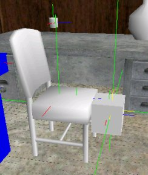
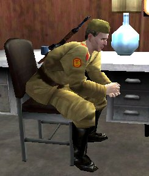
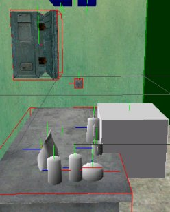
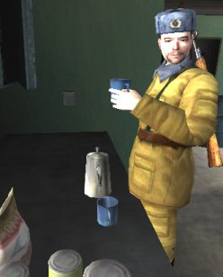
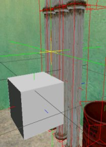
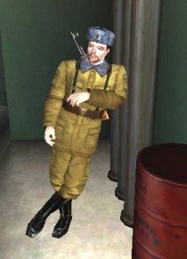
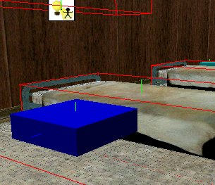
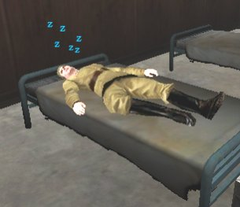
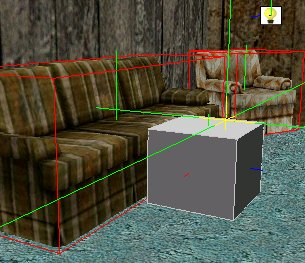
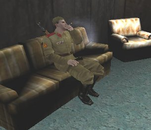

| ### Content Guide |  |
| --- | --- |

# Using AI Brains and Goals

When you place a CAI in a level, you must set the **ModelTemplate **, the **Brain **, the **GoalSet **, and the **Attachments **for the CAI to operate correctly. Each of these four properties need to match or the CAI may end up hovering in the air on fire, or not even appear in the game.

Another important property is AttributeOverrides, which allows you to modify an AIs senses. For more information about AttributeOverrides, see [Using AI Senses ](Senses.md).

All human AIs have a CAIBrain object (in code) that specifies a collection of behaviour-related attributes. In DEdit, the CAIBrain selection appears in the Brain property in the Properties tab for every CAIHuman you insert into your level.

Brains must mach a characters ModelTemplate because the ModelTemplate for each CAI can only perform a specific set of animations. If a brain does not match a ModelTemplate then errors result when the CAI attempts to perform actions its brain tells it to do, but that it has no animations to perform. Similary, **Attachments **for the CAI must match what the CAI is capable of carrying or the object can appear embedded in the model's body incorrectly. The left hand, for example, can typically carry a grenade, but does not carry a sword correctly.

Goals must also match, because not all ModelTemplates and Brains have the same animation sets or understanding of objects. Ninjas can jump, but soldiers do not have a jump animation. A SovietSoldier ModelTemplate with a Ninja brain and a NinjaPatrol goal may try to perform a smoke and teleport operation during combat, but the ModelTemplate does not have an animation for this. The results of mismatching Brains, Models, and Goals are unpredictable, but never satisfactory. Often ModelTemplates with mismatching goals or brains simply stand in place and do nothing.

The following topics explain how to use brains, goals, and AINodes to place NOLF 2 AI in a level and give them "life":

- [Using CAI Brains ](#CAIBrains)
- [Using CAI GoalSets ](#CAIGoalSets)
- [Using AINodes and Goals ](#AINodesandGoals)
- [Using AINodes and SmartObjects ](#UsingAINodesandSmartObjects)

---

## Using CAI Brains

Each character AI requires a brain in order to function. Specific brains must match the models they are designed for. The default brain works for most human models, but to cause AIs to function according to the roles they are playing in the game, you must specify the brain that matches that role and model. Police, for instance, require the Police brain in order to act like police. Ninjas require the Ninja brain in order to sneak around and teleport. Indian guards require the Tulwar brain in order to wave their swords in the air and attack as designed.

The following brains currently exist in the NOLF2 game code:

| #### Brain | #### Definition |
| --- | --- |
| **Default ** | The standard brain for all unspecified CAI classes. |
| **Tulwar ** | The brain for Tulwar CAI classes. |
| **Ninja ** | The brain for Ninja CAI classes. |
| **EZNinja ** | A secondary brain for Ninja CAI classes. |
| **Bystander ** | The brain for non-combatant bystander CAI classes. |
| **SSoldier ** | The brain for Super-Soldier CAI classes. |
| **PierreBoss ** | The brain for Pierre CAI classes. |
| **Robot ** | The brain for Robot CAI classes. |
| **ViewMaster ** | The brain for ViewMaster CAI classes. |
| **Rat ** | The brain for Animal CAI classes. |
| **Police ** | The brain for Police CAI classes. |
| **Contact ** | The brain for Contact CAI classes. |
| **Volkov ** | The brain for Volkov CAI classes. |

[Top ](#top)

---

## Using CAI GoalSets

The following table lists GoalSets that currently exist in the NOLF2 game code. These definitions exist in the aigoals.txt attributes file. Goals are listed in priority that the AI places on each goal. Some goals build on other goals, so examine the basic GoalSets listed in aigoals.txt for definitions on any goals not listed in this table.

| #### Goal Name | #### Definition |
| --- | --- |
| **None ** | Specifies no particular goalset. AI stands in place and only performs idle animations. |
| **Test ** | Goal0 = "SpecialDamage" Goal1 = "Patrol" |
| **EngineerTest ** | GoalSet0 = "Test" |
| **Sniper ** | RequiredBrain0 = "Default" RequiredBrain1 = "ViewMaster" IncludeGoalSet0 = "DefaultRequired" Goal0 = "Sniper" Goal1 = "Guard" Goal2 = "DrawWeapon" Goal3 = "Alarm" |
| **Patrol ** | RequiredBrain0 = "Default" RequiredBrain1 = "Tulwar" RequiredBrain2 = "Bystander" RequiredBrain3 = "ViewMaster" RequiredBrain4 = "Police" IncludeGoalSet0 = "DefaultRequired" IncludeGoalSet1 = "DefaultBasic" Goal0 = "Patrol" Goal1 = "Work" - The Patrol GoalSet includes the DefaultRequired and DefaultBasic GoalSets to define the standard combat behavior. - The Patrol’s "relaxed" behaviors are defined by the Goals - Patrol and Work. - AI patrols walk along a patrol path defined by LevelDesign through AINodePatrols. - A patrolling AI owns his path, and no other AI can use it until the owning AI dies or relinquishes ownership. - A patrol path can be assigned by specifying a node on the path in the AI’s Initial Command: goal_patrol node=AINodePatrol9. - If no node is specified, AI will find the nearest unowned AINodePatrol, and take ownership of that node’s path. - A patrolling AI may not own an AINodeGuard. Patrol and Guard are mutually exclusive. - If a patrolling AI walks near an unowned work node (AINodeUseObject with SmartObject set to Work), he will stop patrolling to do some “work,” then continue patrolling. Patrolling AI will ignore any work nodes that are owned by an AINodeGuard. - A patrolling AI may animate an investigative walk rather than the routine patrol walk through the command: goal_patrol awareness=investigate. This is useful for levels where AI are intended to be eternally suspicious regardless of stimuli. - Patrolling AI will turn off lights as they leave an AINodePatrol, and turn on lights at a destination AINodePatrol. |
| **Guard ** | RequiredBrain0 = "Default" RequiredBrain1 = "Tulwar" RequiredBrain2 = "Bystander" RequiredBrain3 = "ViewMaster" RequiredBrain4 = "Police" IncludeGoalSet0 = "DefaultRequired" IncludeGoalSet1 = "DefaultBasic" Goal0 = "Guard" Goal1 = "Sniper" Goal2 = "Work" Goal3 = "Menace" - The Guard GoalSet includes the DefaultRequired and DeafultBasic GoalSets to define the standard combat behavior. - The Guard GoalSet includes the Sniper Goal. - Guard’s relaxed behaviors are defined by the Goals Guard, Work, and Menace. - A guarding AI will stay within the return radius of his guard node. If he is drawn outside of this radius, he will walk to return to it. - A guarding AI owns his guard node, and no other AI can use it until he dies or otherwise relinquishes it. - An AINodeGuard can be assigned by specifying a node in the AI’s Initial Command: goal_guard node=AINodeGuard22. - If no node is specified, AI will find the nearest unowned AINodeGuard. - A guarding AI may not own any AINodePatrols. Patrol and Guard are mutually exclusive. - The guarding AI owns his guard node, and the guard node may own additional nodes. Owned nodes are AINodeUseObjects used for the Work, Menace, and Sniper Goals. - An AI that owns a guard node will randomly select work nodes owned by his guard node, rather than always going to the next nearest work node. This AI may not use any unowned work nodes. The same applies to menace nodes. - Menace nodes are used exactly like work nodes, but are used in levels where the AI is supposed to already be aware of an enemy presence, and should appear permanently agitated, even when the AI system thinks the AI is relaxed. When the AI is not in combat he runs between menace nodes (AINodeUseObjects with SmartObject set to Menace), and play aggressive animations. - When a guarding AI investigates a disturbance, he stops at the edge of his guard radius and play an alert animation, rather than walking all the way to the disturbance. - Guard AI do not go to search nodes outside of their guard radius. - If the guarding AI has previously seen the player, heard an alarm, or been shot, then he ignores his guard radius and investigates anywhere. Once the AI returns to a relaxed state of awareness, he starts paying attention to his guard radius again. - If the AI notices a disturbance outside of his guard radius, he does not speak. This prevents an AI from repeatedly saying “I hear you!,” “What was that!,” “I know you’re there!,” but never coming to investigate. - If an AI currently owns a talk node, he ignores his guard node. |
| **Reinforcement ** | RequiredBrain0 = "Default" RequiredBrain1 = "Tulwar" RequiredBrain2 = "Bystander" RequiredBrain3 = "ViewMaster" RequiredBrain4 = "Police" IncludeGoalSet0 = "DefaultRequired" IncludeGoalSet1 = "DefaultBasic" Goal0 = "Patrol" Goal1 = "Guard" Goal2 = "ExitLevel" Goal3 = "Sniper" Goal4 = "Work" Goal5 = "Menace" - The Reinforcement GoalSet is used for AIs who spawned as reinforcements, usually from a command in an alarm. - The Reinforcement GoalSet includes the DefaultRequired and DeafultBasic GoalSets to define the standard combat behavior. - The Reinforcement GoalSet includes the Sniper Goal. - Reinforcement’s relaxed behaviors are defined by the Goals Guard, Work, ExitLevel, and Menace. (See the Guard GoalSet above for more info on Menace). - A reinforcement AI initially enters the level and respond to whatever is currently happening. Once the situation returns to normal, and the AI returns to a relaxed state of awareness, the AI looks for unclaimed guard and patrol nodes. If one is found, then the AI claims the node and activate the Guard or Patrol goal. The AI then behaves like an ordinary AI that is guarding or patrolling. - Unclaimed that exist because the AI that previously owned has died are replenished by reinforcements. This maintains the same number of AIs in the level, and keeps the level at approximately the same difficulty. - Alternatively, the level may intentionally contain a surplus of nodes, so that the level becomes harder once reinforcements are brought in. - If no unclaimed nodes are found, then the AI looks for an AINodeExitLevel. If an ExitLevel node is found, then the AI walks to the node and gets removed from the level. AINodeExitLevel nodes are normally placed in areas the player cannot get to, preventing players from seeing AIs getting instantly removed from the game. - AIs dol not look for an ExitLevel node until they have been in the level for at least 5 seconds. This restriction prevents an AI from spawning near an ExitLevel node, and immediately removing itself before noticing an alarm sounding, or other stimuli. |
| **SuicidePatrol ** | RequiredBrain0 = "Default" RequiredBrain1 = "Tulwar" RequiredBrain2 = "Bystander" RequiredBrain3 = "ViewMaster" RequiredBrain4 = "Police" IncludeGoalSet0 = "DefaultRequired" IncludeGoalSet1 = "SuicideBasic" Goal0 = "Patrol" Goal1 = "Work" |
| **SuicideGuard ** | RequiredBrain0 = "Default" RequiredBrain1 = "Tulwar" RequiredBrain2 = "Bystander" RequiredBrain3 = "ViewMaster" RequiredBrain4 = "Police" IncludeGoalSet0 = "DefaultRequired" IncludeGoalSet1 = "SuicideBasic" Goal0 = "Guard" Goal1 = "Work" |
| **SleepGuard ** | RequiredBrain0 = "Default" RequiredBrain1 = "Tulwar" RequiredBrain2 = "Bystander" RequiredBrain3 = "ViewMaster" RequiredBrain4 = "Police" IncludeGoalSet0 = "DefaultRequired" IncludeGoalSet1 = "DefaultBasic" Goal0 = "Sleep" Goal1 = "Work" Goal2 = "Guard" |
| **NinjaPatrol ** | RequiredBrain0 = "Ninja" IncludeGoalSet0 = "DefaultRequired" IncludeGoalSet1 = "NinjaBasic" Goal0 = "Patrol" Goal1 = "Work" |
| **NinjaGuard ** | RequiredBrain0 = "Ninja" IncludeGoalSet0 = "DefaultRequired" IncludeGoalSet1 = "NinjaBasic" Goal0 = "Guard" Goal1 = "Work" |
| **NinjaReinforcement ** | RequiredBrain0 = "Ninja" IncludeGoalSet0 = "DefaultRequired" IncludeGoalSet1 = "NinjaBasic" Goal0 = "Patrol" Goal1 = "Guard" Goal2 = "ExitLevel" Goal3 = "Work" |
| **EZNinjaPatrol ** | RequiredBrain0 = "EZNinja" IncludeGoalSet0 = "DefaultRequired" IncludeGoalSet1 = "EZNinjaBasic" Goal0 = "Patrol" Goal1 = "Work" |
| **EZNinjaGuard ** | RequiredBrain0 = "EZNinja" IncludeGoalSet0 = "DefaultRequired" IncludeGoalSet1 = "EZNinjaBasic" Goal0 = "Guard" Goal1 = "Work" |
| **EZNinajReinforcement ** | RequiredBrain0 = "EZNinja" IncludeGoalSet0 = "DefaultRequired" IncludeGoalSet1 = "EZNinjaBasic" Goal0 = "Patrol" Goal1 = "Guard" Goal2 = "ExitLevel" Goal3 = "Work" |
| **Whimp ** | RequiredBrain0 = "Default" RequiredBrain1 = "Tulwar" RequiredBrain2 = "Bystander" RequiredBrain3 = "ViewMaster" RequiredBrain4 = "Police" IncludeGoalSet0 = "DefaultRequired" |
| **Talk ** | RequiredBrain0 = "Default" RequiredBrain1 = "Tulwar" RequiredBrain2 = "Bystander" RequiredBrain3 = "ViewMaster" RequiredBrain4 = "Police" IncludeGoalSet0 = "DefaultRequired" Goal0 = "Talk" |
| **Tail ** | RequiredBrain0 = "Default" RequiredBrain1 = "Tulwar" RequiredBrain2 = "Bystander" RequiredBrain3 = "ViewMaster" RequiredBrain4 = "Police" IncludeGoalSet0 = "DefaultRequired" Goal0 = "Tail" |
| **ScientistPatrol ** | RequiredBrain0 = "Default" RequiredBrain1 = "Bystander" RequiredBrain2 = "ViewMaster" IncludeGoalSet0 = "DefaultRequired" Goal0 = "GetBackup" Goal1 = "Patrol" Goal2 = "Work" Goal3 = "Alarm" |
| **ScientistGuard ** | RequiredBrain0 = "Default" RequiredBrain1 = "Bystander" RequiredBrain2 = "ViewMaster" IncludeGoalSet0 = "DefaultRequired" Goal0 = "GetBackup" Goal1 = "Guard" Goal2 = "Work" Goal3 = "Alarm" |
| **RobotPatrol ** | RequiredBrain0 = "Robot" Goal0 = "Patrol" Goal1 = "DrawWeapon" Goal2 = "HolsterWeapon" Goal3 = "Chase" Goal4 = "AttackMelee" Goal5 = "AttackRanged" Goal6 = "AttackFromVantage" Goal7 = "AttackFromView" Goal8 = "RespondToAlarm" Goal9 = "RespondToBackup" Goal10 = "Investigate" Goal11 = "SpecialDamage" |
| **SSPatrol ** | RequiredBrain0 = "SSoldier" IncludeGoalSet0 = "SSRequired" IncludeGoalSet1 = "SSBasic" Goal0 = "Patrol" |
| **SSGuard ** | RequiredBrain0 = "SSoldier" IncludeGoalSet0 = "SSRequired" IncludeGoalSet1 = "SSBasic" Goal0 = "Guard" |
| **PierreBoss ** | RequiredBrain0 = "PierreBoss" Goal0 = "DramaDeath" Goal1 = "Ride" Goal2 = "AttackFromRandomVantage" |
| **MimeArena ** | RequiredBrain0 = "Default" RequiredBrain1 = "Bystander" RequiredBrain2 = "ViewMaster" IncludeGoalSet0 = "DefaultRequired" Goal0 = "Investigate" Goal1 = "AttackMelee" Goal2 = "AttackRangedDynamic" Goal3 = "RespondToAlarm" Goal4 = "AttackFromView" Goal5 = "PsychoChase" |
| **Mime ** | RequiredBrain0 = "Default" RequiredBrain1 = "Bystander" RequiredBrain2 = "ViewMaster" IncludeGoalSet0 = "DefaultRequired" IncludeGoalSet1 = "DefaultBasic" Goal0 = "Guard" Goal1 = "Sniper" Goal2 = "Menace" Goal3 = "Work" |
| **RatGuard ** | RequiredBrain0 = "Rat" Goal0 = "Guard" Goal1 = "Work" Goal2 = "Flee" Goal3 = "SpecialDamage" |
| **RatPatrol ** | RequiredBrain0 = "Rat" Goal0 = "Patrol" Goal1 = "Flee" Goal2 = "SpecialDamage" |
| **NonViolentPatrol ** | RequiredBrain0 = "Tulwar" IncludeGoalSet0 = "DefaultRequired" IncludeGoalSet1 = "NonViolentBasic" Goal0 = "Patrol" Goal1 = "Work" Goal2 = "ProximityCommand" |
| **NonViolentGuard ** | RequiredBrain0 = "Tulwar" IncludeGoalSet0 = "DefaultRequired" IncludeGoalSet1 = "NonViolentBasic" Goal0 = "Guard" Goal1 = "Work" Goal2 = "ProximityCommand" |
| **NonViolentReinforcement ** | RequiredBrain0 = "Tulwar" IncludeGoalSet0 = "DefaultRequired" IncludeGoalSet1 = "NonViolentBasic" Goal0 = "Patrol" Goal1 = "Guard" Goal2 = "ExitLevel" Goal3 = "Work" Goal4 = "ProximityCommand" |
| **Volkov ** | RequiredBrain0 = "Volkov" Goal0 = "Patrol" Goal1 = "DrawWeapon" Goal2 = "HolsterWeapon" Goal3 = "Chase" Goal4 = "AttackMelee" Goal5 = "AttackRanged" Goal6 = "AttackFromVantage" Goal7 = "AttackFromView" Goal8 = "RespondToAlarm" Goal9 = "RespondToBackup" Goal10 = "Investigate" Goal11 = "DramaDeath" |
| **PilotGuard ** | RequiredBrain0 = "Default" RequiredBrain1 = "Contact" Goal0 = "SpecialDamage" Goal1 = "Guard" Goal2 = "Work" |
| **PilotPatrol ** | RequiredBrain0 = "Default" RequiredBrain1 = "Contact" Goal0 = "SpecialDamage" Goal1 = "Patrol" Goal2 = "Work" |
| **AllyMelee ** | RequiredBrain0 = "Contact" IncludeGoalSet0 = "DefaultRequired" Goal0 = "DrawWeapon" Goal1 = "HolsterWeapon" Goal2 = "Investigate" Goal3 = "Chase" Goal4 = "AttackMelee" Goal5 = "Guard" |
| **Iskano ** | RequiredBrain0 = "Ninja" IncludeGoalSet0 = "NinjaBasic" Goal0 = "Guard" Goal1 = "Work" |
| **Kamal ** | RequiredBrain0 = "Default" Goal0 = "Guard" Goal1 = "Work" Goal2 = "Flee" Goal3 = "SpecialDamage" |

[Top ](#top)

---

## Using AINodes and Goals

AINode objects tell AIs how to use the environment they exist in. Without an AINode, AIs simply stand in place and perform idle animations (depending on their brains and default goalsets). AINodes provide visibility and perception of objects and components in the game that AIs can use and manipulate. An AI with a patrol goal, for example, requires at least two AINodePatrol objects in order to know which points to patrol between.

As with all AI objects, placement is important. Some AINodes are capable of sizing, and specify an area. Some AI Nodes must be linked to other AI nodes. Most AI nodes need to exist within an AI volume for the AI to locate and use the node. Pay paticular attention to the placement of AI nodes within the AI volumes of your level. Do not embed your AI nodes inside world geometry or the AI is likely to ignore the geometry and either pass through it or fail to use the node.

The following AINode objects exist in the NOLF2 game code:

| #### **Node Type ** | #### Description |
| --- | --- |
| **AINode ** | Specifies a generic AINode object primarily used to script an AI to go to different points in a level, or to create general areas where AIs can path and operate. |
| **AINodeAssassinate ** | Specifies a location used by the AI to attack. This AINode was used in NOLF1 and is not currently supported in NOLF2. |
| **AINodeBackup ** | Specifies a location where the AI runs to backup when they have a backup goal. |
| **AINodeCover ** | Specifies a location where the AI can find cover, and gives them a firing direction in a directed cone. These nodes get used by AIs in the ATTACKFROMCOVER and COVER states. Additional AINodeCover information: - Firing Direction: The cone displayed in DEdit determines the area (field of fire) that the AI fires from. Rotate the node to face the cone in the direction the AI will fire. If IgnoreDir is TRUE then the AI does not use the firing area. - 1WayRoll/1WayStep and 2WayRoll/2WayStep all cause 1WayCorner and 2WayCorner behaviour. The properties are named incorrectly for backwards compatibility with NOLF1 levels. For NOLF2, the properties can safely be changed to 1WayCorner and 2WayCorner. - The AI must enter the radius of the cover node for the cover not to be valid. - If the AI's target gets within the threat radius of the cover node, then the AI executes the ThreatRadiusReaction. - When the AI arrives at a cover node, it sends a message containing the word TRIGGER to the object specified in the Object property. This allows you to flip over tables or other objects in the way by activating a keyframed animation. |
| **AINodeDeath ** | Used for special AI death animations. AIs with a special AI death goal move to this location and play their death animations when they get killed. Do not use this node unless a special death animation exists for the AI you are using. |
| **AINodeDisturbance ** | Specifies a disturbance that can be triggered on or off. AIs move to this node to investigate the distrubance. |
| **AINodeExitLevel ** | Specifies a location where an AI with an exit goal can exit the level. |
| **AINodeGoto ** | Specifies a location that an AI can move to. You can trigger any AI to move to an AINodeGoto object by sending them a moveto message. |
| **AINodeGuard ** | Similar to a patrol node, but specifies a location that an AI with a Guard goal can guard. AIs with the guard goal will not attack until the character enters the guard node region. You can also specify other AINodeUseObject nodes that the guard can use when using the AINodeGuard node. These are typically smart objects such as smoking sections, coffee pots, urinals, etc. **Possession: ** If more than one AINodeGuard exists in an area, the first guard to get a node takes possession of all the GuardedNodes specified by that node AINodeGuard node. Make sure each guard AINodeGuard node specifies unique GuardedNodes or only the first guard will be able to use them. This is known as "possession" and keeps guards from using objects that belong to other guards. |
| **AINodeObstruct ** | Specifies an obstruction that an AI can use for cover. This is similar to the cover node and allows you to specify a field of fire for the AI. |
| **AINodePanic ** | Specifies a location for AIs with a panic goal to move to when they panic. |
| **AINodePatrol ** | Specifies a patrol location and path for an AI with a patrol goal. Requires two or more patrol nodes linked together. Make sure patrol lines pass through AI volumes. If you specify a patrol through world geometry, the AI may pass through the world geometry. |
| **AINodeSearch ** | Specifies an location where an AI with a search goal can move to and search. When AIs with a search goal detect a disturbance, they move to all of the search nodes in their region and check each one. You can specify a command to reset their goals once they have visited all of the search nodes. |
| **AINodeSensing ** | Specifies an location where you can send commands to other objects based on an AIs sense perception of the player. |
| **AINodeTail ** | Specifies an location for AIs with a tail goal to acquire an object to tail. |
| **AINodeTalk ** | Specifies an location for AIs with a talk goal to go to and wait to talk. |
| **AINodeUseObject ** | Specifies a smart object for the AI to use (such as a chair, lightswitch or urinal). You must place the object in the appropriate location near the world geometry or prefab that the CAI is intended to use. For more information about the AINodeUseObject node, see [Using AIUseObjectNodes and SmartObjects ](#UsingAINodesandSmartObjects)in the next topic. |
| **AINodeVantage ** | Specifies an area where the AI can see the character and acquire a target. These nodes get used by AIs in the ATTACKFROMVANTAGE state. See AINodeCover for a description of the properties. This node is similar to AINodeCover except it does not give a hit point bonus. |
| **AINodeVantageRoof ** | Specifies an area where the AI can look down on the character. See the description of AINodeVantage for additional information. |
| **AINodeView ** | Specifies an area where the AI can see the character. This node gets used in contjuction with the AIVolumePlayerInfo node. See [Using Regions and Volumes ](Pathing.md)for a description of the AIVolumePlayerInfo node. |

### GoalSet Operation

The following information describes how some of the more specific goals used by the NOLF2 AI operate.

**Chase— **Once the Chase Goal is activated (by seeing the enemy) the AI will never lose interest in chasing, with the following exceptions:

- An AI may lose interest in chasing if another goal activates that puts the AI in a state of awareness other than alert (so, relaxed or suspicious). Normally any Goals that activate in favor of Chase are other alert Goals, such as AttackRanged. The exceptions are Goals like SpecialDamage, which incapacitate the AI and then send him searching for his attacker. When an AI wakes up from SpecialDamage, he is investigative and loses interest in chasing.
- An AI may lose interest in chasing if he loses his target in a Junction volume, and gives up.
- Chase Goal Parameters:

  - **SeekPlayer=1: **This parameter instructs the AI to immediately start chasing a player, even if no stimuli have been sensed. This allows the AI to cheat in combat levels where the AI is intended to already know where the player is. The AI ignores Junction volumes while seeking the player. Once the player has been seen, the AI falls back to normal chasing behavior where he can get lost in Junction volumes.
  - **NeverGiveUp=1: **This parameter instructs the AI to cheat indefinitely. The AI will always know where the player is, and will never lose interest in chasing. This parameter was used for the nolf2 ninja trailer park level, where combat should never stop, but ninjas may get temporarily incapacitated when hit with SpecialDamage (e.g. poison).

**AttackFromCover— **Cover nodes have an optional parameter Object. This Object may be an object like a table that can be flipped on its side to use for cover. If an AINodeUseObject also points to this object, and the UseObject node has a SmartObject set to something for cover, the SmartObject can specify what animation the AI should use when activating the Object. For example, SmartObject FlipTable tells an AI how to animate when flipping a table to use as cover. After flipping the table, the AI runs to the Cover node, and runs the normal AttackFromCover behavior.

**AttackFromVantage **—AINodeVantage may specify an optional Object property. This object gets triggered On before the AI starts attacking from the Vantage node, and triggered Off after the AI attacks. This allows you to perform various operations when the AI uses the AINodeVantage node, for example you can open and shut window shutters. This Object was used in NOLF2 to allow Pierre to open and shut steam hatches in the underwater base boss-fight.

- You may find the following goals, derived from **AttackFromVantage **, useful for providing AIs with additional operational capacity.

  - **AttackFromRandomVantage **works exactly like AttackFromVantage, but does not require any stimuli to activate the Goal, and chooses valid Vantage nodes at random instead of choosing the nearest valid node. This Goal is used in NOLF2 for the Pierre boos-fight in the underwater base, where Pierre pops out of random steam hatches to throw knives at the player.
  - **AttackFromRoofVantage **works exactly like AttackFromVantage, but uses AINodeVantageRoof attractor nodes instead of normal AINodeVantages. An AI may only activate AttackFromRoofVantage if no other AI already has the Goal active, and only if at least 3 AI are already attacking the same target. This Goal is used in NOLF2 to control when ninja AI attack from rooftops.

**AttackFromView— **An AI will attack from an AINodeView if the AI has sensed stimuli of the enemy’s presence, and cannot find a path to the enemy, and the enemy is in an AIVolumePlayerInfo that points to a View node that the AI can find a path to.

- **SeekPlayer=1: **This parameter instructs an AI to attack from a View node without first sensing any stimuli.

**Work— **AINodeUseObjects set to SmartObjects for work are used with the Work Goal. These nodes control most of relaxed behaviors of the NOLF2 AI (such as smoking, working at desks, dancing, leaning, etc).

- There are various Goals derived from Work that are nearly identical, but are attracted to different types of Smart Objects:

  - **Sleep: **AI sleeps in a bed or chair, or while standing. Visual senses are disabled while sleeping.
  - **PlacePoster and EnjoyPoster: **Used in the India levels for police placing posters and civilians looking at posters.
  - **Destroy: **Used for SuperSoldiers to destroy things by smashing or shooting.
  - **Ride: **Used for the underwater base boss-fight to levitate Pierre on steam bursts.

- If a Work node has a ReactivationTime of zero, an AI may not use this node again until first using another Work node. Any ReactivationTime greater than zero will allow an AI to re-use the same node once the node is active again.
- An AI can be instructed to immediately stop working at a node by sending a Disable command to the node.
- If an AI is interrupted in the middle of working, he may optionally play an interrupt animation. For example, an AI that is smoking may abruptly throw down his cigarette instead of calmly putting it out. When the Work Goal deactivates, it will play an interrupt animation if it exists in animationsCharacterName.txt, otherwise the AI will play its normal out transition if it exists.
- If an AI is hit with SpecialDamage while working, he may optionally play a specific SpecialDamage animation rather than transition out of Work normally. For example, and AI may slump over and pass out at his desk, instead of standing up, pushing in his chair and then passing out. This animation actually plays in the SpecialDamage Goal.
- AI may play a specific death animation corresponding to his work. For example, slumping over a desk, or falling out of a chair.

**SpecialDamage— **The SpecialDamage Goal handles damage types that are specific to nolf2, but may act as a template for similar functionality in other titles. It handles both instant and progressive damage, and includes the following damage types:

- Sleeping
- Stun
- Bear_Trap
- Glue
- Laughing
- Slippery
- Bleeding
- Burn
- Choke
- ASSS (Anti SuperSoldier Serum)
- Poison
- Electrocute

Incapacitating animations and transition animations are defined through SmartObjects. Note that this goal uses SmartObjects to drive animation without the presence of an AINodeUseObject.

Instead of playing the normal in-transition animation, the Goal may play an animation specific to the AI’s current animation, as described previously in the Work Goal. This allows an AI to slump over on his desk when knocked-out. This also allows an AI to get knocked out while sleeping or prone without getting up first.

AI may play a specific death ani mation corresponding to the damage. For example, dying instantly without moving while knocked out.

[Top ](#top)

---

## Using AIUseObjectNodes and SmartObjects

Each ModelTemplate in the game has a set of animations specific to SmartObjects. SmartObjects are a selected property of **AINodeUseObject **nodes that allow an AI to use an object in the game. These objects allow you to tell an AI of a area where they can perform a specific action, such as smoking, browsing, and admiring the scenery. They also allow you to tell an AI about the location of an object they can use, such as a light switch, urinal, file cabinet, or alarm switch. There are many SmartObjects currently listed in the **AINodeUseObject **node, and not all are valid or functioning.

The following list briefly describes each of the SmartObjects you can use in the game, and in some cases gives instructions for the placement of the object. To research the precise placement of objects, you are advised to look in the NOLF 2 levels developed by Monolith. Needless to say, many SmartObjects require the CAI to have an animation for the action to perform, so not all ModelTemplates you select can use all SmartObjects. Additionally, AIs may also require an Attachment object to perform the action with, or an object prop may need to exist in the game for the AI to use. Many SmartObjects were designed to trigger or control specific animation sequences, so to understand the specifics of how they are used, you must look at how they are implemented in the NOLF 2 levels.

>

### LightSwitch

Place the AIUseObjectNode - LightSwitch node near a lightswitch object to allow an AI to activate or deactivate a lightswitch. To get the lightswitch to work you must also toggle the volumes near the lightswitch from Lit TRUE to Lit FALSE when the lights are turned on or off. You may also want to place and toggle a PlayerInformation node in this area so that he player can hide in areas where the lights are off. This allows you to create dark areas the player can hide in until the AI turns the lights on.

### Desk

Place the AIUseObjectNode - Desk node near a desk to enable AIs to perform a "working at desk" animation.

### DeskDrawer

Place the AIUseObjectNode - DeskDrawer node near a desk drawer to enable AIs to open and browse through a desk drawer.

### Alarm

Place the AIUseObjectNode - Alarm node near an alarm box prop to enable AIs to sound an alarm.

### SmokingSection

Place the AIUseObjectNode - SmokingSection in an area you want AIs to perform their smoking animations.

### FileCabinet

Place the AIUseObjectNode - FileCabinet node in front of a file cabinet prop with a drawer that an AI can open and browse through.

### Chair

Place the AIUseObjectNode - Chair node in front of a chair you want the AI to sit in.

The placement of this node requires that the blue line points away from the chair, and the green light points up. The top edge of the node is level with the top of the chair. As with all nodes, you may need to adjust the distance from the object several times before you get the desired effect. Incorrectly placed nodes can result in the ModelTemplate overlapping with the prop or world geometry. The following image illustrates the use of the Chair node:

### Urinal

Place the AIUseObjectNode - Urinal node in front of a urinal you want the AI to use.

### CoffeePot

Place the AIUseObjectNode - CoffePot node near a table where you want the AI to play a drinking coffee animation. The AI does not pour the coffee, but picks up a cup from the table and drinks from it.

The placement of this node requires that the blue line points to the table where the AI will drink. The following image illustrates the use of the CoffeePot node:

### Hammer

Place the AIUseObjectNode - Hammer node pointing to a location where you want an AI to play a hammering animation.

### HammerLow

Place the AIUseObjectNode - HammerLow node pointing to a location where you want an AI to play a bend and hammer animation.

### Wrench

Place the AIUseObjectNode - Wrench node pointing to a location where you want an AI to play a using wrench animation.

### WrenchLow

Place the AIUseObjectNode - WrenchLow node pointing to a location where you want an AI to play a bend and use wrench animation.

### LeanBack

Place the AIUseObjectNode - LeanBack node near a wall the AI can lean against, or anywhere you want the AI to play a lean back animation.

### LeanBar

Place the AIUseObjectNode - LeanBar node where you want the AI to play a leaning against a bar animation.

The placement of this node requires that the blue line points in the direction the AI will face, and the node is located at the appropriate distance from the object the AI will lean against. The following image illustrates the use of the LeanBar node:

### LeanLeft

Place the AIUseObjectNode - LeanLeft node where you want an AI to play a leaning to the left animation.

### LeanRight

Place the AIUseObjectNode - LeanRight node where you want an AI to play a leaning to the right animation.

### Lazyboy

Place the AIUseObjectNode - Lazyboy node where you want an AI to play an a sit back and move feet up animation.

### PosterSpot

Place the AIUseObjectNode - PosterSpot node where you want an AI to play an identify poster spot animation.

### Poster

Place the AIUseObjectNode - Poster node where you want an AI to play a placing poster animation.

### StandControlPanel

Place the AIUseObjectNode - StandControlPanel node where you want an AI to play a stand and use control panel animation.

### Research

Place the AIUseObjectNode - Research node where you want an AI to play a research animation.

### ResearchMicroscope

Place the AIUseObjectNode - ResearchMicroscope node where you want an AI to play a look through microscope animation.

### Fire

Place the AIUseObjectNode - Fire node where you want an AI to play an on fire animation.

### NinjaIdle

Place the AIUseObjectNode - NinjaIdel node where you want an ninja to play its idle animations.

### FileCabinetD

Place the AIUseObjectNode - FileCabinetD node where you want an AI to play its search through the files in a file cabinet animation. This node is primarily used for file cabinets the AI should check when a disturbance occurs. The file cabinet pointed to by this node only gets checked when the AI detects a disturbance.

### BedTime

Place the AIUseObjectNode - BedTime node next to a bunk or a bed to get an AI to lay down and sleep in the bed. AIs using this node remain asleep only for a random amount of time, and they get up and go about their business after the sleep time passes. To get them to remain asleep until they are disturbed use BedTimeInfinite.

The placement of this node requires that the red line points to the head of the bed, the blue line points away from the bed, and the green light points up. The following image illustrates the use of the BedTime node and also applies to the BedTimeInfinite node:

### BedTimeInfinite

BedTimeInfinite is identicale to BedTime except that rather than waking up and going about their business, AIs using this node remain asleep until they are disturbed by an alarm, the presence of the player, or any other disturbance.

### SmashLeft

Place the AIUseObjectNode - SmashLeft node where you want a SuperSoldier AI to smash something to its left.

### SmashRight

Place the AIUseObjectNode - SmashRight node where you want a SuperSoldier AI to smash something to its right.

### AttackProp

Place the AIUseObjectNode - AttackProp node where you want an AI to attack a prop once. Works with all AI.

### AttackPropRepeatedly

Place the AIUseObjectNode - AttackPropRepeatedly node where you want an AI to attack a prop until it is destroyed or until the AI gets disturbed by other stimuli. Works with all AI.

### Steam

Place the AIUseObjectNode - Steam node where you want Pierre to play his "ride steam" animation.

### LazyboyInfinite

Place the AIUseObjectNode - LazyboyInfinite node where you want an AI to play a sitting in a lazy boy chair animation. This is identical to the LazyBoy node except the AI will remains in the chair until disturbed.

### ChairInfinite

Place the AIUseObjectNode - ChairInfinite node where you want an AI to play a sitting in a chiar animation. This is identical to the Chair node except the AI remains in the chair until disturbed.

### SniperStand

Place the AIUseObjectNode - SniperStand node where you want an AI to take a standing sniper position.

### SniperCrouch

Place the AIUseObjectNode - SniperCrouch node where you want an AI to take a crouched sniper position.

### CoverFlipTable

Use the AIUseObjectNode - CoverFlipTable node in conjunction with a cover node. The cover node sends a trigger to a WorldModel to flip a table when the AIReaches the node. See the NOLF2 levels for examples of implementation.

### CoverFlipDesk

The AIUseObjectNode - CoverFlipDesk node works in a similar manner to the CoverFlipTable node, except a desk prop gets flipped instead of a table. See the NOLF2 levels for examples of implementation.

### Entertain

Place the AIUseObjectNode - Entertain node is designed to work in conjunction with the Dance node and is intended to allow AIs to play their entertainment animation when a radio is turned on.

### Dance

Place the AIUseObjectNode - Dance node where you want an AI to dance.

### Barrel

Place the AIUseObjectNode - Barrel node is similar to the CoverFlipTable node. It works with a Cover node to flip a barrel the AI can use for cover.

### VendingMachine

Place the AIUseObjectNode - VendingMachine node where you want an AI to play its use and kick vending machine animation. See the vending machine prefab for examples of implementation.

### HitWall

Place the AIUseObjectNode - HitWall node where you want an AI to pound on the wall in a panic. This was used in NOLF2 where the AI were trapped and pounding on the door as water rushed in to drown them.

### OutdoorUrinal

Place the AIUseObjectNode - OutdoorUrinal node where you want an AI to urinate without a urinal.

### WashHands

Place the AIUseObjectNode - WashHands object where you want an AI to play its washing hands animation. This animation should be used in conjunction with a sink prop.

### SmokingChair

Place the AIUseObjectNode - SmokingChair node near a chair you want the AI to sit and smoke in.

The placement of this node requires that the blue line points away from the chair, and the green light points up. The following image illustrates the use of the SmokingChair node:

### SitControlPanel

Place the AIUseObjectNode - SitControlPanel node where you want an AI to sit and push buttons.

### Typewriter

Place the AIUseObjectNode - Typewriter node where you want an AI to play its typing animation. This works best in conjunction with a desk and typewriter prop.

### SpeakerPhone

Place the AIUseObjectNode - SpeakerPhone node where you want an AI to press the button on a speakerphone.

### AlarmBox

Place the AIUseObjectNode - AlarmBox node in front of alarm boxes that require an open box animation prior to pressing the button to activate an alarm.

### MenaceInfinite

Place the AIUseObjectNode - MenaceInfinite node where you want an AI to play its menace animation until it is disturbed.

### MenaceNonInfinite

Place the AIUseObjectNode - MenaceNonInfinite node where you want an AI to play its menace animation for a specified period of time.

### NinjaMenace

Place the AIUseObjectNode - NinjaMenace node where you want a Ninja to play its menace animation.

### AdmireScenery

Place the AIUseObjectNode - AdmireScenery node where you want an AI to play its looking around animation.

### StandSleep

Place the AIUseObjectNode - StandSleep node where you want an AI with a sleep goal to stand and doze off for a specified period of time.

### StandSleepInfinite

Place the AIUseObjectNode - StandSleepInfinite node where you want an AI with a sleep goal to stand and doze off until they are disturbed.

### RatIdle

Place the AIUseObjectNode - RatIdle animation where you want a rat to play its idle look around animation.

### Browse

Place the AIUseObjectNode - Browse node where you want an AI to play its browsing through something animation.

### ArmstrongStruggle

Place the AIUseObjectNode - ArmstrongStruggle node where you want Armstrong to play his struggle to lift something massive animation.

### ResearcherCabinet

Place the AIUseObjectNode - ResearcherCabinet node where you want a scientist to play his research cabinet animation.

### DrinkingFountain

Place the AIUseObjectNode - DrinkingFountain node near a drinking fountain prop you want an AI to drink from.

### PushButton

Place the AIUseObjectNode - PushButton node where you want an AI to play its push button animation.

### PierreStop1

The AIUseObjectNode - PierreStop1 node is used for the Pierre on a unicycle animation.

### PierreStop2

The AIUseObjectNode - PierreStop2 node is used for the Pierre on a unicycle animation.

### CoverBarrel

Place the AIUseObjectNode - CoverBarrel node where you want an AI to flip a barrel and use it for cover.

### BrokenUrinal

Place the AIUseObjectNode - BrokenUrinal node where you want an AI to play its broken urinal animation.

### LeanRail

Place the AIUseObjectNode - LeanRail node where you want an AI to play its leaning against a rail animation.

### MimeEntertain

Place the AIUseObjectNode - MimeEntertain node where you want a Mime to play its entertain/torture animation.

[Top ](#top)

---

Touchdown Entertainment, Inc. [Send feedback regarding this page. ](mailto:support@touchdownentertainment.com?subject=JupiterDevGuide Feedback: WAI\Goals.md)2006, All Rights Reserved.
