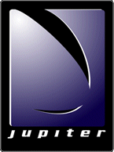

# Development Guide

---

*

Jupiter System
*

Document Version 2006.1.18
Jupiter Build 69

---

## Legal Notices

>

The Jupiter Development System is copyright 1998-2006 by Touchdown Entertainment, Inc. , Kirkland, Washington, U.S.A. All rights reserved.

ImageMagick is copyright 2000 by ImageMagick Studio, a non-profit organization dedicated to making software imaging solutions freely available.

The FreeType Project is copyright 1996-2000 by David Turner, Robert Wilhelm, and Werner Lemberg. All rights reserved except as specified in the *Credits *appendix.
